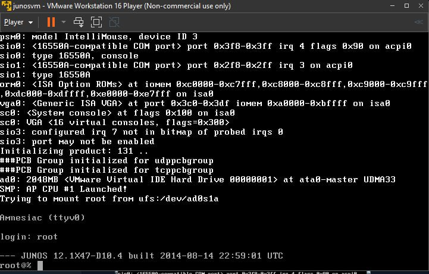
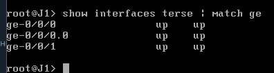

# Практична робота кредитного модуля  
Тема: Побудова ІР-мереж на базі обладнання Juniper  

## Виконання  

### Розгортання віртуального файєрвола vSRX у VMware Workstation Player  

#### Встановлення VMware Workstation Player  
1. Завантажити VMware Workstation Player із [офіційного сайту](https://www.vmware.com/go/getplayer).  
2. Виконати інсталяцію, залишаючи стандартні параметри.  
3. Запустити VMware Workstation Player (якщо не знаходиться в пошуку, можна відкрити через `C:\Program Files (x86)\VMware\VMware Player\vmplayer.exe`).  


#### Завантаження та імпорт образу vSRX  
1. Завантажити файл `junos-vsrx-12.1X47-D10.4-domestic.ova`.  
2. Відкрити VMware Workstation Player.  
3. Натиснути "Open a Virtual Machine".  
4. Вибрати файл `junos-vsrx-12.1X47-D10.4-domestic.ova`.  
5. Натиснути "Import" та дочекатися завершення процесу.  


#### Налаштування віртуальної машини  
1. У списку віртуальних машин вибрати junos-vsrx.  
2. Натиснути "Edit virtual machine settings".  
3. Видалити Floppy Drive (якщо є).  
4. Переконатися, що мережеві адаптери налаштовані так:  
   - Network Adapter 1 → Bridged Mode (відповідає `ge-0/0/0` на vSRX).  
   - Network Adapter 2 → Bridged Mode (відповідає `ge-0/0/1` на vSRX).  
5. Натиснути OK для збереження налаштувань.  


#### Запуск віртуальної машини  
1. У VMware Workstation Player вибрати vSRX.  
2. Натиснути "Play virtual machine".  
3. Після завантаження з’явиться консольний інтерфейс.  
4. Увійти в систему під користувачем `root` (пароль не потрібен).  

```sh
login: root
```




### Налаштування vSRX


Після запуску віртуальної машини виконаємо початкові налаштування.


#### Налаштування початкових параметрів vSRX
Для встановлення базових параметрів пристрою виконаємо наступні команди:

```sh
cli
edit
set system host-name J1
set system root-authentication plain-text-password
```
Після виконання останньої команди система запросить введення нового пароля для `root`. 

```sh
commit
exit
```


#### Перегляд мережевих інтерфейсів
Щоб переглянути список доступних мережевих інтерфейсів, виконаємо команду:

```sh
show interfaces terse | match ge-
```

Очікуваний вивід:

```
ge-0/0/0    up    up
ge-0/0/0.0  up    up
ge-0/0/1    up    up
```



#### Відключення інтерфейсу ge-0/0/1
Згідно з умовами роботи, необхідно відключити інтерфейс `ge-0/0/1`. Виконаємо:

```sh
configure
set interfaces ge-0/0/1 disable
commit
exit
```


Щоб перевірити, чи інтерфейс вимкнено, скористаємося командою:

```sh
show interfaces terse ge-0/0/1
```

Очікуваний вивід:

```
Interface  Admin  Link  Proto  Local  Remote
ge-0/0/1   down   down
```


Ось виправлений текст із таблицею:  


#### Налаштування IP-адреси на ge-0/0/0  
Інтерфейс `ge-0/0/0` підключений до тієї ж мережі, що і хост-машина. Необхідно призначити йому статичну IP-адресу.  

Для цього визначимо необхідні параметри мережі:  

| Параметр                 | Значення           |
| ------------------------ | ------------------ |
| ІР-адреса хосту          | `192.168.1.48`     |
| Маска підмережі          | `255.255.255.0`    |
| Шлюз за замовченням      | `192.168.1.1`      |
| ІР-адреса для ge-0/0/0.0 | `192.168.1.200/24` |

Щоб налаштувати IP-адресу для інтерфейсу `ge-0/0/0.0`, виконайте наступні команди:  

```sh
configure
set interfaces ge-0/0/0 unit 0 family inet address 192.168.1.200/24
commit
exit
```

Переконаємося, що IP-адреса була застосована:  
```sh
show interfaces terse | match ge-0/0/0
```


#### Налаштування маршруту за замовчуванням  
Щоб налаштувати маршрут за замовчуванням, використовуйте:  

```sh
configure
set routing-options static route 0.0.0.0/0 next-hop 192.168.1.1
commit
exit
```

Перевіримо, чи маршрут за замовчуванням налаштований:  

```sh
show route
```

Очікуваний вивід:  
```
0.0.0.0/0   [Static/5]  00:05:14  [Next hop: ge-0/0/0.0]
```


#### Перевірка з'єднання  
1. Виконати ping на шлюз:  
```sh
ping 192.168.1.1
```

2. Перевірити підключення до глобальної мережі:  
```sh
ping 8.8.8.8
```

Пінг проходить — конфігурація виконана правильно.  


### Налаштування Routing Instance

Налаштуємо Routing Instance та підключимо його до основного маршрутизатора згідно зі схемою (Мал. 2).

#### Налаштування віртуального інтерфейсу `lo0`
```sh
configure
set interfaces lo0 unit 1 family inet address 10.0.0.1/32
set interfaces lo0 unit 1 family inet address 10.0.0.2/32
```
> Примітка: Команду `commit` після цього кроку не виконувати, вона буде виконана пізніше.

[Рисунок 8 - Налаштування інтерфейсу lo0]  
(Вставити скріншот)


#### Налаштування інтерфейсу `lt-0/0/0` (віртуальне з'єднання між маршрутизаторами)
```sh
set interfaces lt-0/0/0 unit 0 encapsulation ethernet
set interfaces lt-0/0/0 unit 0 peer-unit 1
set interfaces lt-0/0/0 unit 0 family inet address 172.16.0.2/16

set interfaces lt-0/0/0 unit 1 encapsulation ethernet
set interfaces lt-0/0/0 unit 1 peer-unit 0
set interfaces lt-0/0/0 unit 1 family inet address 172.16.0.1/16
```


#### Створення Routing Instance з назвою `J1A`
```sh
set routing-instances J1A instance-type virtual-router
set routing-instances J1A interface lt-0/0/0.0
set routing-instances J1A interface lo0.1
set routing-instances J1A routing-options static route 0.0.0.0/0 next-hop 172.16.0.1
```
> Примітка: Команду `commit` все ще не виконувати.


#### Додавання статичного маршруту на майстер-маршрутизаторі
```sh
set routing-options static route 10.0.0.2/32 next-hop 172.16.0.2
commit
```


#### Вимкнення функцій безпеки та перехід у режим маршрутизації
```sh
delete security
set security forwarding-options family mpls mode packet-based
commit
request system reboot
```
Після виконання цих команд vSRX перезавантажиться.


#### Перевірка підключення - ping на майстер-маршрутизатор
```sh
ping 10.0.0.1 routing-instance J1A
```
Очікуваний результат:
```
64 bytes from 10.0.0.1: icmp_seq=0 ttl=64 time=3.6 ms
```


#### Перегляд таблиці маршрутизації для `J1A`
```sh
show route table J1A.inet.0
```


#### Перегляд таблиці маршрутизації майстер-маршрутизатора
```sh
show route table inet.0
```


#### Ping з майстер-маршрутизатора на `J1A`
```sh
ping 10.0.0.2
```

Очікуваний результат:
```
64 bytes from 10.0.0.2: icmp_seq=0 ttl=64 time=4.2 ms
```


#### Чи є зв’язок між `J1A` та зовнішньою мережею? Чому?  

Так, зв’язок між `J1A` та зовнішньою мережею є.  

1. Наявність статичного маршруту за замовчуванням  
   - В `J1A` налаштований статичний маршрут `0.0.0.0/0` через `172.16.0.1`, що дозволяє йому передавати весь трафік до майстер-маршрутизатора `J1`.  
   - Перевірено командою:
     ```sh
     show route table J1A.inet.0
     ```
     Очікуваний вивід:
     ```
     0.0.0.0/0   [Static] > to 172.16.0.1 via lt-0/0/0.0
     ```

2. Правильне налаштування маршрутизації на `J1`  
   - `J1` знає, як перенаправляти трафік із `J1A` у зовнішню мережу, оскільки у нього є маршрут:
     ```
     0.0.0.0/0   [Static] > to 192.168.1.1 via ge-0/0/0.0
     ```
   - Це означає, що весь трафік, який `J1A` надсилає до `J1`, далі передається через `ge-0/0/0.0` до шлюза `192.168.1.1`.

3. Успішний ping до глобальної IP-адреси (Google DNS - `8.8.8.8`)  
   - Перевірка:
     ```sh
     ping 8.8.8.8
     ```
   - Якщо отримано відповіді, значить маршрут працює коректно.

4. Підключення до локальної мережі та шлюза  
   - Перевірено ping до шлюза `192.168.1.1`:
     ```sh
     ping 192.168.1.1
     ```
   - Це підтверджує, що `J1` передає трафік у зовнішню мережу.


### Висновок  

У ході виконання лабораторної роботи було розгорнуто та налаштовано віртуальний файєрвол `vSRX` у середовищі `VMware Workstation Player`. Було здійснено підключення віртуального пристрою до мережі, налаштовано мережеві інтерфейси, створено Routing Instance, а також перевірено маршрутизацію між `J1A`, основним маршрутизатором `J1` та зовнішньою мережею.  

Основні етапи роботи:  
- Розгортання `vSRX` у VMware та його початкове налаштування.  
- Конфігурація мережевих інтерфейсів, зокрема `ge-0/0/0` для зв’язку з локальною мережею.  
- Призначення статичних IP-адрес для інтерфейсів `lo0` та `lt-0/0/0`.  
- Створення Routing Instance `J1A`, що дозволяє розділити маршрутизацію на рівні віртуального файєрвола.  
- Налаштування маршрутів на `J1` та `J1A`, що забезпечує коректну передачу трафіку між підмережами.  
- Перевірка зв’язку, включаючи `ping` між віртуальними машинами та доступ до глобальної мережі (`8.8.8.8`).  

- `J1A` має доступ до зовнішньої мережі.  
- Налаштовано коректні статичні маршрути між `J1A` та `J1`.  
- Реалізовано підключення віртуального файєрвола до мережевої інфраструктури.  
- Всі перевірки (`ping`, `show route`) підтвердили правильність налаштувань.  

Робота дозволила засвоїти практичні навички конфігурації `Juniper vSRX`, маршрутизації трафіку та налаштування мережевих інтерфейсів. Завдяки цьому вдалося створити стабільне з’єднання між віртуальними пристроями та забезпечити вихід в інтернет через основний маршрутизатор.
