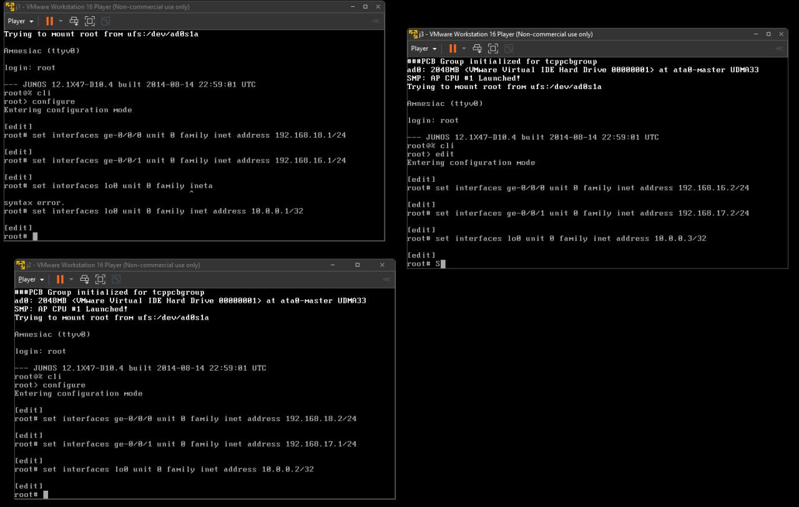
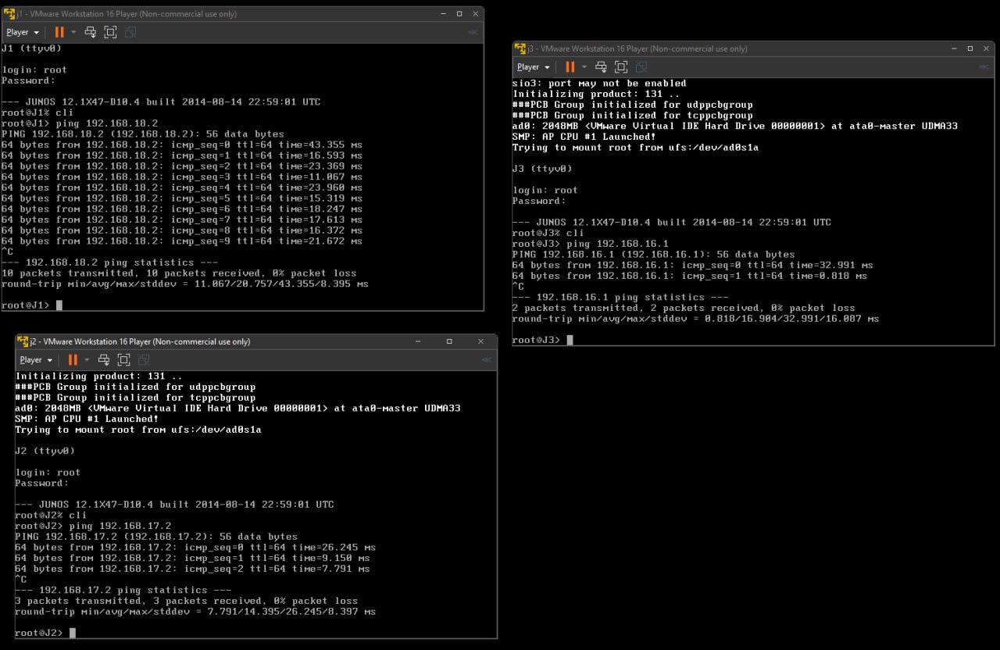
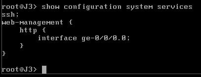
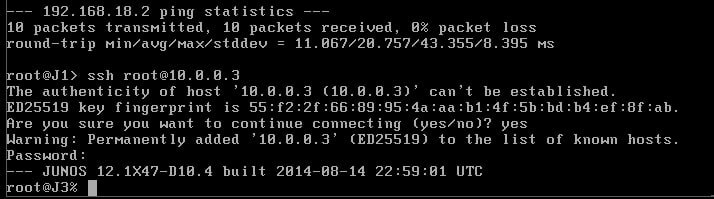
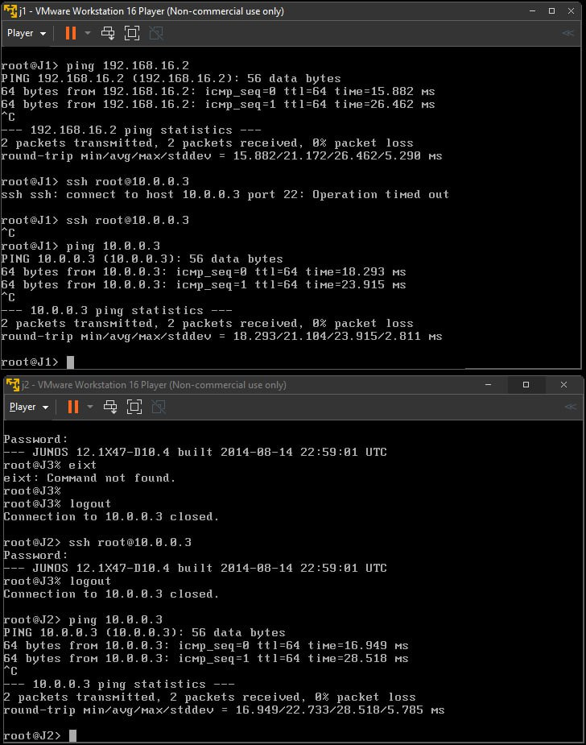
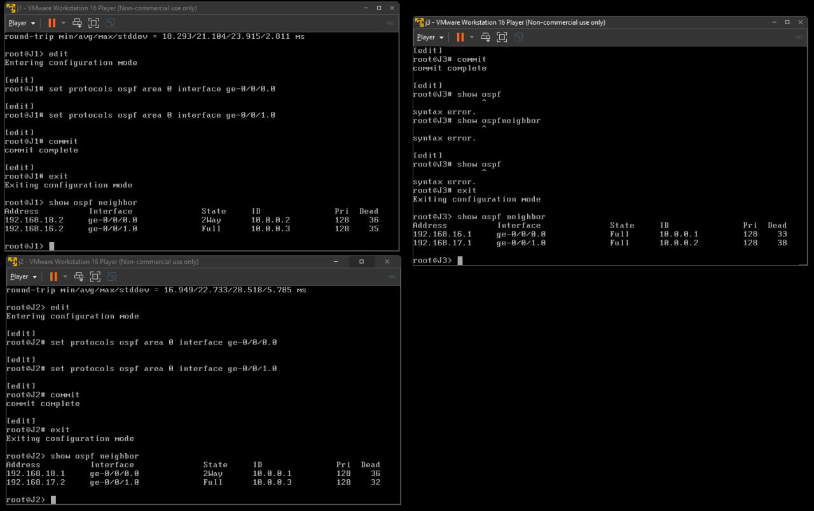

# ПРАКТИЧНА РОБОТА КРЕДИТНОГО МОДУЛЯ  
Тема: Налаштування firewall filters в Junos

Мета роботи:
1. Вивчити топологію з трьома маршрутизаторами (J1, J2, J3).  
2. Забезпечити маршрутизацію (статичну або OSPF).  
3. Перевірити та увімкнути SSH на J3.  
4. Перевірити SSH-доступ до J3 з J1 та J2.  
5. Налаштувати firewall filter на J3, щоб дозволити SSH лише з J2 і заборонити з усіх інших адрес.  
6. Перевірити сусідів OSPF (якщо вибрано OSPF) за допомогою команди `show ospf neighbor`.  
7. Перевірити доступ по SSH з J2 → J3 (дозволено) і з J1 → J3 (заборонено).

## Виконання

Як у завданні, маємо три vSRX (або Olive / JunOS) маршрутизатори: J1, J2, J3.  

### Мережі (за прикладом із малюнку):

- LAN12: між J1 та J2  
  - `192.168.18.0/24`  
  - J1 → `192.168.18.1/24`  
  - J2 → `192.168.18.2/24`

- LAN21 / LAN13: між J1 та J3  
  - `192.168.16.0/24`  
  - J1 → `192.168.16.1/24`  
  - J3 → `192.168.16.2/24`

- LAN32: між J2 та J3  
  - `192.168.17.0/24`  
  - J2 → `192.168.17.1/24`  
  - J3 → `192.168.17.2/24`

- Loopback-и (/32):  
  - J1: `10.0.0.1/32`  
  - J2: `10.0.0.2/32`  
  - J3: `10.0.0.3/32`

Примітка: У VMware Workstation кожен зв’язок робимо через LAN Segment (LAN12, LAN13, LAN23).

### Налаштування базових параметрів

Виконуємо на кожному маршрутизаторі (J1/J2/J3) — задати ім’я, видалити security (для режиму маршрутизації) і встановити IP-адреси.

#### Приклад для J1:

```bash
# Увійти в конфігурацію
cli
configure

# Ім’я
set system host-name J1

# Видалити security (режим маршрутизатора)
delete security
set security forwarding-options family mpls mode packet-based

# Loopback
set interfaces lo0 unit 0 family inet address 10.0.0.1/32

# Фізичні інтерфейси
set interfaces ge-0/0/0 unit 0 family inet address 192.168.18.1/24  # До J2
set interfaces ge-0/0/1 unit 0 family inet address 192.168.16.1/24  # До J3

commit
run request system reboot
```



Аналогічно для J2 і J3, змінюючи IP згідно схеми.  
Після перезавантаження кожен має свої інтерфейси “up” і loopback.


### Забезпечення маршрутизації

#### Варіант 1: Статична маршрутизація

##### На J1 (приклад):

```bash
configure
set routing-options static route 10.0.0.2/32 next-hop 192.168.18.2
set routing-options static route 10.0.0.3/32 next-hop 192.168.16.2
commit
```

##### На J2:

```bash
configure
set routing-options static route 10.0.0.1/32 next-hop 192.168.18.1
set routing-options static route 10.0.0.3/32 next-hop 192.168.17.2
commit
```

##### На J3:

```bash
configure
set routing-options static route 10.0.0.1/32 next-hop 192.168.16.1
set routing-options static route 10.0.0.2/32 next-hop 192.168.17.1
commit
```

Потім перевірити пінг:
```bash
ping 10.0.0.2
ping 10.0.0.3
```
…і навпаки з інших.




#### Варіант 2: OSPF

Альтернативно можна увімкнути OSPF на кожному інтерфейсі:

```bash
configure
set protocols ospf area 0 interface ge-0/0/0.0
set protocols ospf area 0 interface ge-0/0/1.0
commit
```
(Повторити на J1, J2, J3.)  

Перевірити сусідів:
```
show ospf neighbor
```


### 4. Увімкнути та перевірити SSH на J3

1. Перевірити:

   ```bash
   show configuration system services
   ```
   Якщо ssh; там є — значить увімкнено.

2. Якщо немає:
   ```bash
   configure
   set system services ssh
   commit
   ```

3. Перевірити з J1 та J2:
   ```bash
   ssh root@10.0.0.3
   ```
   Обидва повинні підключитись (при відсутності фільтрів).







### 5. Налаштування Firewall Filter на J3

Задача: дозволити SSH лише з J2 (наприклад, `10.0.0.2`) і блокувати з усіх інших IP.

1. Створити фільтр:

   ```bash
   configure
   set firewall family inet filter SSH-FILTER term ALLOW-J2 from source-address 10.0.0.2/32
   set firewall family inet filter SSH-FILTER term ALLOW-J2 from protocol tcp
   set firewall family inet filter SSH-FILTER term ALLOW-J2 from destination-port 22
   set firewall family inet filter SSH-FILTER term ALLOW-J2 then accept

   set firewall family inet filter SSH-FILTER term BLOCK-OTHER-SSH from protocol tcp
   set firewall family inet filter SSH-FILTER term BLOCK-OTHER-SSH from destination-port 22
   set firewall family inet filter SSH-FILTER term BLOCK-OTHER-SSH then discard

   # Дозволити все інше
   set firewall family inet filter SSH-FILTER term ALLOW-ALL then accept
   ```

2. Призначити фільтр на вхідний трафік (input) інтерфейсів J3:

   ```bash
   set interfaces ge-0/0/0 unit 0 family inet filter input SSH-FILTER
   set interfaces ge-0/0/1 unit 0 family inet filter input SSH-FILTER
   commit
   ```

3. Перевірити:
   - Із J2 → `ssh root@10.0.0.3` має працювати.
   - Із J1 → `ssh root@10.0.0.3` має блокуватись (зависання/timeout).



### 6. Перевірка сусідів OSPF (якщо обрали OSPF)

На кожному маршрутизаторі (J1, J2, J3):
```
show ospf neighbor
```
Кожен має бачити 2 сусіди (повна трикутна топологія).



### Результати та висновки

1. Статична або динамічна (OSPF) маршрутизація забезпечує досяжність між усіма Loopback IP та мережами.  
2. SSH вмикаємо на J3 і переконуємось, що він працює з обох маршрутизаторів до налаштування фільтра.  
3. Firewall Filter на J3 з умовами:
   - Дозвіл SSH тільки з J2,
   - Заборона SSH з усіх інших,
   - Дозвіл решти трафіку.  

У результаті:  
- J2 може `ssh` на J3,  
- J1 → J3 по ssh заборонено.  
- При цьому ping (і інші типи трафіку) не блокується.

## Висновок

У ході виконання цієї лабораторної роботи ми ознайомились із базовими принципами налаштування міжмережевих екранів (firewall filters) в операційній системі JunOS. Було створено мережу з трьома маршрутизаторами, які з’єднані між собою в топології трикутника. На кожному маршрутизаторі було налаштовано IP-адресацію, loopback-інтерфейси та забезпечено маршрутизацію — як статичну, так і за допомогою OSPF.

Особливу увагу приділено налаштуванню фільтра, що обмежує доступ по SSH до маршрутизатора J3. Було реалізовано правило, яке дозволяє SSH-доступ лише з маршрутизатора J2, блокує доступ з усіх інших адрес, але водночас не перешкоджає іншому IP-трафіку. Таким чином, ми не лише реалізували базові механізми контролю доступу, але й закріпили практичні навички роботи з фільтрами та інтерфейсами в JunOS.

У результаті виконання лабораторної:
- Працює маршрутизація між усіма вузлами.
- SSH на J3 доступний лише з J2.
- Доступ з J1 по SSH блокується відповідно до фільтра.
- Перевірена робота OSPF (або статичних маршрутів).
- Отримані практичні навички з конфігурації firewall filters, перевірки сусідів OSPF та базової діагностики мережі в JunOS.

Отже, поставлену мету роботи досягнуто повністю.