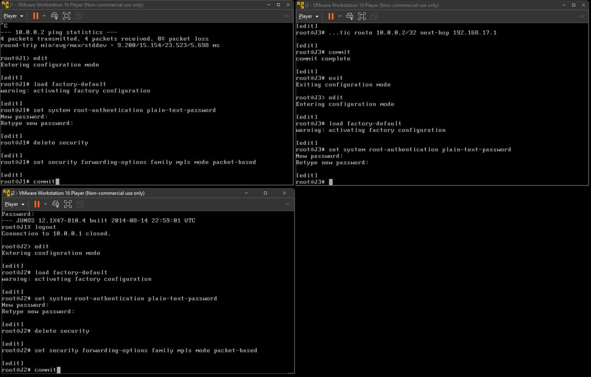
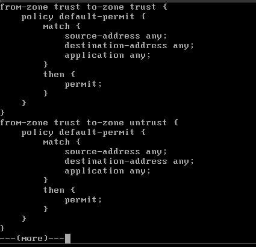

# ПРАКТИЧНА РОБОТА КРЕДИТНОГО МОДУЛЯ  
Тема: Налаштування зонального міжмережевого екрану

## **Топологія та розподіл інтерфейсів**

1. **J1** (packet-based):  
   - Інтерфейс `ge-0/0/0` з адресою `192.168.16.1/24` → з’єднання з J3  
   - Loopback (`lo0.0`): `10.0.0.1/32`

2. **J2** (packet-based):  
   - Інтерфейс `ge-0/0/0` з адресою `192.168.17.1/24` → з’єднання з J3  
   - Loopback (`lo0.0`): `10.0.0.2/32`

3. **J3** (flow-based, vSRX за промовчанням):  
   - Інтерфейс `ge-0/0/0`: `192.168.16.2/24` — відноситься до **trust**  
   - Інтерфейс `ge-0/0/1`: `192.168.17.2/24` — відноситься до **untrust**  
   - Loopback (`lo0.0`): `10.0.0.3/32`

Взаємодія J1 ↔ J2 відбувається лише через J3, оскільки пряме з’єднання J1–J2 відсутнє.  

## **Первинна підготовка**

### **Налаштування J1 та J2 у packet-based**

На кожному (J1 та J2):
1. Видалено підсистему безпеки:
   ```bash
   delete security
   set security forwarding-options family mpls mode packet-based
   commit
   run request system reboot
   ```
2. Після перезавантаження обидва маршрутизатори працюють у звичайному “router-mode”.

### **J3 у flow-based (vSRX)**

J3 використовується “як є”, або (за потреби) повертається до заводських налаштувань:
```bash
load factory-default
commit
run request system reboot
```
У типовій конфігурації vSRX вже передбачено зони **trust** та **untrust**, але інтерфейси не додані.



## **IP-адресація**

### J1

```bash
set interfaces ge-0/0/0 unit 0 family inet address 192.168.16.1/24
set interfaces lo0 unit 0 family inet address 10.0.0.1/32
set system host-name J1
commit
```

### J2

```bash
set interfaces ge-0/0/0 unit 0 family inet address 192.168.17.1/24
set interfaces lo0 unit 0 family inet address 10.0.0.2/32
set system host-name J2
commit
```

### J3

```bash
set interfaces ge-0/0/0 unit 0 family inet address 192.168.16.2/24
set interfaces ge-0/0/1 unit 0 family inet address 192.168.17.2/24
set interfaces lo0 unit 0 family inet address 10.0.0.3/32
set system host-name J3
commit
```


## **Зонування та базова безпека (J3)**

1. **Додати інтерфейси до зон**:
   ```bash
   set security zones security-zone trust interfaces ge-0/0/0.0
   set security zones security-zone untrust interfaces ge-0/0/1.0
   commit
   ```

2. **Перевірити політики за замовчуванням**:
   ```bash
   show security policies
   ```
   Зазвичай `default-permit` для trust → untrust та `default-deny` для untrust → trust.

3. **Увімкнути host-inbound-traffic** (якщо потрібні ping або ssh безпосередньо на J3):
   ```bash
   set security zones security-zone trust interfaces ge-0/0/0.0 host-inbound-traffic system-services ping
   set security zones security-zone trust interfaces ge-0/0/0.0 host-inbound-traffic protocols ospf
   set security zones security-zone untrust interfaces ge-0/0/1.0 host-inbound-traffic system-services ping
   set security zones security-zone untrust interfaces ge-0/0/1.0 host-inbound-traffic protocols ospf
   commit
   ```





## **Маршрутизація (OSPF)**

### J1

```bash
set protocols ospf area 0 interface ge-0/0/0.0
set protocols ospf area 0 interface lo0.0
commit
```

### J2

```bash
set protocols ospf area 0 interface ge-0/0/0.0
set protocols ospf area 0 interface lo0.0
commit
```

### J3

```bash
set protocols ospf area 0 interface ge-0/0/0.0
set protocols ospf area 0 interface ge-0/0/1.0
set protocols ospf area 0 interface lo0.0
commit
```


Перевірити сусідів:
```bash
show ospf neighbor
```
J3 має бачити J1 та J2; J1 і J2 повинні бачити J3, що підтверджує доставку пакетів через зони trust/untrust.


## **Політики та пропуск трафіку**

1. **trust → untrust**  
   Зазвичай factory-default має `default-permit`, тобто весь трафік J1→J3→J2 дозволено.

2. **untrust → trust**  
   Здебільшого factory-default є `default-deny`, тож J2→J3→J1 блокується. Якщо потрібен зворотний зв’язок (наприклад, ping, ssh), додають відповідну політику, наприклад:

   Для ssh:
   ```bash
   set security policies from-zone untrust to-zone trust policy allow-ssh match source-address any destination-address any application junos-ssh
   set security policies from-zone untrust to-zone trust policy allow-ssh then permit
   commit
   ```

## **Тестування**

1. **OSPF adjacency**  
   ```bash
   show ospf neighbor
   ```
   - J1 → бачить J3  
   - J2 → бачить J3  

2. **Ping**  
   - `ping 10.0.0.2` із J1 → проходить через J3, працює лише якщо untrust→trust політика дозволяє зворотний трафік.  
   - `ping 10.0.0.3` (J3 loopback) перевіряє host-inbound-traffic system-services ping на інтерфейсі J3.

3. **SSH**  
   - `ssh root@10.0.0.2` (J1 → J2) вимагає політики в обидва боки, якщо потрібно повний доступ.

4. **Перевірка політик**  
   ```bash
   show security policies from-zone trust to-zone untrust
   show security policies from-zone untrust to-zone trust
   ```


## **Висновки**

Таким чином, завдяки пакетному режиму на J1 та J2, а також flow-based режиму на J3, досягається класична схема “перевірки” трафіку на центральному роутері. Протокол OSPF забезпечує динамічний обмін маршрутами між трьома вузлами, а політики безпеки на J3 дають змогу гнучко керувати проходженням пакетів між зонами trust і untrust, вибірково дозволяючи чи блокуючи сервіси (ping, SSH тощо). У результаті реалізовано комплексний приклад інтеграції маршрутизації з елементами фільтрації і зонового захисту в Junos OS.
