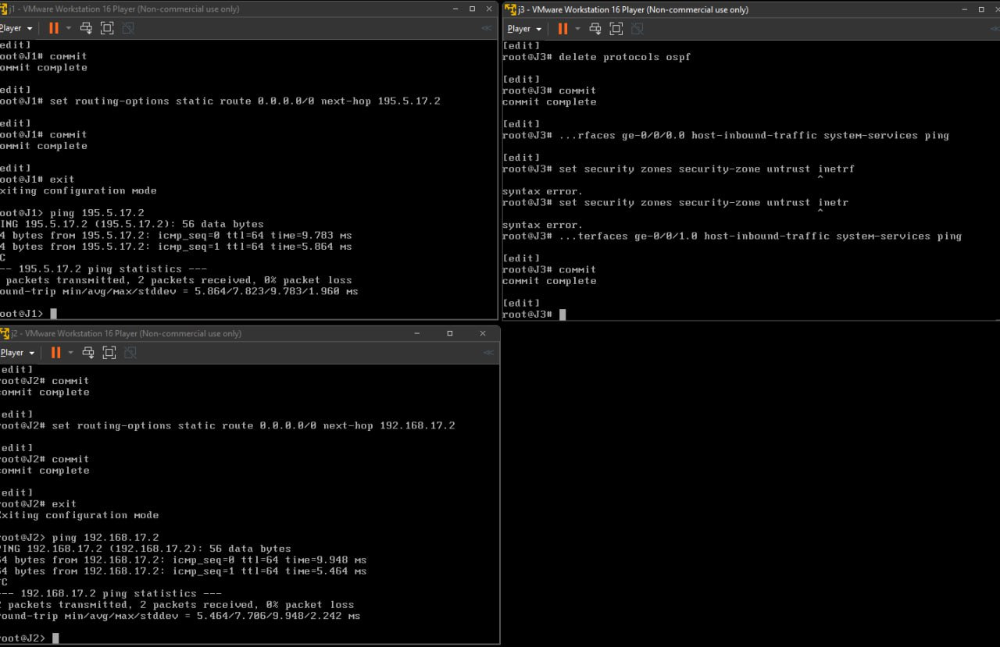
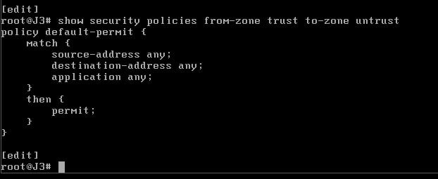
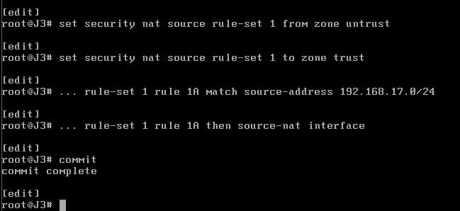
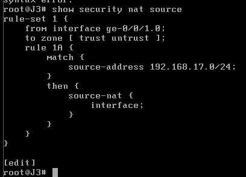
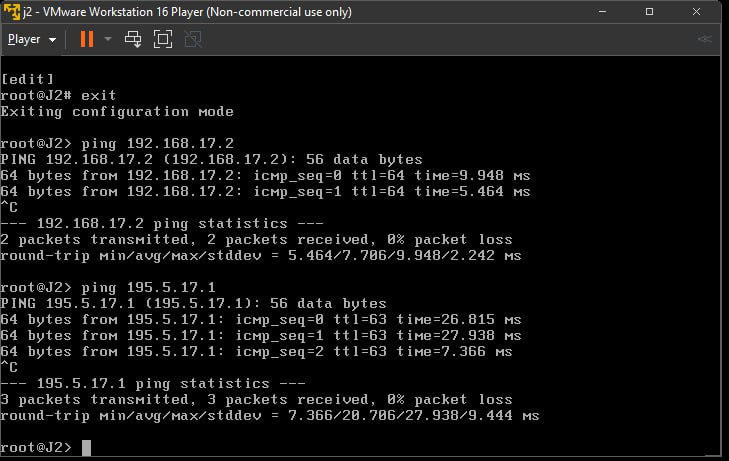

# ПРАКТИЧНА РОБОТА КРЕДИТНОГО МОДУЛЯ  
Тема: Налаштування NAT на Juniper SRX

## Опис мережевої топології

У лабораторній роботі використовується топологія, яка складається з трьох маршрутизаторів: J1 (trust-зона), J2 (untrust-зона) та J3 (NAT-шлюз). З’єднання між пристроями реалізоване через наступні інтерфейси:

- J1 підключений до J3 через мережу `195.5.17.0/24`:
  - J1: `195.5.17.1/24` (інтерфейс `ge-0/0/1`)
  - J3: `195.5.17.2/24` (інтерфейс `ge-0/0/0`)

- J2 підключений до J3 через мережу `192.168.17.0/24`:
  - J2: `192.168.17.1/24` (інтерфейс `ge-0/0/0`)
  - J3: `192.168.17.2/24` (інтерфейс `ge-0/0/1`)

Кожен маршрутизатор також має петльовий інтерфейс:
- J1: `10.0.0.1/32`
- J2: `10.0.0.2/32`
- J3: `10.0.0.3/32`

Уся зовнішня комунікація з мережі `192.168.17.0/24` (тобто з J2) відбувається через J3, який виконує функції NAT-шлюзу.  

## Переведення маршрутизаторів J1 та J2 у режим packet-based

Оскільки маршрутизатори J1 та J2 працюють у режимі packet-based, необхідно внести відповідні зміни у конфігурацію. За замовчуванням пристрої Juniper SRX працюють у flow-based (security) режимі, тому потрібно:

1. Видалити підсистему security;
2. Установити режим пересилання пакетів як packet-based;
3. Застосувати зміни за допомогою `commit`;
4. Перезавантажити маршрутизатор.

Ці дії виконуються як на J1, так і на J2. Нижче наведено приклад команд, які вводились на J1 (аналогічно — на J2):

```
configure
delete security
set security forwarding-options family mpls mode packet-based
commit
run request system reboot
```

Після виконання `commit` система виводить попередження про необхідність перезавантаження для активації змін, що пов’язані з режимом обробки трафіку. Перезавантаження підтверджується командою `yes`.

Результат: маршрутизатори J1 та J2 більше не використовують політики безпеки, і працюють як звичайні маршрутизатори, без Stateful Firewall функціоналу. Це необхідно для забезпечення коректного функціонування лабораторної топології, де функції безпеки виконує J3 у режимі flow-based.

(Я не додам скріншоти, бо вони такі самі з іншої роботи)


## Підтвердження режиму flow-based на маршрутизаторі J3

Оскільки маршрутизатор J3 за замовчуванням працює у режимі flow-based, немає потреби видаляти підсистему `security` чи переводити його у `packet-based` режим, як це робилося з J1 та J2. Flow-based режим на J3 є необхідним для реалізації функціоналу NAT та фільтрації трафіку, передбаченого лабораторною роботою.

Таким чином, після скидання конфігурації або завантаження базового шаблону для vSRX, J3 автоматично перебуває у потрібному режимі. Жодних додаткових налаштувань для зміни режиму пересилання пакетів на J3 виконувати не потрібно.

## Налаштування інтерфейсів та зон відповідно до топології

У цій лабораторній роботі використовується оновлена топологія з трьома маршрутизаторами J1, J2 та J3. Згідно з нею:

- J3 працює у режимі flow-based;
- J1 та J2 — у режимі packet-based;
- З'єднання між J1 ↔ J3 здійснюється по мережі 195.5.17.0/24 через інтерфейси `ge-0/0/0` на J3 та `ge-0/0/1` на J1;
- З'єднання між J2 ↔ J3 відбувається по мережі 192.168.17.0/24.

---

### Налаштування інтерфейсів на J3:

```bash
set interfaces ge-0/0/0 unit 0 family inet address 195.5.17.2/24
set interfaces ge-0/0/1 unit 0 family inet address 192.168.17.2/24
```

### Прив’язка інтерфейсів до зон безпеки:

```bash
set security zones security-zone trust interfaces ge-0/0/0.0
set security zones security-zone untrust interfaces ge-0/0/1.0
```

- ge-0/0/0.0 веде до мережі 195.5.17.0/24 і потрапляє в зону trust (тобто з'єднання з J1).
- ge-0/0/1.0 веде до мережі 192.168.17.0/24 і потрапляє в зону untrust (тобто з'єднання з J2).

---

### Налаштування інтерфейсів на J1:

Оскільки IP-адресація змінилася, на маршрутизаторі J1 необхідно встановити нову адресу на інтерфейсі `ge-0/0/0`:

```bash
set interfaces ge-0/0/0 unit 0 family inet address 195.5.17.1/24
```

Цей інтерфейс з’єднаний з J3, і разом вони утворюють мережу 195.5.17.0/24.

## Видалення OSPF та налаштування статичної маршрутизації

У попередніх лабораторних роботах для маршрутизації між маршрутизаторами J1, J2 та J3 використовувався протокол динамічної маршрутизації OSPF. Проте відповідно до вимог цієї роботи, необхідно перейти на статичну маршрутизацію.

### Видалення OSPF з J1 та J2

На обох маршрутизаторах (J1 та J2) було видалено OSPF наступною командою:

```bash
delete protocols ospf
```

Після цього система не використовує динамічну маршрутизацію для побудови таблиці маршрутів.

---

### Додавання статичних маршрутів

Для забезпечення коректного обміну даними між хостами через маршрутизатор J3 були додані маршрути за замовчуванням на J1 та J2, які направляють весь трафік через J3:

#### На маршрутизаторі J1:

```bash
set routing-options static route 0.0.0.0/0 next-hop 195.5.17.2
```

> Цей маршрут спрямовує увесь вихідний трафік з J1 до J3 через інтерфейс `ge-0/0/1` (адреса J3 — 195.5.17.2).

#### На маршрутизаторі J2:

```bash
set routing-options static route 0.0.0.0/0 next-hop 192.168.17.2
```

> Цей маршрут направляє увесь трафік з J2 через інтерфейс `ge-0/0/0`, підключений до J3.

---

Після налаштування маршрутизації J1 та J2 успішно обмінюються даними між собою через J3, навіть за відсутності прямого з'єднання. У наступних пунктах буде проведена перевірка доступності між пристроями та налаштовано NAT.


Ось як можна оформити цей пункт у звіті:

---

## Дозвіл ICMP (ping) на інтерфейсах J3

Для забезпечення можливості перевірки зв’язку між маршрутизаторами, необхідно дозволити ICMP-трафік (ping) на вхідних інтерфейсах маршрутизатора J3, які належать до зон trust і untrust.

Це досягається за допомогою налаштування `host-inbound-traffic` у відповідних security-зонах.

### Команди для налаштування:

```bash
set security zones security-zone trust interfaces ge-0/0/0.0 host-inbound-traffic system-services ping
set security zones security-zone untrust interfaces ge-0/0/1.0 host-inbound-traffic system-services ping
```

Після внесення змін необхідно виконати команду:

```bash
commit
```

---

### Перевірка доступності J3 з J1 та J2

Після застосування конфігурації було виконано перевірку зв’язку з J3 за допомогою команди `ping` з маршрутизаторів J1 та J2:

- З J1:

```bash
ping 195.5.17.2
```

- З J2:

```bash
ping 192.168.17.2
```



У обох випадках ICMP-запити були успішно доставлені, що підтверджує коректну роботу `host-inbound-traffic` і правильне налаштування зон безпеки. Це забезпечує базову комунікацію, необхідну для подальших налаштувань NAT.

## Перевірка політики безпеки з зони trust до зони untrust

На даному етапі було перевірено налаштування політики безпеки для трафіку, що прямує з зони trust (мережа J1) до зони untrust (мережа J2).

Для цього на маршрутизаторі J3 була виконана команда:

```bash
show security policies from-zone trust to-zone untrust
```

Результат показує, що активна політика має назву `default-permit`, яка дозволяє увесь трафік між зонами незалежно від джерела, призначення чи типу застосунку:

```text
policy default-permit {
  match {
    source-address any;
    destination-address any;
    application any;
  }
  then {
    permit;
  }
}
```



Ця політика дозволяє весь вхідний та вихідний трафік між зазначеними зонами без будь-яких обмежень. Це забезпечує прозорість маршрутизації між зонами та дозволяє виконувати NAT, що буде реалізовано на наступному етапі. Однак у продуктивному середовищі така політика є потенційно небезпечною та має бути замінена на більш детальну з фільтрами за IP-адресами та протоколами.


## Перевірка політики безпеки з зони untrust до зони trust

На цьому етапі було перевірено політику безпеки для трафіку, який надходить із зони untrust у зону trust, тобто з J2 до J1. Для цього на маршрутизаторі J3 була виконана команда:

```bash
show security policies from-zone untrust to-zone trust
```

Результат показує, що активна політика має назву `default-deny`, яка забороняє увесь трафік між зазначеними зонами незалежно від IP-адрес чи типу застосунку:

```text
policy default-deny {
  match {
    source-address any;
    destination-address any;
    application any;
  }
  then {
    deny;
  }
}
```


Ця політика запроваджена для блокування ініціації з’єднань з менш довіреної зони (untrust) до більш довіреної (trust). Це є стандартною практикою для підвищення рівня безпеки: лише трафік, що ініціюється з trust-зони, дозволений, тоді як з untrust — блокується.


Ось оновлений і виправлений варіант пункту звіту, відповідно до правильного напрямку NAT (з зони untrust до trust) і коректного інтерфейсу:

---

## Налаштування NAT відповідно до топології

Згідно з топологією, трафік з мережі `192.168.17.0/24` (зона `untrust`) має виходити в мережу `195.5.17.0/24` (зона `trust`) через інтерфейс `ge-0/0/0` маршрутизатора J3. Для цього необхідно налаштувати Source NAT (Network Address Translation) з підміною адреси на адресу вихідного інтерфейсу.

Налаштування NAT виконується наступними командами:

```bash
set security nat source rule-set 1 from interface ge-0/0/1.0
set security nat source rule-set 1 to zone trust
set security nat source rule-set 1 rule 1A match source-address 192.168.17.0/24
set security nat source rule-set 1 rule 1A then source-nat interface
commit
```

> Пояснення:
> - `from interface ge-0/0/1.0` — інтерфейс, з якого надходить трафік з зони `untrust`;
> - `to zone trust` — NAT застосовується при виході в зону `trust`;
> - `source-address` — адреси джерела, які підлягають трансляції;
> - `then source-nat interface` — підміна джерела на IP-адресу вихідного інтерфейсу (тобто `ge-0/0/0`, що веде в trust).



Це дозволяє вузлам з `untrust`-мережі, зокрема J2, виходити в мережу `195.5.17.0/24` (наприклад, на інтерфейс J1) шляхом трансляції їх IP-адрес на зовнішню адресу інтерфейсу J3.



---

Готово! Далі переходимо до перевірки дії NAT через статистику?
## Перевірка працездатності NAT

На цьому етапі було виконано перевірку налаштувань NAT шляхом запуску ICMP-запитів (ping) з маршрутизатора J2 до J1. Згідно з топологією, IP-адреса інтерфейсу маршрутизатора J1, що під’єднаний до зони trust, — 195.5.17.1. Відповідно, було виконано команду:

```
run ping 195.5.17.1
```



У результаті видно успішну відповідь на всі ICMP-запити, що свідчить про правильно налаштований NAT. Завдяки NAT-перетворенню вихідний IP-адрес з підмережі `192.168.17.0/24` був замінений на адресу зовнішнього інтерфейсу J3, що дало змогу пакетам досягти J1.

Це підтверджує, що:
- правила NAT працюють коректно;
- маршрутизація з боку J1 також налаштована правильно;
- безпекові політики дозволяють проходження ICMP-трафіку із зони untrust до зони trust.


## Перевірка спрацювання NAT

Для підтвердження коректності роботи NAT виконується команда:

```bash
run show security nat source rule 1A
```

У результаті мають з’явитися статистичні дані, які відображають кількість трансляцій. Зокрема, цікавлять такі параметри:

- Translation hits — кількість спрацювань NAT;
- Successful sessions — кількість успішно трансльованих з’єднань;
- Failed sessions — невдалі спроби трансляції;
- Number of sessions — поточна кількість активних сесій.

Після надсилання ICMP-запитів (ping) з J2 до J1 через J3, ці показники повинні збільшитися, що підтверджує проходження трафіку через налаштоване NAT.

На наведеному нижче зображенні видно, що NAT дійсно працює, оскільки було зафіксовано 7 успішних трансляцій:


Це підтверджує правильність налаштування та функціонування механізму NAT у мережі відповідно до заданої топології.

## Висновок

У ході виконання практичної роботи було налаштовано NAT (Network Address Translation) на маршрутизаторі Juniper SRX відповідно до заданої мережевої топології. Було розділено інтерфейси маршрутизатора J3 на зони безпеки `trust` та `untrust`, після чого реалізовано правила політики безпеки для керування міжзонним трафіком.  

Особливу увагу було приділено налаштуванню NAT для маршрутизації трафіку з внутрішньої мережі `192.168.17.0/24` (зона `untrust`) до зовнішньої мережі `195.5.17.0/24` (зона `trust`) із підміною адреси вихідного інтерфейсу. За допомогою відповідних команд було створено NAT-правила, які забезпечують трансляцію IP-адрес при виході у зовнішню мережу.

Проведено тестування шляхом надсилання ICMP-пакетів з J2 на J1, у результаті чого спостерігалася успішна трансляція та підтвердження роботи NAT через статистику трансляцій.

Таким чином, поставлену задачу було успішно виконано. Отримані практичні навички з налаштування NAT, політик безпеки та зони конфіденційності є важливими для подальшої роботи з мережевими пристроями Juniper.
