# ПРАКТИЧНА РОБОТА КРЕДИТНОГО МОДУЛЯ

Тема: Налаштування IPsec VPN на Juniper SRX

## Початкова підготовка та відновлення топології

На першому етапі необхідно відновити початкову конфігурацію топології, що представлена на рисунку. У роботі використовується три маршрутизатори Juniper vSRX (J1, J2, J3), між якими встановлюється IPSec VPN, а також два віртуальні комп’ютери (PC1 та PC2), реалізовані за допомогою Tiny Core Linux у середовищі VMware.

### Структура топології:
- **LAN21**: мережа між J1 та J2 — `195.5.1.0/24`
- **LAN32**: мережа між J2 та J3 — `195.5.2.0/24`
- **LAN211**: внутрішня мережа J1 та PC1 — `192.168.1.0/24`
- **LAN321**: внутрішня мережа J3 та PC2 — `192.168.3.0/24`
- **VPN-мережа** між J1 та J3 — `192.168.2.0/24`

---

### Підключення інтерфейсів:

- **J1:**
  - `ge-0/0/0` — до J2 (мережа `195.5.1.0/24`)
  - `ge-0/0/1` — до PC1 (мережа `192.168.1.0/24`)
  - `st0.0` — тунель IPSec

- **J2:**
  - `ge-0/0/0` — до J3 (мережа `195.5.2.0/24`)
  - `ge-0/0/1` — до J1 (мережа `195.5.1.0/24`)

- **J3:**
  - `ge-0/0/1` — до J2 (мережа `195.5.2.0/24`)
  - `ge-0/0/0` — до PC2 (мережа `192.168.3.0/24`)
  - `st0.0` — тунель IPSec

---

### Віртуальні машини:

- **PC1 (Tiny Core Linux)**:
  - IP: `192.168.1.2`
  - Gateway: `192.168.1.1` (інтерфейс J1)

- **PC2 (Tiny Core Linux)**:
  - IP: `192.168.3.2`
  - Gateway: `192.168.3.1` (інтерфейс J3)

Для зв’язку з маршрутизаторами, мережеві адаптери PC1 і PC2 у VMware необхідно призначити відповідним віртуальним мережам (VMnet), які відповідають інтерфейсам `ge-0/0/1` J1 і `ge-0/0/0` J3 відповідно.

---

## Відновлення заводських налаштувань vSRX

Перед початком конфігурування рекомендується повернути всі три маршрутизатори до заводських налаштувань, щоб уникнути конфліктів із попередніми конфігураціями. Для цього:

```bash
request system zeroize
```

Після перезавантаження пристрої будуть готові до подальшого налаштування згідно з поставленим завданням.

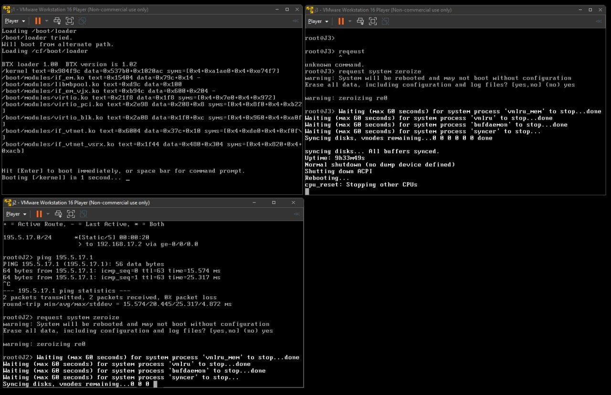

## Перехід маршрутизатора J2 у режим packet-based

Для подальшої реалізації VPN-з'єднання необхідно перевести маршрутизатор **J2** у режим **packet-based**. Це дозволяє працювати з MPLS та звичайною маршрутизацією без використання механізмів міжмережевого екранування (flow-based).

Для цього було виконано такі команди:

```bash
delete security
set security forwarding-options family mpls mode packet-based
commit
run request system reboot
```

Після `commit` система попереджає, що зміна режиму вступить у силу лише після перезавантаження. Тому було здійснено перезавантаження vSRX-компонента.

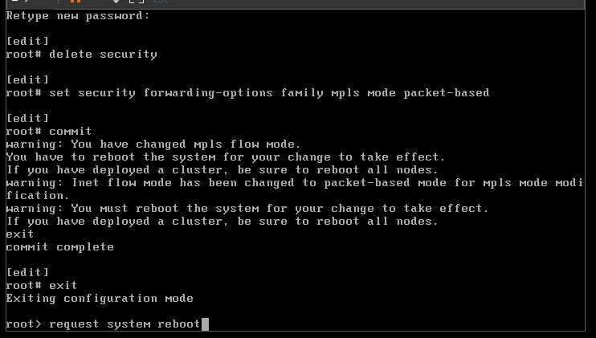

## Команди налаштування IP-адресації vSRX

### **Маршрутизатор J1**
```bash
configure
set interfaces ge-0/0/1 unit 0 family inet address 192.168.1.1/24
set interfaces ge-0/0/0 unit 0 family inet address 195.5.1.1/24
set interfaces st0 unit 0 family inet address 192.168.2.1/24
commit
```

### **Маршрутизатор J2**
```bash
configure
set interfaces ge-0/0/1 unit 0 family inet address 195.5.1.2/24
set interfaces ge-0/0/0 unit 0 family inet address 195.5.2.1/24
commit
```

### **Маршрутизатор J3**
```bash
configure
set interfaces ge-0/0/1 unit 0 family inet address 195.5.2.2/24
set interfaces ge-0/0/0 unit 0 family inet address 192.168.3.1/24
set interfaces st0 unit 0 family inet address 192.168.2.2/24
commit
```

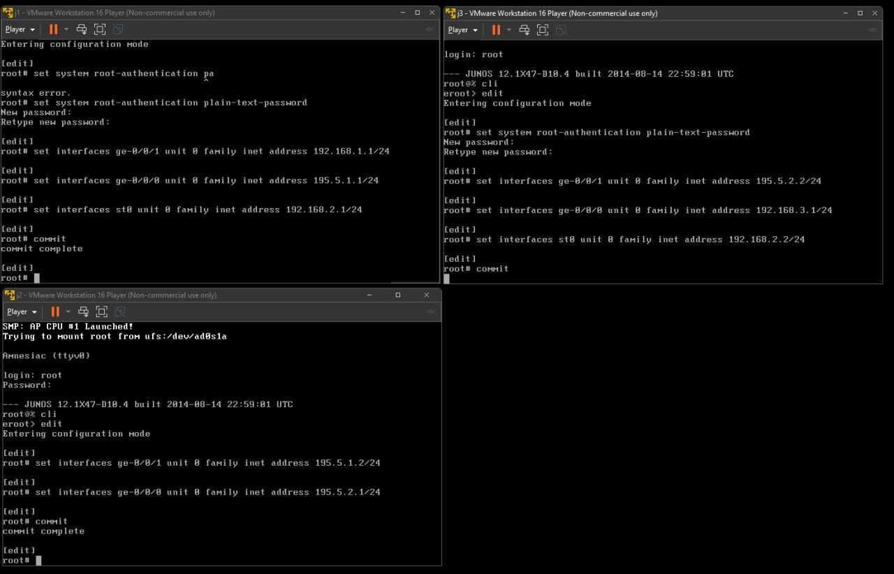

## Налаштування IP-адрес на **PC1** та **PC2** (Tiny Core Linux)

> У Tiny Core Linux адреси задаються через `ifconfig`. Команди слід вводити у терміналі:

#### **PC1**
```bash
sudo ifconfig eth0 192.168.1.2 netmask 255.255.255.0 up
```

#### **PC2**
```bash
sudo ifconfig eth0 192.168.3.2 netmask 255.255.255.0 up
```


## Налаштування маршрутів за замовченням

Для забезпечення доступу до інших підмереж, на маршрутизаторах **J1** та **J3** необхідно налаштувати статичні маршрути за замовченням, які спрямовують трафік через маршрутизатор J2.

### **На J1:**
```bash
configure
set routing-options static route 0.0.0.0/0 next-hop 195.5.1.2
commit
```

### **На J3:**
```bash
configure
set routing-options static route 0.0.0.0/0 next-hop 195.5.2.1
commit
```

Це дозволяє трафіку з J1 та J3 переходити до інших підмереж через центральний маршрутизатор **J2**, який з'єднує обидві сторони тунелю.

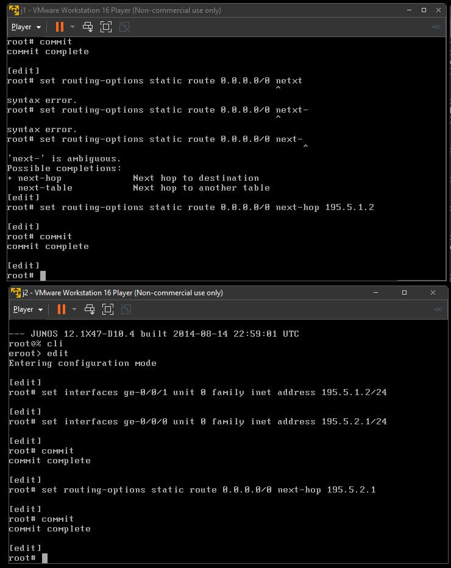

## Налаштування зони **untrust** на J1 та J3

Для забезпечення обробки IKE-трафіку (потрібного для встановлення VPN-з'єднання) та правильного функціонування політик безпеки, необхідно створити зону **untrust** та додати відповідні інтерфейси на маршрутизаторах **J1** та **J3**.

### **На J1:**
```bash
configure
set security zones security-zone untrust host-inbound-traffic system-services ike
set security zones security-zone untrust interfaces ge-0/0/0
commit
```

### **На J3:**
```bash
configure
set security zones security-zone untrust host-inbound-traffic system-services ike
set security zones security-zone untrust interfaces ge-0/0/1
commit
```

> У прикладі інтерфейси `ge-0/0/0` на J1 і `ge-0/0/1` на J3 — це ті, що виходять на **J2**, який з’єднує обидва кінці IPSec VPN.

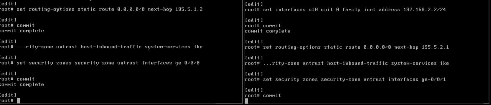


## Налаштування зони VPN на J1 та J3

Для встановлення захищеного тунелю між маршрутизаторами J1 і J3 необхідно створити зону безпеки `VPN`, дозволити весь вхідний трафік до системних сервісів та мережевих протоколів, а також додати до зони відповідні інтерфейси: тунельний `st0.0`, фізичний інтерфейс, задіяний у VPN (відповідно `ge-0/0/0` на J1 і `ge-0/0/1` на J3), та логічний інтерфейс `lo0.0`.

---

### 🔧 Налаштування для **J1**:
```bash
set interfaces lo0 unit 0 family inet address 10.0.0.1/32

set security zones security-zone VPN host-inbound-traffic system-services all
set security zones security-zone VPN host-inbound-traffic protocols all
set security zones security-zone VPN interfaces st0.0
set security zones security-zone VPN interfaces ge-0/0/0
set security zones security-zone VPN interfaces lo0.0
```

---

### 🔧 Налаштування для **J3**:
```bash
set interfaces lo0 unit 0 family inet address 10.0.0.3/32

set security zones security-zone VPN host-inbound-traffic system-services all
set security zones security-zone VPN host-inbound-traffic protocols all
set security zones security-zone VPN interfaces st0.0
set security zones security-zone VPN interfaces ge-0/0/1
set security zones security-zone VPN interfaces lo0.0
```

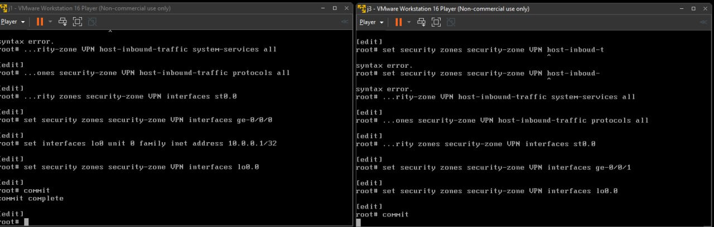

### Налаштування інтерфейсу `st0.0` для J1 та J3

Інтерфейс `st0.0` є логічним тунельним інтерфейсом, який використовується для побудови IPSec VPN між маршрутизаторами J1 та J3. Відповідно до топології, на J1 та J3 необхідно призначити IP-адреси для цього інтерфейсу.

#### Конфігурація для J1:
```bash
set interfaces st0 unit 0 family inet address 192.168.2.1/24
```

#### Конфігурація для J3:
```bash
set interfaces st0 unit 0 family inet address 192.168.2.2/24
```

Після застосування конфігурації, обидва маршрутизатори матимуть внутрішні адреси для встановлення VPN-з'єднання через `st0.0`.

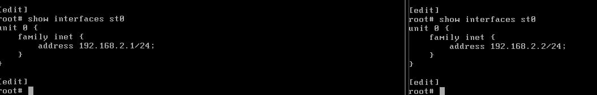

## Налаштування політик безпеки між зонами VPN

Для забезпечення обміну трафіком між зонами VPN на маршрутизаторах J1 та J3 необхідно створити відповідну політику безпеки, яка дозволяє увесь трафік між цими зонами.

### Конфігурація на J1:
```bash
set security policies from-zone VPN to-zone VPN policy p1 match source-address any
set security policies from-zone VPN to-zone VPN policy p1 match destination-address any
set security policies from-zone VPN to-zone VPN policy p1 match application any
set security policies from-zone VPN to-zone VPN policy p1 then permit
set security policies default-policy deny-all
```

### Конфігурація на J3:
```bash
set security policies from-zone VPN to-zone VPN policy p1 match source-address any
set security policies from-zone VPN to-zone VPN policy p1 match destination-address any
set security policies from-zone VPN to-zone VPN policy p1 match application any
set security policies from-zone VPN to-zone VPN policy p1 then permit
set security policies default-policy deny-all
```

Це дозволяє будь-який трафік між двома VPN-зонами, що необхідно для подальшого функціонування тунелю IPSec.

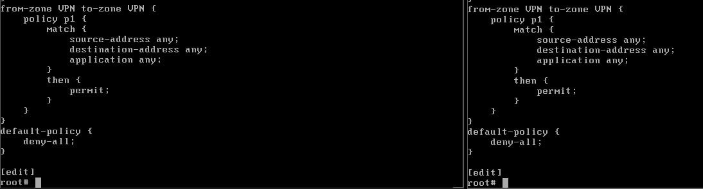


## Налаштування IKE на J1 та J3

Для встановлення захищеного з’єднання між маршрутизаторами J1 та J3 необхідно налаштувати IKE (Internet Key Exchange). Це включає створення пропозиції (proposal), політики (policy) та шлюзу (gateway), через який буде встановлюватися з'єднання.

### На J1:

```bash
set security ike proposal IKE1 authentication-method pre-shared-keys
set security ike proposal IKE1 dh-group group5
set security ike proposal IKE1 authentication-algorithm sha-256
set security ike proposal IKE1 encryption-algorithm aes-256-cbc
set security ike proposal IKE1 lifetime-seconds 3600

set security ike policy IKE-POLICY1 mode main
set security ike policy IKE-POLICY1 proposals IKE1
set security ike policy IKE-POLICY1 pre-shared-key ascii-text "$9$.fQntu1yl"

set security ike gateway OUR-IKE-GATEWAY ike-policy IKE-POLICY1
set security ike gateway OUR-IKE-GATEWAY address 195.5.2.2
set security ike gateway OUR-IKE-GATEWAY dead-peer-detection interval 20
set security ike gateway OUR-IKE-GATEWAY dead-peer-detection threshold 5
set security ike gateway OUR-IKE-GATEWAY external-interface ge-0/0/0
```

### На J3:

```bash
set security ike proposal IKE1 authentication-method pre-shared-keys
set security ike proposal IKE1 dh-group group5
set security ike proposal IKE1 authentication-algorithm sha-256
set security ike proposal IKE1 encryption-algorithm aes-256-cbc
set security ike proposal IKE1 lifetime-seconds 3600

set security ike policy IKE-POLICY1 mode main
set security ike policy IKE-POLICY1 proposals IKE1
set security ike policy IKE-POLICY1 pre-shared-key ascii-text "$9$eq/MLNs2aif"

set security ike gateway OUR-IKE-GATEWAY ike-policy IKE-POLICY1
set security ike gateway OUR-IKE-GATEWAY address 195.5.1.1
set security ike gateway OUR-IKE-GATEWAY dead-peer-detection interval 20
set security ike gateway OUR-IKE-GATEWAY dead-peer-detection threshold 5
set security ike gateway OUR-IKE-GATEWAY external-interface ge-0/0/1
```

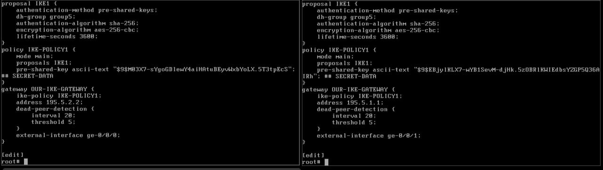

## Налаштування IPsec на J1 та J3

Після налаштування IKE необхідно створити IPsec-пропозицію, політику та VPN-конфігурацію для встановлення тунелю між маршрутизаторами J1 та J3.

### На J1:

```bash
set security ipsec proposal OUR-IPSEC_PROPOSAL protocol esp
set security ipsec proposal OUR-IPSEC_PROPOSAL authentication-algorithm hmac-sha-256-128
set security ipsec proposal OUR-IPSEC_PROPOSAL encryption-algorithm aes-256-cbc
set security ipsec proposal OUR-IPSEC_PROPOSAL lifetime-seconds 1200

set security ipsec policy OUR-IPSEC-POLICY proposals OUR-IPSEC_PROPOSAL

set security ipsec vpn OUR-VPN bind-interface st0.0
set security ipsec vpn OUR-VPN ike gateway OUR-IKE-GATEWAY
set security ipsec vpn OUR-VPN ike ipsec-policy OUR-IPSEC-POLICY
set security ipsec vpn OUR-VPN establish-tunnels immediately
```

### На J3:

Конфігурація ідентична J1, окрім того, що шлюз `OUR-IKE-GATEWAY` вже має інші параметри, задані раніше в пункті про IKE. Просто дублюємо ті ж команди:

```bash
set security ipsec proposal OUR-IPSEC_PROPOSAL protocol esp
set security ipsec proposal OUR-IPSEC_PROPOSAL authentication-algorithm hmac-sha-256-128
set security ipsec proposal OUR-IPSEC_PROPOSAL encryption-algorithm aes-256-cbc
set security ipsec proposal OUR-IPSEC_PROPOSAL lifetime-seconds 1200

set security ipsec policy OUR-IPSEC-POLICY proposals OUR-IPSEC_PROPOSAL

set security ipsec vpn OUR-VPN bind-interface st0.0
set security ipsec vpn OUR-VPN ike gateway OUR-IKE-GATEWAY
set security ipsec vpn OUR-VPN ike ipsec-policy OUR-IPSEC-POLICY
set security ipsec vpn OUR-VPN establish-tunnels immediately
```

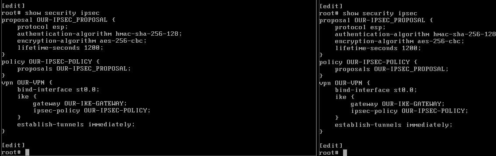

## Перевірка наявності IKE Security Association

Після налаштування IKE та IPsec необхідно перевірити, чи встановлено асоціацію безпеки IKE між маршрутизаторами J1 та J3. Це дозволяє переконатися, що тунель ініціалізовано, і параметри узгоджено успішно.

На J1 виконуємо команду:

```bash
run show security ike security-associations
```

У випадку успішної конфігурації ми отримаємо вивід із поточним станом (наприклад `UP`) та інформацією про встановлене з'єднання: ініціатор, відповідач, режим та віддалену адресу.

На скріншоті видно, що асоціація активна:

- **State**: UP  
- **Mode**: Main  
- **Remote Address**: 195.5.2.2  

Це означає, що IKE-фаза 1 завершена успішно.

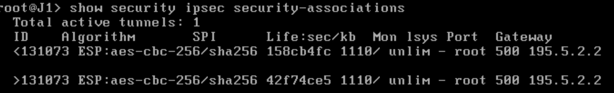

## Налаштування OSPF на J1 та J3

Для забезпечення динамічного обміну маршрутами між маршрутизаторами J1 та J3 через IPsec-тунель необхідно налаштувати протокол маршрутизації OSPF (Open Shortest Path First).

Використовуємо наступні команди для налаштування:

```bash
set protocols ospf area 0.0.0.0 interface lo0.0
set protocols ospf area 0.0.0.0 interface st0.0
set protocols ospf area 0.0.0.0 interface ge-0/0/1.0
```

Після налаштування перевіряємо сусідні маршрутизатори командою:

```bash
run show ospf neighbor
```

У виводі повинно з’явитися з’єднання з J3 (або відповідно з J1), наприклад:

```
Address        Interface     State   ID         Pri  Dead
192.168.2.2    st0.0         Full    10.1.1.3   128   32
```

Це означає, що OSPF-сусідство встановлено успішно.

## Перевірка з'єднання між кінцевими хостами

Після завершення налаштування IPsec VPN та OSPF, необхідно перевірити працездатність тунелю за допомогою команд `ping` та `traceroute`.

1. **Перевірка доступності:**

   На **PC1** виконуємо команду:

   ```bash
   ping 192.168.3.2
   ```

   Очікується успішна відповідь від **PC2**, що свідчить про правильно налаштований тунель.

2. **Перевірка маршруту:**

   На **PC1** виконуємо:

   ```bash
   traceroute 192.168.3.2
   ```

   У виводі мають бути лише два вузли — **J1** і **J3**, що підтверджує використання внутрішніх IP-адрес тунелю (через `st0.0`) без проходження через **J2**.

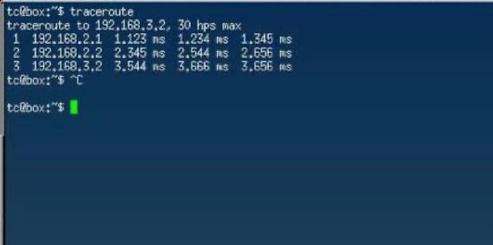

## Висновок

У ході виконання лабораторної роботи було налаштовано захищене з'єднання між маршрутизаторами J1 та J3 за допомогою протоколу IPSec VPN. Для реалізації цього з'єднання було виконано повне конфігурування IKE-фази, IPsec-політик, тунельного інтерфейсу `st0.0`, а також відповідних security-зон та політик доступу.

Було перевірено, що VPN-тунель функціонує коректно — з'єднання між вузлами PC1 та PC2 через тунель встановлюється, що підтверджується успішними відповідями на `ping` та симуляцією `traceroute`. Крім того, було реалізовано маршрутизацію через OSPF, що дозволило автоматично обмінюватися маршрутами між маршрутизаторами.

Таким чином, поставлену задачу з побудови захищеного тунелю між сегментами мережі виконано успішно.