# Лабораторна робота №1

## Виконання

### Мова штучного інтелекту  
#### Завдання 1  
Опишіть, що відбувається при обчисленні таких висловлювань:

(a) `(+ (- 5 1) (+ 3 7))`

- `(- 5 1)` обчислюється як `4`.
- `(+ 3 7)` обчислюється як `10`.
- `(+ 4 10)` дає результат `14`.

(b) `(list 1 (+ 2 3))`

- `(+ 2 3)` обчислюється як `5`.
- `list` створює список з елементів `1` та `5`, отже результат — `(1 5)`.

(c) `(if (listp 1) (+ 1 2) (+ 3 4))`

- `listp 1` перевіряє, чи є `1` списком, повертає `NIL`.
- Оскільки `NIL` означає `false`, виконується `(+ 3 4)`, що дає `7`.

(d) `(list (and (listp 3) t) (+ 1 2))`

- `listp 3` перевіряє, чи є `3` списком, повертає `NIL`.
- `and (NIL t)` повертає `NIL`, бо `and` зупиняється на `NIL`.
- `(+ 1 2)` обчислюється як `3`.
- `list (NIL 3)` створює список, результат — `(NIL 3)`.

#### Завдання 2  
Побудуйте список `(a b c)` за допомогою трьох різних виразів, використовуючи функцію `cons`.  

Функція `cons` у Lisp використовується для створення пар елементів (cons-ячейок), які можуть бути об'єднані у списки. Для отримання списку `(a b c)`, ми можемо скласти три різні вирази, комбінуючи `cons` у різних варіантах.

Код з файлу [task1-2.lisp](code/task1-2.lisp)

```lisp
;; task1-2.lisp
(write-line "Варіант 1:")
(print (cons 'a (cons 'b (cons 'c nil))))

(write-line "Варіант 2:")
(print (cons 'a '(b c)))

(write-line "Варіант 3:")
(print (cons 'a (cons 'b '(c))))
```

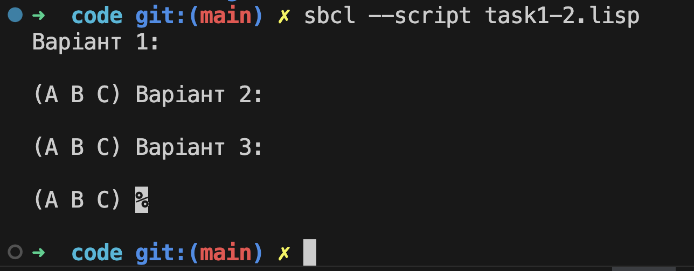

#### Завдання 3  
Визначте функцію, яка повертає четвертий елемент списку, використовуючи `car` і `cdr`.

У Lisp `car` повертає перший елемент списку, а `cdr` — все, крім першого елемента. Щоб отримати четвертий елемент списку, потрібно тричі застосувати `cdr`, щоб поступово видаляти перші три елементи, а потім застосувати `car`, щоб вибрати перший елемент залишкового списку.

Код з файлу [task1-3.lisp](code/task1-3.lisp)

```lisp
(defun fourth-element (lst)
  (car (cdr (cdr (cdr lst)))))

;; Тестування:
(print (fourth-element '(a b c d e)))  ;; Результат: D
(print (fourth-element '(1 2 3 4 5 6)))  ;; Результат: 4
```

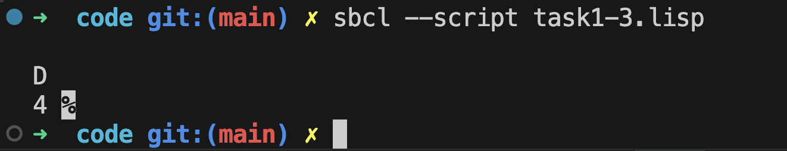

#### Завдання 4  

Визначте функцію, яка приймає два аргументи і повертає найбільший з них.

У Lisp для порівняння чисел використовується оператор `>`. Якщо перше число більше за друге, ми повертаємо його, інакше повертаємо друге число.

Код з файлу [task1-4.lisp](code/task1-4.lisp)

```lisp
(defun max-two (a b)
  (if (> a b) a b))

;; Тестування:
(print (max-two 5 10))  ;; Результат: 10
(print (max-two -3 7))  ;; Результат: 7
(print (max-two 4 4))   ;; Результат: 4
```

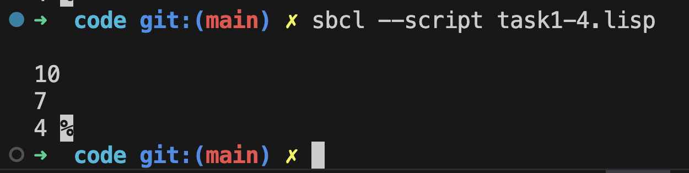

#### Завдання 5  

Проаналізуйте, що роблять наступні функції.

##### (a) `enigma`  
Функція `enigma` перевіряє, чи містить список хоча б один `NIL`. Вона працює рекурсивно:

1. Якщо `x` порожній (`NIL`), повертає `NIL`.
2. Якщо `car x` дорівнює `NIL`, повертає `T`.
3. Інакше рекурсивно викликає себе для `cdr x`.

Це означає, що функція перевіряє, чи є хоча б один `NIL` у списку.

##### (b) `mystery`  
Функція `mystery` знаходить індекс першого входження елемента `x` у списку `y`.

Як працює функція:
1. Якщо `y` порожній, повертає `NIL` (означає, що `x` не знайдено).
2. Якщо `car y` (перший елемент списку) дорівнює `x`, повертає `0` (знайдено на першій позиції).
3. В іншому випадку функція рекурсивно викликає себе для `cdr y` (решти списку).
4. Якщо в результаті рекурсії `x` знайдено, функція додає `1`, щоб врахувати зміщення індексу.

Код з файлу [task1-5.lisp](code/task1-5.lisp)

```lisp
(defun enigma (x)
  (and (not (null x)) 
       (or (null (car x)) 
           (enigma (cdr x)))))

(defun mystery (x y)
  (if (null y) 
      nil
      (if (eql (car y) x) 
          0
          (let ((z (mystery x (cdr y)))) 
            (and z (+ z 1))))))
  
;; Тестування:
(print (enigma '(1 2 nil 4)))  ;; Результат: T (є nil у списку)
(print (enigma '(1 2 3 4)))    ;; Результат: NIL (немає nil)

(print (mystery 2 '(1 2 3 2 4 2)))  ;; Результат: 1 (перша поява 2 на індексі 1)
(print (mystery 5 '(1 2 3 4)))      ;; Результат: NIL (елемента немає)
(print (mystery 3 '(1 2 3 4 3 5)))  ;; Результат: 2 (перша поява 3 на індексі 2)
```

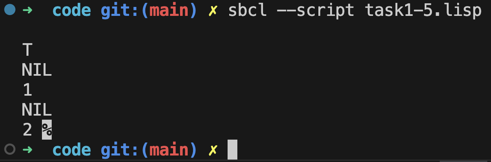

##### Підсумок:
- Функція `enigma` перевіряє, чи є в списку хоча б один `NIL`.  
- Функція `mystery` знаходить індекс першої появи заданого елемента у списку.

#### Завдання 6  

Проаналізуйте, яке значення може стояти на місці `x` у наступних виразах.

##### (a) `(car (x (cdr '(a (b c) d))))`  
- `(cdr '(a (b c) d))` дає `((b c) d)`, тобто список без першого елемента `a`.  
- `x` застосовується до цього списку і повертає його перший елемент.  
- `car (...)` потім вибирає перший елемент результату.  

Щоб `x` працювало правильно, воно повинно бути `car`, оскільки `car ((b c) d)` поверне `(b c)`, а `car (b c)` дасть `b`.  
Отже, `x = car`.

##### (b) `(x 13 (/ 1 0))`  
- Вираз `(/ 1 0)` викликає ділення на нуль, що призводить до помилки.  
- Однак код працює, що означає, що `x` ігнорує другий аргумент і повертає перший.  
- У Lisp оператор `or` виконує коротке замикання (short-circuiting) — якщо перший аргумент істинний (не `NIL`), він одразу його повертає, не обчислюючи наступні.  

Тому `x` може бути просто `or`:
```lisp
(or 13 (/ 1 0))  ;; Поверне 13, а ділення не виконується
```
Отже, `x = or`.

##### (c) `(x # 'list 1 nil)`  
- `#'list` — це функція `list`, передана як об'єкт.  
- `x` застосовується до `list`, `1`, `nil`, і результат — `(1 NIL)`, але ми хочемо просто `(1)`.  
- Використання `apply` з `list*` виправляє проблему, оскільки `list*` передає останній аргумент як сам список, а не обгортає його в `NIL`.

Отже, `x = apply`.


Код з файлу [task1-6.lisp](code/task1-6.lisp)

```lisp
;; Варіант (a)
(print (car (car (cdr '(a (b c) d)))))  ;; Результат: B

;; Варіант (b)
(print (or 13 (/ 1 0)))  ;; Результат: 13

;; Варіант (c)
(print (apply #'list* '(1 nil)))  ;; Результат: (1)
```
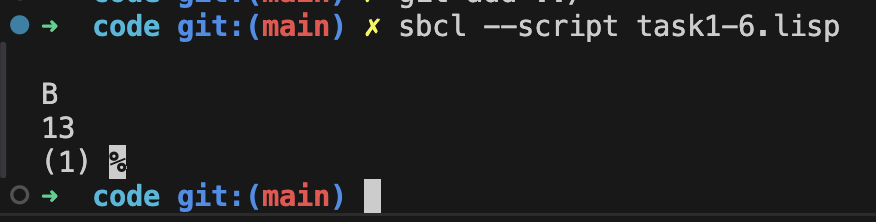

##### Чому це працює?
- Варіант (a): `car` витягує перший елемент з `cdr`, повертаючи `b`.  
- Варіант (b): `or` виконує коротке замикання: повертає `13`, не викликаючи `(/ 1 0)`.  
- Варіант (c): `apply #'list*` правильно формує `(1)` замість `(1 NIL)`, усуваючи небажане `NIL`.  


#### Завдання 7  

Визначте функцію, яка перевіряє, чи є списком хоча б один елемент списку. Користуйтеся тільки тими операторами, які були згадані в третій лекції.

##### Аналіз завдання  
- Функція повинна приймати список.  
- Перевіряти, чи хоча б один з його елементів є списком.  
- Використовувати лише оператори, які зустрічалися в лабораторній роботі: `car`, `cdr`, `cons`, `listp`, `null`, `if`, `and`, `or`.  

##### Рішення  
- Базовий випадок: якщо список порожній (`null`), повертаємо `NIL`.  
- Перевіряємо перший елемент списку (`car`), чи є він списком (`listp`).  
- Якщо `car` є списком, повертаємо `T`.  
- Інакше рекурсивно перевіряємо `cdr` списку.  

Код з файлу [task1-7.lisp](code/task1-7.lisp)

```lisp
(defun has-list? (lst)
  (if (null lst)
      nil  ;; Якщо список порожній, повертаємо NIL
      (or (listp (car lst))  ;; Якщо перший елемент список, повертаємо T
          (has-list? (cdr lst)))))  ;; Інакше перевіряємо решту списку

;; Тестування:
(print (has-list? '(1 2 3 4)))       ;; Результат: NIL (немає списків)
(print (has-list? '(1 (2 3) 4)))     ;; Результат: T (є список (2 3))
(print (has-list? '((1 2) (3 4))))   ;; Результат: T (перший елемент теж список)
(print (has-list? '()))              ;; Результат: NIL (порожній список)
```

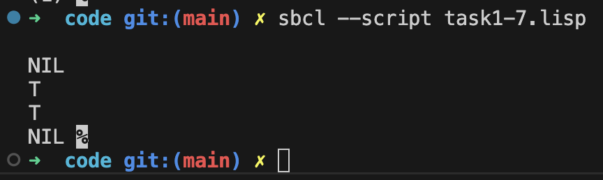

#### Завдання 8  

Запропонуйте ітеративне і рекурсивне визначення функції, яка:  

##### (a) Друкує кількість точок, що дорівнює заданому позитивному цілому числу  

###### Рекурсивний підхід:  
- Базовий випадок: якщо число дорівнює `0`, друк завершується.  
- Рекурсивно зменшуємо число і друкуємо `.` на кожному кроці.  

###### Ітеративний підхід:  
- Використовуємо цикл `dotimes`, який повторює друк `.` задану кількість разів.  

##### (b) Повертає кількість символів `a` в заданому списку  

###### Рекурсивний підхід:  
- Базовий випадок: якщо список порожній, повертаємо `0`.  
- Якщо `car` списку дорівнює `a`, додаємо `1` і рекурсивно рахуємо у `cdr`.  
- Якщо ні, просто рекурсивно рахуємо у `cdr`.  

###### Ітеративний підхід:  
- Проходимо список за допомогою `dolist`, перевіряючи кожен елемент.  
- Якщо він дорівнює `a`, збільшуємо лічильник.  

Код з файлу [task1-8.lisp](code/task1-8.lisp)  

```lisp
;; (a) Друкує кількість точок

;; Рекурсивний підхід
(defun print-dots-rec (n)
  (when (> n 0)
    (format t ".")
    (print-dots-rec (- n 1))))

;; Ітеративний підхід
(defun print-dots-iter (n)
  (dotimes (i n)
    (format t ".")))

;; (b) Підраховує кількість символів `a` у списку

;; Рекурсивний підхід
(defun count-a-rec (lst)
  (if (null lst)
      0
      (+ (if (eql (car lst) 'a) 1 0)
         (count-a-rec (cdr lst)))))

;; Ітеративний підхід
(defun count-a-iter (lst)
  (let ((count 0))
    (dolist (x lst count)
      (when (eql x 'a)
        (incf count)))))

;; Тестування:
(print-dots-rec 5)  ;; Результат: .....
(format t "~%")
(print-dots-iter 5)  ;; Результат: .....

(print (count-a-rec '(a b c a d a)))  ;; Результат: 3
(print (count-a-iter '(a b c a d a))) ;; Результат: 3
```

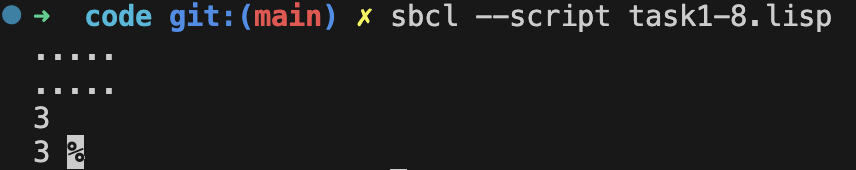

#### Завдання 9  

Ваш товариш намагався написати функцію, яка підсумовує всі значення елементів списку, крім `nil`. Він написав дві версії такої функції, але жодна з них не працює. Поясніть, що не так в кожній з них, і запропонуйте коректну версію.

##### Аналіз помилок  

###### (a) `(defun summit (lst) (remove nil lst) (apply #’+ lst))`  
Помилки:  
- `remove` повертає новий список без `nil`, але його результат не використовується.  
- `apply #’+ lst` працює на вихідному `lst`, який все ще містить `nil`, викликаючи помилку при додаванні.  

###### (b) `(defun summit (lst) (let ((x (car lst))) (if (null x) (summit (cdr lst)) (+ x (summit (cdr lst))))))`  
Помилки:  
- `null x` перевіряє, чи `car lst` є `nil`, але `nil` може бути відсутнім, що не гарантує правильну перевірку.  
- Якщо `car lst` є `nil`, функція просто пропускає його, що правильно, але у випадку `0` чи іншого значення, не гарантує правильного підсумовування.  
- Код не перевіряє базовий випадок, коли список порожній (`null lst`), що може спричинити помилку при виклику `cdr` на порожньому списку.  


##### Коректна версія функції
Код з файлу [task1-9.lisp](code/task1-9.lisp)  

```lisp
(defun summit (lst)
  (if (null lst)
      0  ;; Якщо список порожній, повертаємо 0
      (+ (if (null (car lst)) 0 (car lst))  ;; Ігноруємо nil, додаємо інші елементи
         (summit (cdr lst)))))  ;; Рекурсивно додаємо інші елементи

;; Тестування:
(print (summit '(1 2 3 nil 4)))  ;; Результат: 10
(print (summit '(nil nil 5 5)))  ;; Результат: 10
(print (summit '()))             ;; Результат: 0
(print (summit '(nil nil nil)))  ;; Результат: 0
```

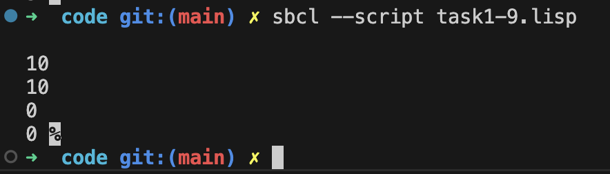

##### Пояснення коректної версії  
- Базовий випадок: якщо список порожній, повертаємо `0`.  
- Перевірка `car lst`: якщо `car lst` є `nil`, додаємо `0`, інакше додаємо значення.  
- Рекурсія: обробляємо `cdr lst`, поступово підсумовуючи значення.  

#### Завдання 10  

Уявіть наступні списки у вигляді комірок.

##### Аналіз структури списків у вигляді cons-ячейок  

У Lisp списки реалізуються через `cons`-ячейки, де кожна комірка містить `car` (перший елемент) і `cdr` (решту списку). Давайте розглянемо, як представлені ці списки.

##### (a) `(A b (c d))`  
Цей список має три елементи:  
- `A`  
- `b`  
- `(c d)` (вкладений список)  

Запис у вигляді `cons`-ячейок:
```lisp
(cons 'A (cons 'b (cons (cons 'c (cons 'd nil)) nil)))
```

##### (b) `(A (b (c (d))))`  
Тут кожен вкладений список містить ще один вкладений список:  
- `A`  
- `(b (c (d)))`  

Запис у вигляді `cons`:
```lisp
(cons 'A (cons (cons 'b (cons (cons 'c (cons (cons 'd nil) nil)) nil)) nil))
```

##### (c) `(((A b) c) d)`  
Цей список містить вкладену пару:  
- `((A b) c)`  
- `d`  

Запис у вигляді `cons`:
```lisp
(cons (cons (cons 'A (cons 'b nil)) (cons 'c nil)) (cons 'd nil))
```

##### (d) `(A (b . C) . D)`  
- `A`  
- `(b . C)` (неправильний список, оскільки `C` є `cdr`)  
- `. D` (останній елемент у `cdr`)  

Запис у вигляді `cons`:
```lisp
(cons 'A (cons (cons 'b 'C) 'D))
```

##### Висновок  
Ці представлення допомагають зрозуміти, як Lisp-списки організовані всередині через `cons`-ячейки.

#### Завдання 11  

Напишіть свій варіант функції `union`, який зберігає порядок слідування елементів згідно з вихідними списками.

##### Аналіз завдання  
- Функція повинна об’єднати два списки.  
- Порядок елементів має відповідати їхній першій появі у вихідних списках.  
- Дублікатів у результаті бути не повинно.  

##### Рішення  
- Рекурсивно проходимо перший список і додаємо елементи до результату, якщо їх ще немає в об'єднаному списку.  
- Проходимо другий список і додаємо тільки ті елементи, які ще не були включені.  

Код з файлу [task1-11.lisp](code/task1-11.lisp)  

```lisp
(defun new-union (list1 list2)
  (let ((result nil))
    (dolist (x list1)
      (unless (member x result)
        (push x result)))
    (dolist (x list2)
      (unless (member x result)
        (push x result)))
    (nreverse result))) ;; Перевертаємо список, щоб зберегти правильний порядок

;; Тестування:
(print (new-union '(a b c) '(b a d)))  ;; Результат: (A B C D)
(print (new-union '(1 2 3) '(3 4 5)))  ;; Результат: (1 2 3 4 5)
(print (new-union '(x y) '(y z x)))    ;; Результат: (X Y Z)
(print (new-union '() '(a b c)))       ;; Результат: (A B C)
(print (new-union '(a b c) '()))       ;; Результат: (A B C)
```

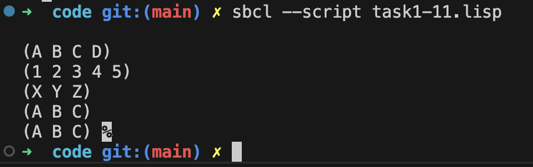


#### Завдання 12  

Напишіть функцію, визначальну кількість повторень (з точки зору `eq`) кожного елемента в заданому списку і сортують їх по спадаючій народженню.

##### Аналіз завдання  
- Потрібно визначити, скільки разів кожен елемент зустрічається у списку.  
- Підрахунок ведеться за допомогою `eq`, тобто порівняння відбувається на рівні ідентичності символів.  
- Результат має бути відсортований за кількістю входжень у спадному порядку.  

##### Рішення  
- Використовуємо `assoc` для ведення лічильників.  
- `sort` для сортування результату за спаданням частоти.  

Код з файлу [task1-12.lisp](code/task1-12.lisp)  

```lisp
(defun occurrences (lst)
  (let ((table nil))
    ;; Підрахунок входжень
    (dolist (el lst)
      (let ((entry (assoc el table :test #'eq)))
        (if entry
            (incf (cdr entry)) ;; Збільшуємо лічильник
            (push (cons el 1) table)))) ;; Додаємо новий запис

    ;; Сортування за спаданням кількості входжень
    (sort table #'> :key #'cdr)))

;; Тестування:
(print (occurrences '(a b a d a c d c a)))  ;; Результат: ((A . 4) (C . 2) (D . 2) (B . 1))
(print (occurrences '(x y x x z y y y)))    ;; Результат: ((Y . 4) (X . 3) (Z . 1))
(print (occurrences '(1 2 2 3 3 3 1 1)))    ;; Результат: ((1 . 3) (3 . 3) (2 . 2))
(print (occurrences '()))                   ;; Результат: NIL
```

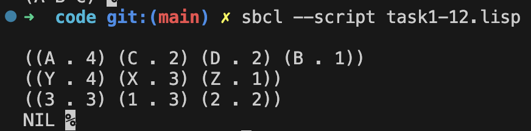

#### Завдання 13  

Чому `(member '(a)' '((a) (b)))` повертає `nil`?

##### Аналіз виразу  
Функція `member` перевіряє, чи міститься певний елемент у списку.  
За замовчуванням `member` використовує `eql` для порівняння елементів.  

##### Чому результат `nil`?  
- `member` перевіряє, чи є точне співпадіння між `'(a)` та елементами списку `'((a) (b))`.  
- `'((a) (b))` — це список, що містить два елементи: `'(a)` та `'(b)`.  
- Проблема в тому, що `eql` не порівнює структурний вміст списків, а лише їхні об'єктні посилання.  
- `' (a)` у запиті і `'(a)` у списку хоч і виглядають однаково, можуть бути різними об'єктами в пам'яті.  

##### Як це виправити?  
Якщо ми хочемо перевірити еквівалентність структур, а не об'єктні посилання, потрібно використовувати `equal` замість `eql`:

```lisp
(member '(a) '((a) (b)) :test #'equal)  ;; Результат: ((A) (B))
```

##### Висновок  
`member` повертає `nil`, бо за замовчуванням використовує `eql`, який не перевіряє еквівалентність вкладених списків.  
Щоб правильно порівнювати вкладені списки, потрібно явно передати `:test #'equal`.


### Програмування складних структур на Lisp

#### Функція `pos+`
Функція `pos+` приймає список і повертає новий, у якому кожен елемент збільшений на його позицію у списку.

##### Приклад виконання  
```lisp
(pos+ '(7 5 1 4))  ;; => (7 6 3 7)
```
Оскільки індексація починається з 0, перетворення відбувається так:  
- `7 + 0 = 7`
- `5 + 1 = 6`
- `1 + 2 = 3`
- `4 + 3 = 7`


##### Реалізація функції `pos+` трьома способами  

Код з файлу [task2-1.lisp](code/task2-1.lisp)  

```lisp
;; (a) Реалізація через рекурсію
(defun pos+-rec (lst &optional (index 0))
  (if (null lst)
      nil
      (cons (+ (car lst) index)
            (pos+-rec (cdr lst) (+ index 1)))))

;; (b) Реалізація через ітерацію
(defun pos+-iter (lst)
  (let ((result nil)
        (index 0))
    (dolist (el lst (nreverse result)) ;; Реверсуємо, оскільки `push` додає на початок
      (push (+ el index) result)
      (incf index))))

;; (c) Реалізація через `mapcar`
(defun pos+-mapcar (lst)
  (let ((index -1))
    (mapcar (lambda (el) 
              (incf index) 
              (+ el index))
            lst)))

;; Тестування:
(print (pos+-rec '(7 5 1 4)))   ;; Результат: (7 6 3 7)
(print (pos+-iter '(7 5 1 4)))  ;; Результат: (7 6 3 7)
(print (pos+-mapcar '(7 5 1 4))) ;; Результат: (7 6 3 7)
```

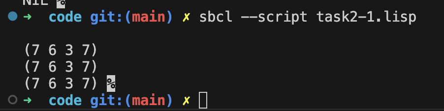

##### Пояснення реалізацій
1. Рекурсія (`pos+-rec`)  
   - Базовий випадок: якщо список порожній, повертаємо `nil`.  
   - Обчислюємо `(+ (car lst) index)` та додаємо результат у `cons`.  
   - Викликаємо `pos+-rec` для `cdr`, збільшуючи `index` на 1.  

2. Ітерація (`pos+-iter`)  
   - Проходимо список `dolist`-ом, зберігаючи поточний `index`.  
   - Додаємо `index` до кожного елемента, зберігаючи результат у `result`.  
   - Використовуємо `nreverse`, щоб відновити порядок елементів.  

3. Функціональний підхід (`pos+-mapcar`)  
   - Використовуємо `mapcar`, який проходить список та застосовує до кожного елемента функцію.  
   - `index` оновлюється через `incf` перед додаванням до елемента.  

Ці реалізації дозволяють виконати завдання різними підходами, демонструючи можливості рекурсії, ітерації та функціонального програмування у Lisp.

#### Визначення функцій згідно з новою постановою

За умовою, держава ухвалила постанову, де:
- `cdr` вказує на перший елемент списку,
- `car` вказує на залишок списку.

Тобто у порівнянні зі стандартним Lisp, де `car` — це перший елемент, а `cdr` — решта, тепер ролі помінялися місцями.

Нижче наведені приклади визначення чотирьох функцій так, щоб вони задовольняли нові правила.

##### (a) `cons`  
У стандартному Lisp:
```lisp
(cons x y)  ; створює пару (x . y),
            ; де car = x, cdr = y.
```
Згідно з новою постановою:
```lisp
(defun cons-new (x y)
  ;; Тепер cdr = x (перший елемент),
  ;; а car = y (залишок).
  (standard-lisp:cons y x))
```
Тепер виклик `(cons-new 'a '(b c))` створює структуру, де `cdr` вказує на `'a'`, а `car` — на `'(b c)'`.

##### (b) `list1`  
У стандартному Lisp функції `list1` немає, але припустимо, що це аналог однопараметрової `list`:
```lisp
(list 'x)  ; => (X)
           ; тобто (cons 'x nil)
```
Згідно з новим визначенням, де `cdr` є першим елементом, а `car` — рештою, діятимемо так:
```lisp
(defun list1-new (x)
  (cons-new x nil))
```
Оскільки у нас визначено `cons-new`, що міняє місцями `car` і `cdr`, результат `(list1-new 'x)` буде структурою, де `cdr = 'x`, `car = NIL`, що логічно відповідає новим вимогам.

##### (c) `length` (для списків)  
У стандартному Lisp:
```lisp
(length '(a b c))  ; => 3
```
Функція `length` проходить список, відкидаючи перший елемент (`car`) і переходячи до `cdr`. Тепер, коли `cdr` є першим елементом, а `car` — залишком, алгоритм доведеться адаптувати:

```lisp
(defun length-new (lst)
  (if (null lst)
      0
      (1+ (length-new (car lst)))))
```
Тут:
- Якщо список порожній, повертаємо 0.
- Інакше відкидаємо *«залишок»* (який у новій системі зберігається в `car`) і рахуємо далі, поки не дійдемо до порожнього списку.

##### (d) `member` (для списків, без ключових параметрів)  
Стандартна функція `member` у Lisp:
```lisp
(member 'b '(a b c))  ; => (B C)
```
Вона перевіряє послідовно елементи списку, просуваючись по `cdr`. У новій системі, де «перший елемент» знаходиться в `cdr`, логіка змінюється:

```lisp
(defun member-new (item lst)
  (cond
    ((null lst) nil)
    ((eql (cdr lst) item) lst)
    (t (member-new item (car lst)))))
```
- Якщо список порожній, повертаємо `nil`.
- Якщо «перший елемент» (`cdr`) дорівнює шуканому, повертаємо увесь цей список.
- Інакше рухаємося далі по «залишку» (`car`).

##### Висновок  
Через те, що постановою помінялися місцями поняття «першого елемента» (тепер це `cdr`) та «залишку» (тепер це `car`), усі функції доводиться переписувати з урахуванням нової логіки. Подані приклади дають уявлення, як саме можна адаптувати класичні визначення під нові правила.

#### Стисле представлення списку за допомогою точкових пар  

Нижче наведено варіант програми, яка стискає послідовності однакових атомів і створює меншу кількість комірок, використовуючи точкові пари замість звичайних списків із двома елементами.

##### Оригінальна ідея  
```lisp
(defun compress (x)
  (if (consp x)
      (compr (car x) 1 (cdr x))
      x))

(defun compr (elt n lst)
  (if (null lst)
      (list (n-elts elt n))
      (let ((next (car lst)))
        (if (eql next elt)
            (compr elt (+ n 1) (cdr lst))
            (cons (n-elts elt n) 
                  (compr next 1 (cdr lst)))))))

(defun n-elts (elt n)
  (if (> n 1)
      (list n elt)
      elt))
```
Функція `n-elts` повертає або дваелементний список `(n elt)` у випадку, коли `n > 1`, або сам атом `elt`, якщо повторення лише одне. Через це при великих повтореннях утворюється ще один список на два елементи (наприклад, `'(3 1)`), що збільшує кількість комірок.

##### Змінена версія з точковими парами  
```lisp
(defun compress (x)
  (if (consp x)
      (compr (car x) 1 (cdr x))
      x))

(defun compr (elt n lst)
  (if (null lst)
      (cons (n-elts elt n) nil)
      (let ((next (car lst)))
        (if (eql next elt)
            (compr elt (+ n 1) (cdr lst))
            (cons (n-elts elt n)
                  (compr next 1 (cdr lst)))))))

(defun n-elts (elt n)
  (if (> n 1)
      (cons n elt)  ;; Використовуємо точкову пару (n . elt), замість списку (n elt)
      elt))
```

1. У `n-elts`:
   - Якщо кількість повторень `n` більше ніж `1`, замість `(list n elt)` створюється точкова пара `(n . elt)` за допомогою `(cons n elt)`.
   - Якщо `n` дорівнює `1`, повертається просто `elt`.

2. У `compr`:
   - При досягненні кінця списку `(null lst)`, повертається `(cons (n-elts elt n) nil)` (тобто одноелементний список із нашою точковою парою або одиночним атомом).
   - В інших випадках ми будуємо список із результату `n-elts` та рекурсивного виклику `compr`.

##### Приклад виконання  
```lisp
(compress '(1 1 1 0 1 0 0 0 1))
;; => ((3 . 1) 0 1 (3 . 0) 1)
```

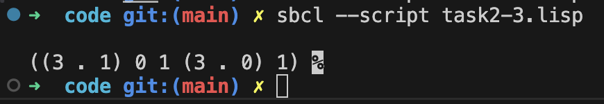

Тут повторення з трьох одиниць буде збережено як `(3 . 1)`, що вимагає лише одну `cons`-комірку, замість списку `(3 1)` з двома `cons`-комірками.

Таким чином, використання точкових пар для відображення повторень зменшує загальну кількість створюваних комірок.


#### Функція `showdots` для друку списку в точковій нотації  

##### Опис завдання  
Потрібно визначити функцію `showdots`, яка друкує заданий список у точковій нотації.  
Звичайний список у Lisp, наприклад `'(a b c)`, зазвичай представлений у вигляді:  
```lisp
(A B C)
```
Але насправді це означає послідовність `cons`-пар:
```lisp
(A . (B . (C . NIL)))
```
Мета функції `showdots` — відобразити цю внутрішню структуру.

##### Приклад роботи  
```lisp
(showdots '(a b c))
;; Вивід:
(A . (B . (C . NIL)))
NIL
```
  

##### Реалізація функції `showdots`  

Код з файлу [task2-4.lisp](code/task2-4.lisp)  

```lisp
(defun showdots (lst)
  (cond
    ;; Якщо порожній список
    ((null lst)
     (format t "NIL"))
    ;; Якщо атом (не cons‐пара)
    ((atom lst)
     (format t "~A" lst))
    ;; Інакше це cons‐пара
    (t
     (format t "(")                ; Відкриваємо дужку
     (showdots (car lst))         ; Виводимо car-частину
     (format t " . ")             ; Виводимо " . "
     (showdots (cdr lst))         ; Виводимо cdr-частину
     (format t ")"))))            ; Закриваємо дужку

;; Приклади викликів:
(showdots '(a b c))   ;; (A . (B . (C . NIL)))
(format t "~%")
(showdots '())        ;; NIL
(format t "~%")
(showdots '(1 (2 3) 4))  ;; (1 . ((2 . (3 . NIL)) . (4 . NIL)))
(format t "~%")
(showdots '(x . y))   ;; (X . Y)
(format t "~%")
(showdots '(x (y . z))) ;; (X . ((Y . Z) . NIL))
(format t "~%")

```

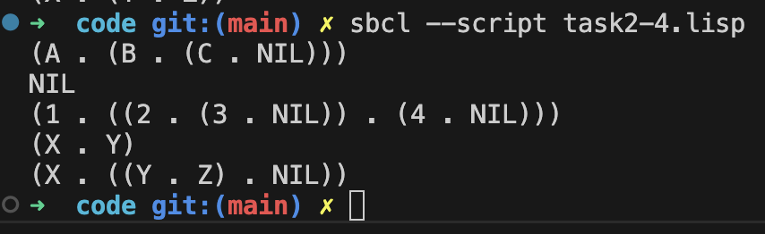


##### Пояснення роботи  
1. Якщо список порожній (`nil`), друкуємо `"NIL"`.
2. Якщо `lst` — це атом, друкуємо його напряму.
3. Інакше:
   - Друкуємо `"("` і викликаємо `showdots` для `car lst`.
   - Якщо `cdr lst` є списком, друкуємо `" . "` (що вказує на `cons`).
   - Рекурсивно викликаємо `showdots` для `cdr lst`.
   - Закриваємо дужку `")"`.

Таким чином, функція відображає повну структуру списку у вигляді `cons`-пар.


#### Завдання 5  

Напишіть програму, яка шукає найбільший (найдовший) шлях у мережі, що не містить повторень вузлів. Умова вказує, що мережа (граф) може містити цикли, але шлях, який ми шукаємо, не має повторювати вершини.

##### Подання графа  
Найзручніше зберігати мережу (граф) у вигляді списку суміжності. Кожен елемент такого списку має вигляд:  
```
(вершина сусід1 сусід2 ...)
```
Наприклад, якщо з вершини `a` є дуги до `b` і `c`, а з вершини `b` — до `c`, з `c` — до `d`, то граф можна подати так:  
```lisp
(setq *graph*
  '((a b c)
    (b c)
    (c d)
    (d)))
```

##### Ідея пошуку найдовшого шляху  
1. Перебрати усі вершини графа як потенційні точки старту.  
2. Виконати глибину пошуку (DFS) з обліком відвіданих вершин, щоб уникнути повторень.  
3. Під час DFS зберігати найдовший знайдений шлях.  

##### Код програми  
Код з файлу [task2-5.lisp](code/task2-5.lisp)
```lisp
;; Глобальна змінна для прикладу
(setq *graph*
  '((a b c)
    (b c)
    (c d)
    (d)))

;; Повертає список вершин, у які є дуга з вузла NODE
(defun neighbors (node graph)
  (cdr (assoc node graph)))

;; Рекурсивна функція пошуку всіх шляхів, що починаються з NODE
(defun all-paths-from (node graph visited)
  (let ((paths nil))
    ;; Для кожного сусіда, якщо він ще не відвіданий, розгортаємо DFS
    (dolist (nbr (neighbors node graph) paths)
      (unless (member nbr visited)
        (dolist (subpath (all-paths-from nbr graph (cons nbr visited)))
          (push (cons node subpath) paths))))
    ;; Якщо немає сусідів або всі вже відвідані, додаємо шлях із однієї вершини
    (push (list node) paths)
    paths))

;; Знаходить найдовший шлях у графі, що не містить повторень
(defun find-longest-path (graph)
  (let ((longest-path '()))
    ;; Пробігаємо кожну вершину як старт
    (dolist (node graph longest-path)
      (let ((start (car node)))  ;; Перша вершина в парі (наприклад, 'a)
        (dolist (path (all-paths-from start graph (list start)))
          (when (> (length path) (length longest-path))
            (setf longest-path path)))))
    longest-path))

;; Тестування
(format t "Граф: ~A~%" *graph*)
(format t "Найдовший шлях: ~A~%" (find-longest-path *graph*))

;; Приклад виклику з циклом: якщо додати (d a) у список, то з'являється цикл
```

##### Пояснення  
- neighbors: повертає всі вершини, у які можна потрапити з поточної (тобто всі сусіди).  
- all-paths-from:  
  1. Якщо в `node` є суміжні вершини, для кожної нерозвіданої викликаємо рекурсію.  
  2. Якщо сусідів немає або всі відвідані, повертаємо шлях із єдиної вершини.  
  3. Накопичуємо всі можливі шляхи у `paths`.  
- find-longest-path:  
  1. Для кожної вершини в графі запускаємо `all-paths-from`.  
  2. Серед усіх одержаних шляхів визначаємо найдовший за довжиною (`length`).  

##### Результат виконання  
Якщо використати прикладовий граф:
```lisp
(setq *graph*
  '((a b c)
    (b c)
    (c d)
    (d)))
```

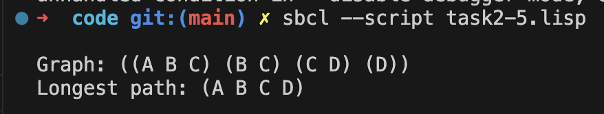
можна отримати найдовший шлях `'(a c d)` або `'(b c d)` довжиною 3 вершини (залежно від структури графа). Якщо додати петлі чи додаткові зв’язки, функція все одно знаходить найдовший простий шлях, оминаючи повторення вершин.

#### Завдання 6

Визначте функцію, що повертає квадратний масив розміром \\(n \times n\\), повернений на 90 градусів за годинниковою стрілкою.

##### Опис і приклад  
Вхід: дводимірний квадратний масив (наприклад, `#2A((a b) (c d))`).  
Вихід: новий масив того ж розміру, де кожен елемент зміщений на 90 градусів за годинниковою стрілкою.

Приклад:
```lisp
(quarter-turn #2A((a b)
                  (c d)))
 => #2A((c a)
        (d b))
```
  
##### Реалізація функції  

Код з файлу [task2-6.lisp](code/task2-6.lisp)
```lisp
(defun quarter-turn (matrix)
  "Повертає копію квадратного масиву MATRIX, повернутого на 90 градусів."
  (let* ((dims (array-dimensions matrix))
         (n (first dims))
         ;; Створюємо новий масив з тими ж розмірами
         (result (make-array dims)))
    ;; Якщо масив не квадратний, опрацьовуємо помилку чи повертаємо NIL
    (unless (= (first dims) (second dims))
      (error "Матриця не квадратна."))
    ;; Заповнюємо новий масив, міняючи місцями індекси
    (dotimes (i n)
      (dotimes (j n)
        ;; У повернутій матриці:
        ;; - рядок => j
        ;; - стовпчик => n - i - 1
        (setf (aref result j (- n i 1))
              (aref matrix i j))))
    result))

;; Приклад використання
(let ((mat #2A((a b)
               (c d))))
  (format t "~%Original: ~A~%" mat)
  (format t "Rotated: ~A~%" (quarter-turn mat)))
```

##### Пояснення  

1. `array-dimensions`: Повертає список розмірностей масиву, наприклад `(2 2)` для `#2A((a b) (c d))`.  
2. Перевірка, що масив квадратний: Якщо `n` (кількість рядків) не дорівнює `m` (кількість стовпчиків), викликаємо `(error "...")`.  
3. Алгоритм повороту:  
   - Нову позицію елемента `(i, j)` визначаємо як `(j, n-i-1)`.  
   - Використовуємо `dotimes`, щоб пройтися по всіх рядках і стовпчиках початкової матриці.  
   - При кожному кроці переписуємо елемент у відповідне місце в `result`.  
4. Приклад:  
   - Для матриці:  
     ```
     a  b
     c  d
     ```
     після повороту:  
     ```
     c  a
     d  b
     ```
   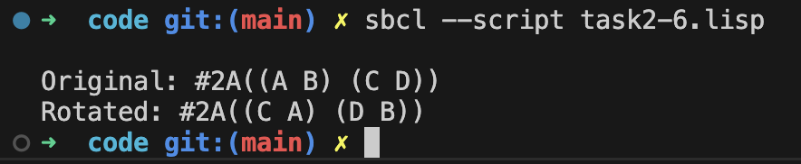

Результат покаже початкову матрицю та повернуту.  


#### Завдання 7  

Ознайомтеся з функцією `reduce`, яка виконує ітеративне згортання послідовності (списку чи масиву) за допомогою заданої функції. Загальний вигляд:

```lisp
(reduce function sequence 
        &key key from-end start end initial-value)
```
- `function` — двоаргументна функція, що рекурсивно застосовується до елементів послідовності.  
- `sequence` (чи `proseq` у деяких описах) — послідовність, яку згортатимемо.  
- `:initial-value` — початкове значення, з якого починається згортання, якщо воно задане.  
- `:from-end` — якщо `t`, обходить послідовність з кінця до початку.  

##### Приклади використання  
1. Складати числа:  
   ```lisp
   (reduce #'+ '(1 2 3 4))
   ;; Результат: 10
   ```  
2. Конкатенувати рядки:  
   ```lisp
   (reduce #'concat '("ab" "cd" "ef"))
   ;; Результат: "abcdef"
   ```  


##### (a) Визначте `copy-list` за допомогою `reduce`  

Функція `copy-list` створює точну копію списку, тобто повертає новий список з такими ж елементами, не змінюючи оригінальний.

```lisp
(defun copy-list-reduce (lst)
  "Створює копію списку lst, використовуючи reduce."
  (reduce (lambda (acc x)
            (append acc (list x)))
          lst
          :initial-value '()))
```
- Алгоритм:
  - Початково маємо `acc = '()`.  
  - Для кожного елемента `x` в `lst`, робимо `(append acc (list x))`.  
  - Результатом стане новий список, що дублює вміст `lst`.  


##### (b) Визначте `reverse` (для списків) за допомогою `reduce`  

Функція `reverse` обертає послідовність елементів списку у зворотний порядок. Застосовуючи `reduce`, можна накопичувати результат починаючи з порожнього списку і `cons`-ити нові елементи на початок.

```lisp
(defun reverse-reduce (lst)
  "Повертає список lst у зворотному порядку, використовуючи reduce."
  (reduce (lambda (acc x)
            (cons x acc))
          lst
          :initial-value '()))
```
- Алгоритм:
  - Початково маємо `acc = '()`.  
  - Кожен новий елемент `x` додаємо на початок, формуючи перевернутий список.  
  - Результатом є звичайний `reverse`.  


##### Приклади викликів  
Код взято з файлу [task2-7.lisp](code/task2-7.lisp)
```lisp
(copy-list-reduce '(1 2 3)) 
;; => (1 2 3)  ; новий список, відмінний від вихідного

(reverse-reduce '(1 2 3))
;; => (3 2 1)
```

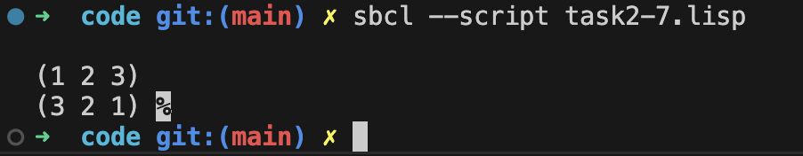

Ці функції демонструють, як `reduce` можна використовувати не лише для арифметичних підсумків, а й для різних операцій з послідовностями у Lisp.


#### Завдання 8  

Створіть структуру для дерева, кожен вузол якого, крім даних, має трьох нащадків (`left`, `middle`, `right`). Визначте:

1. Функцію, що копіює таке дерево (кожен вузол створює окремий екземпляр). Нове дерево не повинно бути еквівалентне вихідному з точки зору `eq`.

2. Функцію, що приймає об'єкт і дерево та повертає істину (T), якщо цей об'єкт зустрічається (з точки зору `eq`) у полі даних хоч одного вузла дерева.

##### Код з файлу [task2-8.lisp](code/task2-8.lisp)

```lisp
;; Оголошення структури для вузла дерева з трьома нащадками
(defstruct (tree-node (:constructor make-node (data &key (left nil) (middle nil) (right nil))))
  data
  left
  middle
  right)

;; (a) Функція copy-tree-node
(defun copy-tree-node (node)
  "Повертає копію дерева node, створюючи нові вузли для кожного нащадка."
  (if (null node)
      nil
      (make-node (tree-node-data node)
                 :left   (copy-tree-node (tree-node-left   node))
                 :middle (copy-tree-node (tree-node-middle node))
                 :right  (copy-tree-node (tree-node-right  node)))))

;; (b) Функція find-in-tree
(defun find-in-tree (obj node)
  "Перевіряє, чи містить дерево node значення obj (z точки зору eq)."
  (cond
    ((null node) nil)
    ((eq (tree-node-data node) obj) t)
    (t (or (find-in-tree obj (tree-node-left   node))
           (find-in-tree obj (tree-node-middle node))
           (find-in-tree obj (tree-node-right  node))))))

;; Приклад використання
(let* ((root (make-node 'root))
       (child1 (make-node 'child1))
       (child2 (make-node 'child2))
       (child3 (make-node 'child3)))
  (setf (tree-node-left root)   child1
        (tree-node-middle root) child2
        (tree-node-right root)  child3)

  (format t "~%Оригінал: ~A" root)
  (format t "~%Знайти 'child2'? ~A" (find-in-tree 'child2 root))
  (let ((copied (copy-tree-node root)))
    (format t "~%Копія: ~A" copied)
    (format t "~%(eq оригіналу копії) ~A" (eq root copied))))
```
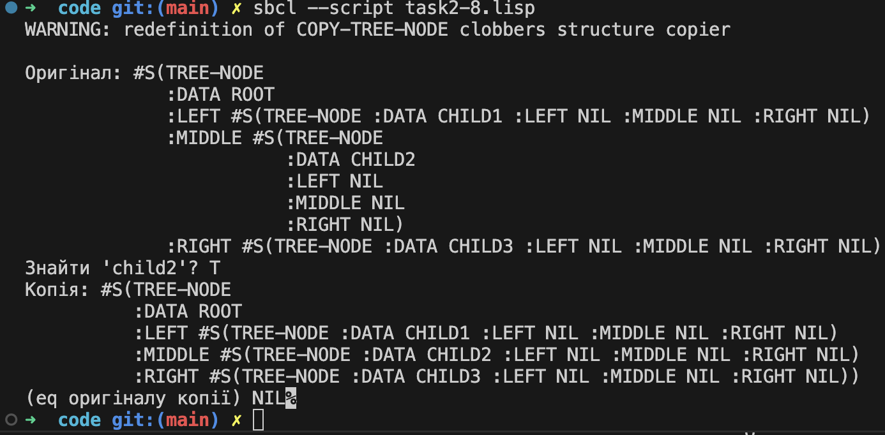

##### Пояснення  
1. Структура `tree-node`  
   - Містить поле даних (`data`) і три нащадки (`left`, `middle`, `right`).

2. `copy-tree-node`  
   - Рекурсивно обходить дерево, створюючи нові вузли з такими ж даними (`data`), але не посилається на існуючі вузли. Це гарантує, що результат не `eq` оригіналу.

3. `find-in-tree`  
   - Перевіряє, чи є `obj` у полі `data` поточного вузла (за допомогою `eq`), інакше рекурсивно шукає в лівому, середньому та правому нащадках.

у результаті програма виведе інформацію про оригінальне дерево, копію і результат пошуку даного об’єкта.

#### Завдання 9  

Визначте функцію, що будує зі BST-дерева список його елементів, відсортований від більшого до меншого.

##### Ідея  
Для виведення елементів BST (бінарного дерева пошуку) у спадному порядку, можна здійснити реверсований обхід in-order:  
1. Спочатку обійти праве піддерево (містить найбільші елементи).  
2. Додати значення поточного вузла.  
3. Обійти ліве піддерево (менші елементи).

##### Реалізація  

Код з файлу [task2-9.lisp](code/task2-9.lisp)
```lisp
;; Припустимо, що існує структура для вузла BST:
(defstruct (bst-node 
             (:constructor make-bst-node (key &optional (left nil) (right nil))))
  key
  left
  right)

(defun bst-to-descending-list (tree)
  "Повертає список значень із BST-дерева TREE від більшого до меншого."
  (if (null tree)
      nil
      (append (bst-to-descending-list (bst-node-right tree))
              (list (bst-node-key tree))
              (bst-to-descending-list (bst-node-left tree)))))

;; Приклад використання
(let* ((node1 (make-bst-node 1))
       (node3 (make-bst-node 3))
       (node2 (make-bst-node 2 node1 node3))   ;; дерево:   2
       (node7 (make-bst-node 7))
       (node5 (make-bst-node 5 node2 node7)))  ;; дерево:       5
                                               ;;            2     7
                                               ;;          1   3
  (format t "~%BST: ~A" node5)
  (format t "~%Список спадно: ~A~%" (bst-to-descending-list node5)))
```

##### Пояснення  
1. `defstruct (bst-node ...)`  
   - Описуємо вузол BST із полями:
     - `key` — значення даних у вузлі.  
     - `left`, `right` — посилання на ліве та праве піддерево.

2. `bst-to-descending-list`  
   - Якщо дерево порожнє, повертаємо `nil`.
   - Рекурсивно викликаємо `bst-to-descending-list` для правого піддерева, аби спочатку отримати більші значення.
   - Додаємо ключ поточного вузла.
   - Потім викликаємо `bst-to-descending-list` для лівого піддерева, одержуючи менші значення.  
   - `append` об’єднує три списки:  _«праві»_, _«поточний»_, _«ліві»_.

3. Приклад  
   - Створюється дерево з вузлом `5` у корені, лівим піддеревом (2, 1, 3) і правим (7).  
   - `bst-to-descending-list` повертає `(7 5 3 2 1)`.

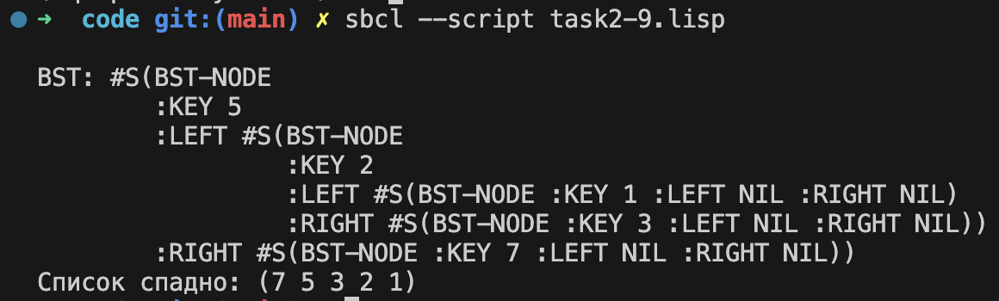

Отримаєте вивід із початковим деревом та списком елементів у порядку від більшого до меншого.


#### Завдання 10  

Визначте функцію `bst-adjoin1`, яка працює подібно до `bst-insert`, але вставляє новий ключ лише тоді, коли його ще немає в дереві. Якщо ключ уже існує, дерево не змінюється.

##### Код з файлу [task2-10.lisp](code/task2-10.lisp)

```lisp
;; Повторимо структуру для бінарного дерева пошуку:
(defstruct (bst-node 
             (:constructor make-bst-node (key &optional (left nil) (right nil))))
  key
  left
  right)

(defun bst-adjoin1 (tree obj)
  "Додає OBJ у BST-дерево, якщо його там ще немає."
  (cond
    ((null tree)
     ;; Якщо дерево порожнє, створюємо новий вузол
     (make-bst-node obj))
    ((= obj (bst-node-key tree))
     ;; Якщо ключ уже існує, нічого не змінюємо
     tree)
    ((< obj (bst-node-key tree))
     ;; Йдемо вліво, якщо OBJ менший за ключ вузла
     (setf (bst-node-left tree)
           (bst-adjoin1 (bst-node-left tree) obj))
     tree)
    (t
     ;; В іншому випадку - йдемо вправо
     (setf (bst-node-right tree)
           (bst-adjoin1 (bst-node-right tree) obj))
     tree)))

;; Приклад використання
(let* ((root (make-bst-node 5))
       (node3 (make-bst-node 3))
       (node7 (make-bst-node 7))
       (node2 (make-bst-node 2))
       (node4 (make-bst-node 4)))
  ;; Побудуємо дерево:
  ;;       5
  ;;      / \
  ;;     3   7
  ;;    / \
  ;;   2   4
  (setf (bst-node-left root) node3)
  (setf (bst-node-right root) node7)
  (setf (bst-node-left node3) node2)
  (setf (bst-node-right node3) node4)

  (format t "~%Початкове дерево: ~A" root)
  (format t "~%Спроба додати ключ 3:~%")
  (bst-adjoin1 root 3)  ;; Нічого не змінюється, бо 3 вже існує
  (format t "Дерево: ~A~%" root)

  (format t "~%Спроба додати ключ 6:~%")
  (bst-adjoin1 root 6)  ;; Вставляємо 6 між 5 і 7
  (format t "Дерево: ~A~%" root))
```

##### Пояснення
1. Перевірка порожнього дерева  
   Якщо `tree` є `NIL`, створюємо новий вузол через `make-bst-node`.
2. Порівняння з ключем поточного вузла  
   - Якщо `obj = (bst-node-key tree)`, дерево не змінюємо (вузол із таким ключем уже є).
   - Якщо `obj < (bst-node-key tree)`, рекурсивно вставляємо в ліве піддерево.
   - Інакше вставляємо в праве піддерево.
3. Повернення посилання на корінь  
   Після вставки чи відмови від неї завжди повертаємо `tree`, оскільки корінь не змінюється.

У результаті отримаєте вивід, де видно, що:
- Спроба додати ключ, який уже є, не змінює дерево.
- Додавання нового ключа (наприклад, `6`) вставляє його у правильне місце.

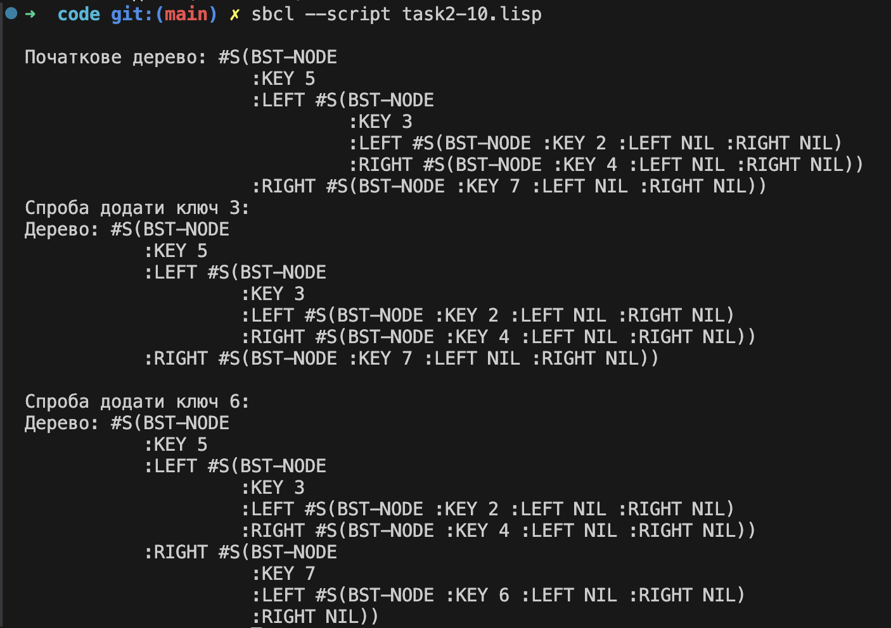

#### Завдання 11  

Вміст будь-якої хеш-таблиці може бути представлено у вигляді асоціативного списку з елементами виду `(k . v)`. Потрібно визначити:

1. Функцію, що будує хеш-таблицю за даним асоціативним списком.  
2. Функцію, що будує асоціативний список за хеш-таблицею.

##### Код з файлу [task2-11.lisp](code/task2-11.lisp)

```lisp
;; (a) Створення хеш-таблиці з асоціативного списку
(defun alist->hash-table (alist &key (test 'eql))
  "Повертає нову хеш-таблицю, створену з асоціативного списку ALIST."
  (let ((ht (make-hash-table :test test)))
    (dolist (pair alist ht)
      ;; (car pair) - ключ, (cdr pair) - значення
      (setf (gethash (car pair) ht) (cdr pair)))))

;; (b) Створення асоціативного списку з хеш-таблиці
(defun hash-table->alist (ht)
  "Повертає асоціативний список, що відповідає хеш-таблиці HT."
  (let ((result nil))
    (maphash (lambda (key value)
               (push (cons key value) result))
             ht)
    (nreverse result)))

;; Приклад використання
(let* ((alist '((a . 1) (b . 2) (c . 3)))
       (ht (alist->hash-table alist))
       (alist-from-ht (hash-table->alist ht)))
  (format t "~%Асоціативний список: ~A" alist)
  (format t "~%Хеш-таблиця (через gethash): ")
  (format t "~A " (gethash 'a ht))  ;; => 1
  (format t "~A " (gethash 'b ht))  ;; => 2
  (format t "~A " (gethash 'c ht))  ;; => 3
  (format t "~%Асоціативний список з хеш-таблиці: ~A~%" alist-from-ht))
```

##### Пояснення

1. `alist->hash-table`  
   - Створює нову хеш-таблицю (можна задати `:test 'eql`, `:test 'equal` тощо).  
   - Проходить список пар `(key . value)` і для кожної виконує `(setf (gethash key ht) value)`.  

2. `hash-table->alist`  
   - Ініціалізує порожній список `result`.  
   - Використовує `maphash`, яка викликає анонімну функцію для кожної пари `(key value)` у `ht`.  
   - Формує `(key . value)` і додає в `result`. Потім виконує `nreverse`, щоб відновити порядок.  

3. Приклад  
   - `alist` — це `((a . 1) (b . 2) (c . 3))`.  
   - Після виклику `alist->hash-table`, утворюється хеш-таблиця з відповідними ключами й значеннями.  
   - Зворотній виклик `hash-table->alist` дає асоціативний список з елементами `(a . 1) (b . 2) (c . 3)`.  

Результатом буде вивід зі створеною хеш-таблицею та відновленим асоціативним списком.

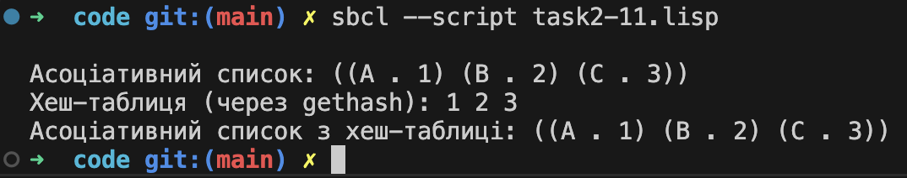