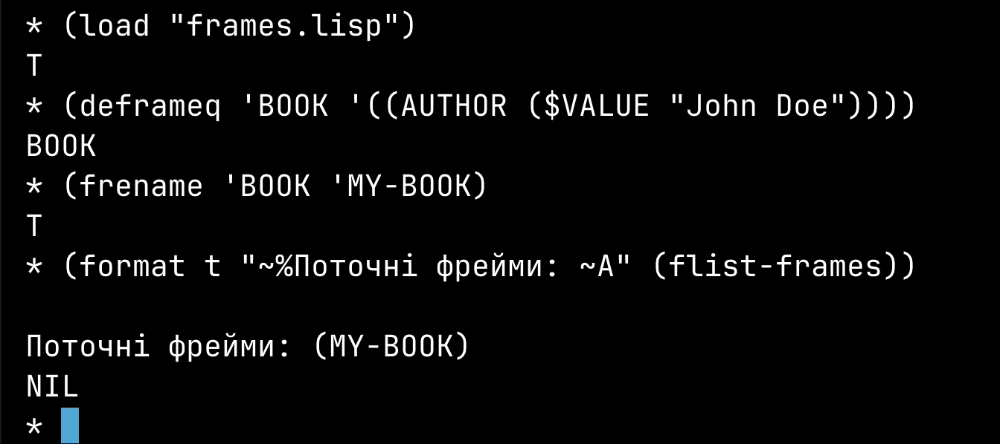
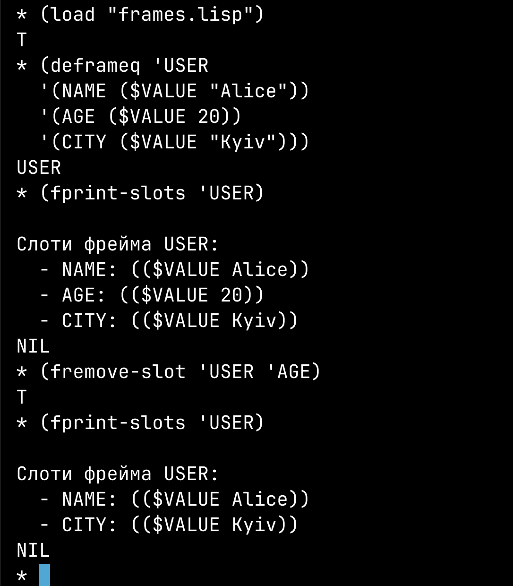
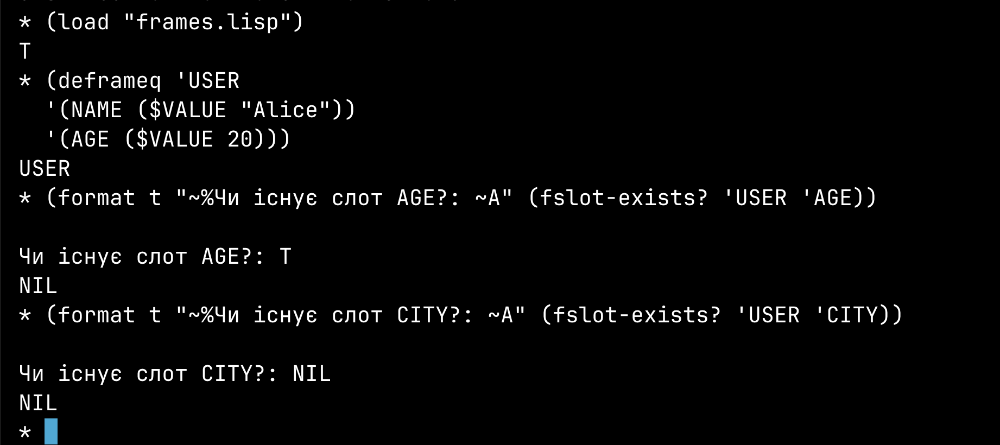

# Лабораторна робота №2-3

Тема: Створення мови представлення знань у вигляді мережі фреймів. Створення фреймової бази знань на основі МПЗ.
Мета: ознайомлення з фреймовою моделлю подання знань та реалізація мови представлення знань (МПЗ) у вигляді фреймової бази знань (ФБЗ).

## Теоретичні відомості

У цій лабораторній роботі потрібно розробити мову представлення знань (МПЗ) у вигляді мережі фреймів та створити на її основі фреймову базу знань (ФБЗ). Це дозволить визначити структуру представлення знань, взаємозв’язки між об’єктами та способи обробки інформації.

### Фреймова модель представлення знань  

Фрейм — це структура даних, що використовується для представлення знань у штучному інтелекті та експертних системах. Він містить набір атрибутів (слотів), що можуть зберігати конкретні значення або посилатися на інші фрейми.  

Основна ідея фреймів полягає у тому, що вони дозволяють структурувати знання та створювати ієрархії, де одні фрейми можуть успадковувати властивості інших.  

#### Основні компоненти фреймової моделі:  

1. Фрейм – основна одиниця знань, що представляє об’єкт або поняття.  
2. Слоти – атрибути фрейму, що містять інформацію про його властивості.  
3. Аспекти слотів – характеристики слотів, що можуть містити значення або методи обробки.  
4. Процедури (демони) – механізми, що автоматично виконуються при зверненні чи зміні значення слота.  
5. Ієрархія фреймів – зв’язки між фреймами, що дозволяють успадковувати слоти.  
6. Фреймова база знань (ФБЗ) – сукупність фреймів, що моделюють предметну область.  

### Принципи побудови фреймової бази знань  

1. Механізм створення фреймів – потрібно реалізувати структуру, яка дозволяє оголошувати нові фрейми та додавати їх у базу.  
2. Редагування та оновлення фреймів – забезпечити можливість додавати нові слоти або змінювати існуючі.  
3. Отримання даних – реалізувати механізм доступу до слотів та їх значень.  
4. Зв’язки між фреймами – реалізувати механізм успадкування властивостей, щоб зменшити дублювання інформації.  
5. Автоматичні обчислення (демони) – додати можливість виконання процедур при зверненні або зміні слотів.  

### Мета розробки мови представлення знань  

Мова представлення знань повинна забезпечувати:  
- Гнучкість у створенні нових фреймів.  
- Можливість встановлення зв’язків між фреймами.  
- Операції для роботи з фреймами та їх слотами.  
- Динамічне оновлення даних та механізми успадкування.  
- Автоматизацію обробки інформації через механізм демонів.  

Ця лабораторна робота дозволяє не лише розробити власну мову представлення знань, але й застосувати її для моделювання конкретної предметної області, що буде виконано у наступних завданнях.

## Виконання 

### Основні принципи МІПД  

1. Структуроване представлення знань  
   - Кожен об’єкт або поняття описується у вигляді фрейму.  
   - Фрейми містять слоти, що описують властивості об’єкта.  

2. Гнучкість у роботі з фреймами  
   - Створення нових фреймів.  
   - Редагування вже існуючих.  
   - Видалення фреймів за необхідності.  

3. Робота з даними у слотах  
   - Додавання значень у слоти.  
   - Отримання значень слотів.  
   - Використання спеціальних аспектів слотів, таких як `$VALUE`, `$DEFAULT`, `$IF-ADDED`.  

4. Механізм успадкування  
   - Фрейми можуть мати ієрархічні зв’язки, успадковуючи слоти від інших фреймів.  
   - Використання спеціального аспекту `AKO` (`a kind of`), що дозволяє вказувати зв’язок між батьківськими та дочірніми фреймами.  

5. Механізм демонів (процедур, що виконуються автоматично)  
   - Якщо в слот додається нове значення, автоматично виконується процедура `$IF-ADDED`.  
   - Дозволяє реалізувати автоматичну обробку інформації.  

6. Розширюваність  
   - Створення нових типів фреймів для різних предметних областей.  
   - Легке розширення МПЗ новими функціями.  

### Основні компоненти МІПД  

1. Глобальна база фреймів (`*FRAMES*`)  
   - Усі створені фрейми зберігатимуться у глобальній структурі, що дозволить легко виконувати до них запити.  

2. Функції для роботи з фреймами  
   - Створення фреймів (`DEFRAMEQ`).  
   - Додавання/редагування слотів (`FASSERTQ`).  
   - Отримання значень (`FGET`).  
   - Видалення фреймів (`FREMOVE`).  

3. Обробка слотів  
   - Перевірка існуючих слотів.  
   - Обробка успадкування.  
   - Виконання демонів під час зміни слотів.  

Наступним кроком буде реалізація ключових функцій МІПД для роботи з фреймами.

Щоб зробити нашу Мову Інтелектуального Представлення Даних (МІПД) більш функціональною та потужною, ми додамо ширший набір функцій для роботи з фреймами.  

#### Базові операції з фреймами  

- `DEFRAMEQ (FRAME-NAME &rest SLOTS)`  
  - Створює новий фрейм або оновлює існуючий.  
  - Приймає ім'я фрейма та список слотів.  
  - Зберігає фрейм у глобальній змінній `*FRAMES*`.  

- `FREMOVE (FRAME-NAME)`  
  - Видаляє фрейм з `*FRAMES*`.  
  - Якщо такого фрейму немає – повертає `NIL`.  

- `FRENAME (OLD-NAME NEW-NAME)`  
  - Змінює ім’я фрейма.  
  - Переносить усі дані фрейма зі старого імені на нове.  
  - Якщо `NEW-NAME` уже зайняте – операція скасовується.  

#### Робота зі слотами  

- `FASSERTQ (FRAME-NAME &rest SLOTS)`  
  - Додає або змінює значення у слотах.  
  - Якщо слот відсутній – створює новий.  

- `FGET (FRAME-NAME SLOT-NAME &optional (ASPECT '$VALUE))`  
  - Повертає значення аспекту вказаного слота.  
  - Якщо слот відсутній – повертає `NIL`.  

- `FREMOVE-SLOT (FRAME-NAME SLOT-NAME)`  
  - Видаляє слот із фрейму.  
  - Не зачіпає інші слоти.  

- `FRENAME-SLOT (FRAME-NAME OLD-NAME NEW-NAME)`  
  - Змінює назву слота.  
  - Якщо `NEW-NAME` уже зайняте – операція скасовується.  

#### Успадкування та зв’язки між фреймами  

- `FSET-PARENT (FRAME-NAME PARENT-NAME)`  
  - Встановлює батьківський фрейм (`PARENT-NAME`) для фрейма (`FRAME-NAME`).  
  - Використовує слот `AKO` (`a kind of`).  

- `FGET-INHERITED (FRAME-NAME SLOT-NAME &optional (ASPECT '$VALUE))`  
  - Повертає значення слота, шукаючи його у поточному фреймі та всіх батьківських фреймах.  
  - Використовується для успадкування знань.  


#### Додаткові можливості  

- `FCOUNT-FRAMES ()`  
  - Повертає кількість створених фреймів у `*FRAMES*`.  

- `FLIST-FRAMES ()`  
  - Виводить список усіх фреймів.  

- `FLIST-SLOTS (FRAME-NAME)`  
  - Виводить список усіх слотів фрейма.  

- `FEXISTS? (FRAME-NAME)`  
  - Перевіряє, чи існує фрейм.  

- `FSLOT-EXISTS? (FRAME-NAME SLOT-NAME)`  
  - Перевіряє, чи існує слот у фреймі.  

### Приклади використання функцій  

```lisp
;; Створюємо фрейм "Автомобіль"
(DEFRAMEQ 'CAR
  (BRAND ($VALUE "Tesla"))
  (MODEL ($VALUE "Model S"))
  (YEAR ($VALUE 2023)))

;; Додаємо новий слот
(FASSERTQ 'CAR
  (COLOR ($VALUE "Red")))

;; Отримуємо значення
(FGET 'CAR 'BRAND)  ;; => ("Tesla")
(FGET 'CAR 'COLOR)  ;; => ("Red")

;; Перейменовуємо фрейм
(FRENAME 'CAR 'ELECTRIC-CAR)

;; Видаляємо слот
(FREMOVE-SLOT 'ELECTRIC-CAR 'YEAR)

;; Додаємо зв'язок з батьківським фреймом "Транспорт"
(FSET-PARENT 'ELECTRIC-CAR 'TRANSPORT)

;; Перевіряємо, скільки є фреймів
(FCOUNT-FRAMES)  ;; => Наприклад, 5

;; Список всіх фреймів
(FLIST-FRAMES)  ;; => (TRANSPORT ELECTRIC-CAR)

;; Перевіряємо, чи існує слот "MODEL"
(FSLOT-EXISTS? 'ELECTRIC-CAR 'MODEL)  ;; => T
```

### Реалізація МПЗ

Нижче наведемо покрокову реалізацію основних функцій нашої мови представлення знань. Для початку визначимо одну з базових функцій для роботи з фреймами і перевіримо її працездатність.

#### Функція `FEXISTS?` (Перевірка існування фрейму)

Ця функція дозволяє дізнатися, чи існує в базі знань фрейм з вказаним іменем. Якщо фрейм присутній у глобальній змінній `*FRAMES*`, повертається `T`, інакше `NIL`.

```lisp
(defun fexists? (frame-name)
  "Перевіряє, чи існує фрейм з іменем FRAME-NAME у глобальному списку *FRAMES*.
   Повертає T, якщо фрейм існує, інакше NIL."
  (not (null (assoc frame-name *FRAMES*))))
```

- Вхідні дані:
  - `frame-name` – ім’я фрейма, яке перевіряється.
- Алгоритм:
  1. Викликаємо `assoc` на `frame-name` у списку `*FRAMES*`.
  2. Якщо `assoc` повертає `NIL`, значить фрейма немає.
  3. Якщо є співпадіння, повертаємо `T`.
- Вихідні дані:
  - `T`, якщо фрейм існує;
  - `NIL` – якщо не існує.

##### Приклад використання
```lisp
;; Припустимо, в нас є глобальна змінна:
(defvar *FRAMES* nil "Список фреймів")

;; Створимо простий фрейм 'BOOK
(push (cons 'BOOK '((AUTHOR ($VALUE "Джон Доу")))) *FRAMES*)

;; Перевіримо, чи він існує
(format t "~%BOOK існує? ~A" (fexists? 'BOOK))  
;; => BOOK існує? T

;; Перевіримо інший фрейм
(format t "~%CAR існує? ~A" (fexists? 'CAR))
;; => CAR існує? NIL
```


Отже, ми успішно реалізували першу функцію МПЗ – `FEXISTS?`. Вона стане в нагоді при створенні, оновленні або видаленні фреймів у випадках, коли потрібно з’ясувати, чи існує фрейм із заданим іменем.


#### Функція `FCOUNT-FRAMES` (Підрахунок фреймів)

Другу функцію, яку реалізуємо, називаємо `FCOUNT-FRAMES`. Вона допомагає дізнатися, скільки фреймів наразі міститься у глобальній базі знань `*FRAMES*`. Це може бути корисно для моніторингу кількості об’єктів та проведення операцій, що залежать від розміру бази.

```lisp
(defun fcount-frames ()
  "Повертає кількість фреймів у глобальній змінній *FRAMES*."
  (length *FRAMES*))
```

##### Алгоритм роботи
1. Викликаємо `length` на списку `*FRAMES*`.
2. Повертаємо отримане число.

##### Приклад використання
```lisp
;; Припустимо, маємо глобальну змінну *FRAMES*:
(defvar *FRAMES* nil "Список фреймів")

;; Додаємо два фрейми
(push (cons 'BOOK '((AUTHOR ($VALUE "Джон Доу")))) *FRAMES*)
(push (cons 'CAR '((COLOR ($VALUE "Red")))) *FRAMES*)

;; Тепер перевіримо кількість
(format t "~%Кількість фреймів: ~A" (fcount-frames))
;; => Кількість фреймів: 2
```


У результаті виконання функції `fcount-frames`, якщо у базі є два фрейми (`BOOK` і `CAR`), ми отримаємо число `2`. Це свідчить про те, що функція правильно підраховує кількість об’єктів у глобальній базі знань.

#### Функція `FLIST-FRAMES` (Виведення переліку фреймів)

Щоб мати швидкий огляд усіх фреймів у нашій базі знань, створимо функцію `FLIST-FRAMES`. Вона повертатиме список імен всіх фреймів, що зберігаються в глобальній змінній `*FRAMES*`.

```lisp
(defun flist-frames ()
  "Повертає список імен усіх фреймів з *FRAMES*."
  (mapcar #'car *FRAMES*))
```

1. Ми використовуємо `mapcar`, щоб пройтися по глобальному списку `*FRAMES*`.
2. Оскільки кожен елемент у `*FRAMES*` має вигляд `(ім'я-фрейма . список-слотів)`, функція `car` повертає саме ім’я фрейма.
3. Результатом є список імен, наприклад `'(BOOK CAR USER)`.

##### Приклад використання

```lisp
;; Припустимо, глобальна змінна *FRAMES* уже містить декілька фреймів:
(defvar *FRAMES* nil "Список фреймів")

(push (cons 'BOOK '((AUTHOR ($VALUE "Джон Доу")))) *FRAMES*)
(push (cons 'CAR '((COLOR ($VALUE "Red")))) *FRAMES*)
(push (cons 'USER '((NAME ($VALUE "Alice")))) *FRAMES*)

;; Тепер подивимося, що маємо у базі:
(print (flist-frames))
;; => (BOOK CAR USER)
```


Таким чином, `FLIST-FRAMES` дає змогу швидко отримати перелік імен усіх фреймів і зорієнтуватися в поточному стані бази знань.

#### Функція `FREMOVE` (Видалення фрейма)

Щоб мати змогу видаляти фрейми з бази знань, створимо функцію `FREMOVE`. Вона знайде фрейм у `*FRAMES*` і, якщо він існує, видалить його.

```lisp
(defun fremove (frame-name)
  "Видаляє фрейм frame-name з глобальної змінної *FRAMES*, якщо він існує.
Повертає T, якщо успішно видалено, або NIL, якщо фрейму не знайдено."
  (let ((pair (assoc frame-name *FRAMES*)))
    (if pair
        (progn
          (setf *FRAMES* (delete pair *FRAMES*))
          t)
      nil)))
```
1. Шукаємо пару `(frame-name . slot-list)` у списку `*FRAMES*` за допомогою `assoc`.
2. Якщо знайшли (pair не NIL) — видаляємо цю пару з `*FRAMES*` за допомогою `delete`.
3. Повертаємо `T` (успішно видалено) або `NIL` (фрейм не існує).

##### Приклад використання
```lisp
(push (cons 'CAR '((COLOR ($VALUE "Red")))) *FRAMES*)
(format t "~%До видалення: ~A" (flist-frames)) 
;; => (CAR ...)

(fremove 'CAR)
(format t "~%Після видалення: ~A" (flist-frames))
;; => Фрейм 'CAR' зник
```


Нижче наведено реалізацію функції `DEFRAMEQ`, за допомогою якої можна створювати або оновлювати фрейми. Із нею можна зручно оголошувати фрейм одним викликом, вказуючи одразу всі слоти.

#### Функція `DEFRAMEQ` (Створення або оновлення фрейму)

```lisp
(defun deframeq (frame-name &rest slots)
  "Створює або оновлює фрейм FRAME-NAME, додаючи слоти SLOTS.
   Кожен елемент з SLOTS має формат (SLOT-NAME (ASPECT (...))...)."
  (let ((existing-frame (assoc frame-name *FRAMES*)))
    (if existing-frame
        (setf (cdr existing-frame)
              (merge-slots (cdr existing-frame) slots))
      (push (cons frame-name slots) *FRAMES*)))
  frame-name)
```

1. Перевіряє, чи фрейм із назвою `frame-name` уже існує:
   - Якщо існує, об’єднує нові слоти (передані у `slots`) із наявними.
   - Якщо не існує, створює нову пару `(frame-name . slots)` і додає в глобальну змінну `*FRAMES*`.
2. Повертає `frame-name` для зручності (щоб можна було ланцюжити виклики).

##### `merge-slots`

```lisp
(defun merge-slots (old-slots new-slots)
  "Об'єднує старі слоти old-slots із новими new-slots.
   Якщо слот уже існує — оновлює його, інакше додає новий."
  (let ((result old-slots))
    (dolist (slot new-slots)
      (let ((found (assoc (car slot) result)))
        (if found
            (setf (cdr found) (cdr slot)) 
          (push slot result))))
    result))
```
- Проходить по списку нових слотів.
- Якщо слот з тим самим іменем уже є — замінює його вміст, інакше додає новий.

##### Приклад використання

```lisp
;; Нехай глобальна змінна *FRAMES* порожня
(setq *FRAMES* nil)

;; Створюємо новий фрейм 'BOOK
(deframeq 'BOOK
  '(TITLE ($VALUE "Програмування на Lisp"))
  '(AUTHOR ($VALUE "Джон Доу"))
  '(COPIES ($VALUE 3)))


;; Тепер у *FRAMES* з'явиться:
;; '((BOOK (TITLE ($VALUE "Програмування на Lisp"))
;;         (AUTHOR ($VALUE "Джон Доу"))
;;         (COPIES ($VALUE 3)) ))

;; Оновимо наш фрейм
(deframeq 'BOOK
  '(YEAR ($VALUE 2023))
  '(AUTHOR ($VALUE "Джон Доу (оновлений)")))


;; Тепер BOOK має слот YEAR, а AUTHOR змінено
```

У результаті цих двох викликів:
1. Створюється фрейм `BOOK` із слотами `TITLE`, `AUTHOR`, `COPIES`.  
2. Оновлюються (або додаються) слоти `YEAR` і `AUTHOR`.  

Функція `DEFRAMEQ` робить процес створення/оновлення фреймів досить зручним і декларативним.


#### Функція `FRENAME` (Перейменування фрейма)

Іноді потрібно змінити ім’я фрейма. `FRENAME` відшукає фрейм зі старою назвою та замінить її на нову, якщо такої ще немає.

```lisp
(defun frename (old-name new-name)
  "Змінює ім’я фрейма з old-name на new-name. Повертає T, якщо вдалося, інакше NIL."
  (cond
    ((fexists? new-name)
     ;; Вже існує фрейм з new-name
     nil)
    ((not (fexists? old-name))
     ;; Старого фрейма немає
     nil)
    (t
     (let ((pair (assoc old-name *FRAMES*)))
       (setf (car pair) new-name)
       t))))
```
1. Перевіряємо, чи вже існує `new-name` (якщо так – повертаємо `NIL`).
2. Перевіряємо, чи існує `old-name` (якщо ні – повертаємо `NIL`).
3. Якщо все гаразд, беремо пару `(old-name . slots)` і замінюємо `old-name` на `new-name`.

##### Приклад використання
```lisp
;; Creating a frame 'BOOK with an AUTHOR slot
(deframeq 'BOOK '((AUTHOR ($VALUE "John Doe"))))

;; Renaming 'BOOK to 'MY-BOOK
(frename 'BOOK 'MY-BOOK)

;; Listing frames
(format t "~%Поточні фрейми: ~A" (flist-frames))

```


#### Функція `FPRINT-SLOTS` (Виведення слотів фрейма)

Для зручного відображення слотів фрейма створимо функцію `FPRINT-SLOTS`. Вона виводитиме всі слоти конкретного фрейма у зручному форматі.

##### Реалізація
```lisp
(defun fprint-slots (frame-name)
  "Виводить усі слоти фрейма frame-name у читабельному форматі."
  (let ((frame (assoc frame-name *FRAMES*)))
    (if frame
        (progn
          (format t "~%Слоти фрейма ~A:" frame-name)
          (dolist (slot (cdr frame))
            (format t "~%  - ~A: ~A" (car slot) (cdr slot))))
      (format t "~%Фрейм ~A не знайдено." frame-name))))
```

##### Що робить ця функція?
1. Шукає фрейм за іменем у `*FRAMES*`.
2. Якщо фрейм існує, проходить по його слотах:
   - Виводить назву кожного слота та його значення.
3. Якщо фрейм не знайдено, виводить повідомлення про помилку.
   
##### Приклад використання
```lisp
;; Створюємо тестовий фрейм USER
(deframeq 'USER '((NAME ($VALUE "Alice")) (AGE ($VALUE 20)) (CITY ($VALUE "Kyiv"))))

;; Виводимо його слоти
(fprint-slots 'USER)
```


#### Функція `FREMOVE-SLOT` (Видалення слота)

Для видалення конкретного слота з фрейма використовуємо `FREMOVE-SLOT`. Вона шукає слот у списку слотів фрейма та вилучає його.

```lisp
(defun fremove-slot (frame-name slot-name)
  "Видаляє слот slot-name з фрейма frame-name. Повертає T якщо успішно, NIL інакше."
  (let ((pair (assoc frame-name *FRAMES*)))
    (if pair
        (let* ((slots (cdr pair))
               (slot (assoc slot-name slots)))
          (if slot
              (progn
                (setf (cdr pair) (delete slot slots))
                t)
            nil))
      nil)))
```
1. Знаходимо пару `(frame-name . slots)`.
2. У `slots` шукаємо слот `(slot-name . aspect-list)`.
3. Якщо знайдено – видаляємо його з `slots` за допомогою `delete` і повертаємо `T`.
4. Якщо ні – повертаємо `NIL`.

##### Приклад використання
```lisp
;; Створюємо тестовий фрейм USER
(deframeq 'USER
  '(NAME ($VALUE "Alice"))
  '(AGE ($VALUE 20))
  '(CITY ($VALUE "Kyiv")))

;; Виводимо його слоти
(fprint-slots 'USER)

;; Видаляємо слот 'AGE'
(fremove-slot 'USER 'AGE)

;; Виводимо оновлені слоти
(fprint-slots 'USER)
```



#### Функція `FSLOT-EXISTS?` (Перевірка існування слота)

Для зручної перевірки, чи міститься у фреймі певний слот, пропонується функція `FSLOT-EXISTS?`. Вона допоможе уникнути непотрібних помилок при спробі додати або видалити слот, якщо його вже/ще немає.

```lisp
(defun fslot-exists? (frame-name slot-name)
  "Перевіряє, чи існує слот SLOT-NAME у фреймі FRAME-NAME.
   Повертає T, якщо слот існує, інакше NIL."
  (let ((frame-pair (assoc frame-name *FRAMES*)))
    (when frame-pair
      (not (null (assoc slot-name (cdr frame-pair)))))))
```

1. Шукаємо фрейм `frame-name` у глобальному алісті `*FRAMES*` за допомогою `assoc`.
2. Якщо фрейм знайдено, виконуємо пошук слота з іменем `slot-name` у списку його слотів.
3. Якщо слот існує, повертаємо `T`, інакше `NIL`.

##### Приклад використання
```lisp
;; Припустимо, що вже є фрейм USER
(deframeq 'USER
  '(NAME ($VALUE "Alice"))
  '(AGE ($VALUE 20)))

(format t "~%Чи існує слот AGE?: ~A" (fslot-exists? 'USER 'AGE))  
;; => Чи існує слот AGE?: T

(format t "~%Чи існує слот CITY?: ~A" (fslot-exists? 'USER 'CITY))
;; => Чи існує слот CITY?: NIL
```



#### Функція `FRENAME-SLOT` (Перейменування слота)

Якщо потрібно змінити назву певного слота у фреймі, можна скористатися `FRENAME-SLOT`. Це корисно, коли ваші вимоги до імені слота змінюються в ході розробки або при рефакторингу.

```lisp
(defun frename-slot (frame-name old-slot new-slot)
  "Перейменовує слот OLD-SLOT у фреймі FRAME-NAME на NEW-SLOT.
   Повертає T, якщо вдалося, інакше NIL."
  (let ((frame-pair (assoc frame-name *FRAMES*)))
    (cond
      ;; Якщо фрейму немає:
      ((null frame-pair) 
       nil)
      ;; Якщо слот з назвою NEW-SLOT уже існує - уникаємо дублювання:
      ((assoc new-slot (cdr frame-pair))
       nil)
      (t
       (let ((target-slot (assoc old-slot (cdr frame-pair))))
         (if (null target-slot)
             ;; Слот з іменем OLD-SLOT не знайдено
             nil
           (progn
             ;; Замінюємо car у знайденого слота (стару назву) на NEW-SLOT
             (setf (car target-slot) new-slot)
             t)))))))

```

1. Визначаємо, чи існує фрейм `frame-name`.
2. Перевіряємо, чи немає конфлікту: слот із назвою `new-slot` уже може бути у фреймі.
3. Якщо слот `old-slot` знайдено і `new-slot` вільний, змінюємо ім’я прямо в структурі фрейма.
4. Повертаємо `T` при успіху, інакше `NIL`.

##### Приклад використання
```lisp
;; Припустимо, що фрейм USER вже існує та має слот AGE
(deframeq 'USER
  '(AGE ($VALUE 20))
  '(CITY ($VALUE "Kyiv")))

(frename-slot 'USER 'AGE 'YEARS)
(format t "~%Слоти фрейма USER: ~A" (mapcar #'car (cdr (assoc 'USER *FRAMES*))))

;; => Тепер замість 'AGE' буде 'YEARS'
```


#### Функція `FSET-PARENT` (Встановлення батьківського фрейма)

Для реалізації АКО-зв’язку (inheritance) корисно мати зручну функцію, що встановлює або оновлює “батьківський” фрейм. Зазвичай ім’я слота для батьків позначають `AKO`, але ви можете використовувати будь-який бажаний символ.

```lisp
(defun fset-parent (child-frame parent-frame)
  "Встановлює (або оновлює) для child-frame зв’язок АКО з parent-frame.
   Повертає T, якщо успішно, інакше NIL."
  (let ((child-pair (assoc child-frame *FRAMES*)))
    (if child-pair
        (progn
          (fremove-slot child-frame 'AKO) ; Спочатку приберемо старий слот AKO, якщо був
          (push `(AKO ($VALUE (,parent-frame))) (cdr child-pair))
          t)
      nil)))
```

1. Перевіряємо, чи існує дочірній фрейм `child-frame`.
2. Видаляємо старий слот `AKO`, щоб уникнути дублювання.
3. Додаємо новий слот `AKO` із значенням, яке посилається на `parent-frame`.
4. Повертаємо `T`, якщо все вдалося, або `NIL`, якщо `child-frame` не існує в `*FRAMES*`.

##### Приклад використання
```lisp
;; Припустимо, є два фрейми:
(deframeq 'TRANSPORT
  '(MAX-SPEED ($VALUE 100))
  '(TYPE ($VALUE "Unknown vehicle")))

(deframeq 'CAR
  '(BRAND ($VALUE "Tesla")))

;; Встановлюємо для CAR батьківський фрейм TRANSPORT:
(fset-parent 'CAR 'TRANSPORT)

;; Перевіряємо:
(fprint-slots 'CAR)

;; Тепер CAR має слот AKO із значенням TRANSPORT.
```


#### Додатковий допоміжний метод `FGET`

Зазвичай зручніше спочатку створити допоміжну функцію `FGET`, яка просто повертає потрібний аспект певного слота без обробки успадкування.

```lisp
(defun fget (frame-name slot-name &optional (aspect '$VALUE))
  "Повертає значення (список) зазначеного ASPECT у SLOT-NAME для FRAME-NAME.
   Якщо фрейм, слот або аспект не знайдені, повертає NIL."
  (let ((frame (assoc frame-name *FRAMES*)))
    (when frame
      (let* ((slots (cdr frame))
             (slot  (assoc slot-name slots)))
        (when slot
          ;; Структура слота має вигляд: (SLOT-NAME (ASPECT1 (val...)) (ASPECT2 (val...)) ...)
          ;; Ми знаходимо підсписок, перший елемент якого є ASPECT, і повертаємо його CDR.
          (let ((aspect-pair (assoc aspect (cdr slot))))
            (when aspect-pair
              ;; CDR aspect-pair містить фактичні дані
              (cdr aspect-pair))))))))
```

- Приклад використання:  
  ```lisp
  ;; Припустимо, у фреймі CAR є (BRAND ($VALUE "Tesla"))
  (fget 'CAR 'BRAND)       ;; => ("Tesla")
  (fget 'CAR 'BRAND '$IF-ADDED)  ;; => Що зберігається під цим аспектом, або NIL
  ```

#### `get-parent`: Отримання батьківського фрейма

Функція `FSET-PARENT` зберігає батьківський фрейм у слоті `(AKO ($VALUE PARENT-FRAME))`, тому ми можемо його отримати наступним чином:

```lisp
(defun get-parent (frame-name)
  "Повертає ІМ’Я батьківського фрейма (ціль `AKO`) для FRAME-NAME,
   або NIL, якщо батька не встановлено."
  (let ((parent-slot (fget frame-name 'AKO)))
    ;; parent-slot має бути списком типу ("TRANSPORT")
    ;; якщо було викликано (FSET-PARENT 'CAR 'TRANSPORT).
    (when (and parent-slot (consp parent-slot))
      (car parent-slot))))
```

- Примітка:  
  Оскільки ми зберігаємо батьківський фрейм у вигляді `(AKO ($VALUE TRANSPORT))`, виклик `FGET` на `(frame-name 'AKO '$VALUE)` поверне `("TRANSPORT")`.  
  Щоб отримати сам символ `TRANSPORT`, достатньо взяти `car` отриманого списку.

Об’єднаємо це у фінальну функцію:

```lisp
(defun fget-inherited (frame-name slot-name &optional (aspect '$VALUE))
  "Повертає значення ASPECT у SLOT-NAME для FRAME-NAME, 
   використовуючи механізм успадкування через AKO.
   Якщо слот не знайдено ніде, повертає NIL."
  (let ((local-value (fget frame-name slot-name aspect)))
    (if local-value
        local-value
      (let ((parent (get-parent frame-name)))
        (when parent
          (fget-inherited parent slot-name aspect))))))
```

##### Приклад використання

1. Створюємо два фрейми – TRANSPORT (основний) та CAR (успадковує TRANSPORT):

   ```lisp
   ;; Базовий фрейм
   (deframeq 'TRANSPORT
     '(MAX-SPEED ($VALUE 100))
     '(TYPE      ($VALUE "Generic Vehicle")))

   ;; Фрейм-нащадок
   (deframeq 'CAR
     '(BRAND ($VALUE "Tesla"))
     '(MODEL ($VALUE "Model S")))

   ;; Встановлюємо успадкування
   (fset-parent 'CAR 'TRANSPORT)
   ```

2. Тепер `CAR` не має власних слотів `MAX-SPEED` та `TYPE`, але успадковує їх із `TRANSPORT`.

3. Використаємо `FGET-INHERITED` для перевірки успадкування:

   ```lisp
   (fget-inherited 'CAR 'BRAND)       ;; => ("Tesla")  -- Знайдено локально
   (fget-inherited 'CAR 'MAX-SPEED)   ;; => (100)      -- Успадковано від TRANSPORT
   (fget-inherited 'CAR 'TYPE)        ;; => ("Generic Vehicle")
   (fget-inherited 'CAR 'YEAR)        ;; => NIL       -- Такого слота немає ніде
   ```


#### Функція `fattach-demon`

Функція `fattach-demon` прикріплює до заданого слота фрейму процедуру-демон. Демон зберігається як аспект `$IF-ADDED` у слоті. Якщо слот вже існує, демон додається або оновлюється; якщо слот відсутній, він створюється із початковим значенням `$VALUE nil` та прикріпленим демоном.

```lisp
(defun fattach-demon (frame-name slot-name demon-func)
  "Прикріплює процедуру-демон demon-func до слота slot-name фрейму frame-name.
Демон зберігається як аспект $IF-ADDED у слоті.
Якщо слот або фрейм не існують, повертає NIL, інакше T."
  (let ((frame (assoc frame-name *FRAMES*)))
    (if frame
        (let ((slot (assoc slot-name (cdr frame))))
          (if slot
              (let ((demon-aspect (assoc '$IF-ADDED (cdr slot))))
                (if demon-aspect
                    (setf (cdr demon-aspect) demon-func)
                    ;; Оновлюємо cdr слота напряму, додаючи аспект $IF-ADDED
                    (setf (cdr slot)
                          (cons (cons '$IF-ADDED demon-func)
                                (cdr slot))))
                t)
              (progn
                ;; Якщо слот не існує – створюємо його з початковими аспектами
                (setf (cdr frame)
                      (cons (list slot-name (list '$VALUE nil)
                                  (list '$IF-ADDED demon-func))
                            (cdr frame)))
                t)))
        nil)))
```

##### Пояснення:
- Функція спочатку знаходить фрейм за іменем `frame-name` у глобальному списку `*FRAMES*`.
- Якщо фрейм існує, перевіряється наявність слота `slot-name`:
  - Якщо слот знайдено, шукається аспект `$IF-ADDED`:
    - Якщо аспект уже існує, його значення оновлюється.
    - Якщо аспект відсутній, він додається до списку аспектів слота за допомогою прямого оновлення через `SETF`.
  - Якщо слот відсутній, створюється новий слот із значенням `$VALUE nil` та прикріпленим аспектом `$IF-ADDED`, що містить функцію-демон.
- Функція повертає `T` при успішному виконанні або `NIL`, якщо фрейм не знайдено.

#### Функція `ftrigger-demon`

Функція `ftrigger-demon` перевіряє, чи існує аспект `$IF-ADDED` у заданому слоті, і якщо так – викликає його з параметрами: ім'я фрейму, ім'я слота та нове значення.

```lisp
(defun ftrigger-demon (frame-name slot-name new-value)
  "Якщо у слоту slot-name фрейму frame-name присутній аспект $IF-ADDED,
викликає його з параметрами (frame-name slot-name new-value) та повертає результат.
Якщо демон не визначено, повертає NIL."
  (let ((frame (assoc frame-name *FRAMES*)))
    (when frame
      (let ((slot (assoc slot-name (cdr frame))))
        (when slot
          (let ((demon-aspect (assoc '$IF-ADDED (cdr slot))))
            (when demon-aspect
              (funcall (cdr demon-aspect) frame-name slot-name new-value))))))))
```

##### Пояснення:
- Функція знаходить потрібний фрейм і слот.
- Якщо в слоті є аспект `$IF-ADDED`, процедура-демон викликається за допомогою `funcall` із заданими параметрами.

#### Функція `fupdate-slot`

Функція `fupdate-slot` оновлює значення аспекту `$VALUE` для заданого слота. Після оновлення значення автоматично викликається демон (якщо він прикріплений) через функцію `ftrigger-demon`.

```lisp
(defun fupdate-slot (frame-name slot-name new-value)
  "Оновлює значення слота slot-name у фреймі frame-name з новим значенням new-value.
Якщо у слоті визначено демон ($IF-ADDED), він буде викликаний.
Повертає T, якщо оновлення вдалося, інакше NIL."
  (let ((frame (assoc frame-name *FRAMES*)))
    (if frame
        (let ((slot (assoc slot-name (cdr frame))))
          (if slot
              (progn
                (let ((value-aspect (assoc '$VALUE (cdr slot))))
                  (if value-aspect
                      (setf (cdr value-aspect) (list new-value))
                      (push (list '$VALUE new-value) (cdr slot))))
                (ftrigger-demon frame-name slot-name new-value)
                t)
              (progn
                (push (list slot-name (list '$VALUE new-value))
                      (cdr frame))
                (ftrigger-demon frame-name slot-name new-value)
                t)))
        nil)))
```

##### Пояснення:
- Функція шукає фрейм і відповідний слот.
- Якщо слот знайдено, значення аспекту `$VALUE` оновлюється або додається (якщо відсутнє).
- Після цього викликається `ftrigger-demon` для виконання прикріпленої демон-процедури.

### Приклад Використання

Після завантаження файлу з визначеннями (наприклад, *frames.lisp*) виконаємо наступні команди:

```lisp
* (deframeq 'PRODUCT
    '(NAME ($VALUE "Ноутбук"))
    '(PRICE ($VALUE 1000)))
PRODUCT
* (fattach-demon 'PRODUCT 'PRICE
    (lambda (frm slot new-val)
      (format t "~%Демон: Значення слота ~A фрейму ~A змінено на ~A"
              slot frm new-val)
      (force-output t)))
T
* (fupdate-slot 'PRODUCT 'PRICE 1200)
T
```

Після виклику `fupdate-slot` має виводитися повідомлення:

```
Демон: Значення слота PRICE фрейму PRODUCT змінено на 1200
```


Цей механізм дозволяє автоматично реагувати на зміну даних, що є критично важливим для підтримки актуальності фреймової бази знань.

### Документаця

Документацію до створеної МПЗ можна знайти в файлі [docs.md](docs.md)


## Реалізація предметної області

Нижче наведено приклад того, як можна реалізувати фреймову базу знань (ФБЗ) за допомогою нашої МПЗ (мови представлення знань на основі фреймів у Common Lisp). Завдання виконується для предметної області “Облік нежитлових приміщень (Бюро технічної інвентаризації)” згідно з умовою, де в місті нараховується велика кількість нежитлових приміщень, і потрібно зберігати та обробляти інформацію про кожну будівлю та приміщення.

### Загальна ідея побудови ФБЗ

1. Фрейм “BTI” (Бюро технічної інвентаризації) – містить загальну інформацію, а також посилання на всі будівлі та приміщення.
2. Фрейм “BUILDING” (прототип будівлі) – містить типові слоти (рік побудови, загальна площа, кількість поверхів, тощо). 
3. Фрейм “PREMISE” (прототип нежитлового приміщення) – містить інформацію про кожне окреме приміщення: поверх, площа, призначення (офіс, склад, майстерня тощо).
4. Успадкування:
   - Конкретна будівля успадковує від “BUILDING”.
   - Конкретне приміщення успадковує від “PREMISE”.
5. Демони:
   - При додаванні приміщення перевіряти, чи не перевищує площа або кількість приміщень допустимі межі (наприклад, 265 кімнат чи певну максимальну площу).
   - Підрахунок частоти звернень до фрейму (згідно з одним із завдань лабораторної).
   - За потреби – перевірка “заповнення” будівлі (наприклад, якщо всі поверхи заповнені, сигналізувати про це).

Нижче – покроковий приклад реалізації в коді.


### Приклад оголошення базових фреймів

```lisp
;;;;;;;;;;;;;;;;;;;;;;;;;;;;;;;;;;;;;;;;;;;;;;;;;;;;;;;;;;;;;;;;;;;;;;;;;;;;;;
;;; Базова змінна, де зберігаються всі фрейми
(defvar *FRAMES* nil "Список фреймів у ФБЗ.")

;;;;;;;;;;;;;;;;;;;;;;;;;;;;;;;;;;;;;;;;;;;;;;;;;;;;;;;;;;;;;;;;;;;;;;;;;;;;;;
;;; Фрейм BTI (Бюро технічної інвентаризації)
;;; Зберігатиме список будівель та іншу службову інформацію.

(deframeq 'BTI
  '(ALL-BUILDINGS ($VALUE))
  '(ALL-PREMISES ($VALUE))
  ;; Лічильник звернень до цього фрейма
  '(ACCESS-COUNT ($VALUE 0)
                 ($IF-GETED (increment-access (lambda (frm slot val)
                                                (incf (car val))  ; Збільшити лічильник
                                                ;; Перевірка: якщо кратне 10, сигналізуємо
                                                (when (zerop (mod (car val) 10))
                                                  (format t "~%[Демон] Фрейм ~A: кількість звернень кратна 10 (~A)~%"
                                                          frm (car val)))))))
  ;; Інші слоти за потреби
  )

;;;;;;;;;;;;;;;;;;;;;;;;;;;;;;;;;;;;;;;;;;;;;;;;;;;;;;;;;;;;;;;;;;;;;;;;;;;;;;
;;; Фрейм BUILDING – прототип для будівель
;;; Містить рік побудови, кількість поверхів, сукупну площу, тощо.

(deframeq 'BUILDING
  '(YEAR-BUILT  ($VALUE 1900))
  '(FLOORS      ($VALUE 1))
  '(TOTAL-AREA  ($VALUE 0))
  ;; Слот зі списком приміщень, які входять до цієї будівлі
  '(PREMISES    ($VALUE))
  ;; Наприклад, можна прикріпити демон при додаванні приміщення
  '(AKO ($VALUE BTI))  ;; Формально можна сказати, що BUILDING успадковує щось від BTI
  )

;;;;;;;;;;;;;;;;;;;;;;;;;;;;;;;;;;;;;;;;;;;;;;;;;;;;;;;;;;;;;;;;;;;;;;;;;;;;;;
;;; Фрейм PREMISE – прототип нежитлового приміщення
;;; Містить загальні дані: площа, поверх, тип використання.

(deframeq 'PREMISE
  '(FLOOR       ($VALUE 1))
  '(AREA        ($VALUE 10))
  '(USAGE-TYPE  ($VALUE "Unknown usage"))
  '(AKO ($VALUE BTI))
  )

```

- `BTI` – містить службову інформацію про все місто, перелік будівель, приміщень тощо.
- `BUILDING` – прототип для конкретної будівлі.
- `PREMISE` – прототип для конкретного нежитлового приміщення.

### Створення конкретних екземплярів (Завдання 8.1)

#### Приклад створення будівлі

```lisp
;; Створюємо будівлю – Будівля №1
(deframeq 'BUILDING-1
  '(AKO ($VALUE BUILDING))       ; успадковує від BUILDING
  '(YEAR-BUILT ($VALUE 2020))
  '(FLOORS     ($VALUE 5))
  '(TOTAL-AREA ($VALUE 800))     ; сукупна площа будівлі
  '(PREMISES   ($VALUE)))        ; поки без приміщень
```

#### Приклад створення приміщення

```lisp
;; Створимо нежитлове приміщення у будівлі №1
(deframeq 'PREMISE-101
  '(AKO ($VALUE PREMISE))
  '(FLOOR ($VALUE 1))
  '(AREA  ($VALUE 60))
  '(USAGE-TYPE ($VALUE "Офісне приміщення"))
  )
```

#### Зв’язування будівлі та приміщення

Завданням може бути: коли ми додаємо приміщення до будівлі, оновлювати слот `PREMISES` у фреймі будівлі та одночасно оновлювати `ALL-PREMISES` у `BTI`.

```lisp
;; Додаємо приміщення 'PREMISE-101' до списку приміщень у 'BUILDING-1'
(defun add-premise-to-building (premise building)
  "Додає фрейм premise до списку PREMISES у фреймі building.
   Також оновлює список ALL-PREMISES у BTI."
  (let ((old-list (fget building 'PREMISES)))
    (fupdate-slot building 'PREMISES (cons premise old-list)))
  ;; Також додамо в BTI:
  (let ((old-bti-list (fget 'BTI 'ALL-PREMISES)))
    (unless (member premise old-bti-list)
      (fupdate-slot 'BTI 'ALL-PREMISES (cons premise old-bti-list)))))
```

Використання:
```lisp
(add-premise-to-building 'PREMISE-101 'BUILDING-1)
```

### Демони (Завдання 8.2)

#### Автоматичний підрахунок звернень до фрейму BTI

У фреймі `BTI` ми додали слот `ACCESS-COUNT` із аспектом `$IF-GETED`. При кожному виклику, що повертає значення з цього слота (через “активну” функцію на кшталт `FGET`), демон збільшує лічильник. Якщо він стає кратним 10 – виводиться повідомлення.

Фрагмент у `BTI` (повторно):
```lisp
(deframeq 'BTI
  '(ALL-BUILDINGS ($VALUE))
  '(ALL-PREMISES  ($VALUE))
  '(ACCESS-COUNT
    ($VALUE 0)
    ($IF-GETED (increment-access (lambda (frm slot val)
                                   (incf (car val))
                                   (when (zerop (mod (car val) 10))
                                     (format t "~%[Демон] Фрейм ~A: кількість звернень = ~A (кратно 10)~%"
                                             frm (car val)))))))
  )
```
> Примітка: Вище показано один із можливих способів. Головне – викликати `ftrigger-demon` у функціях, які роблять “активне” отримання значень.

#### Демон при додаванні приміщення, що перевіряє площу

Припустімо, у фреймі `PREMISE` ми хочемо, щоб при додаванні нового значення у слот `AREA` перевірялося, чи не перевищує воно певну максимальну площу (наприклад, 265). Якщо перевищує – виводити попередження.

```lisp
(deframeq 'PREMISE
  '(FLOOR ($VALUE 1))
  '(AREA
    ($VALUE 10)
    ($IF-ADDED
      (check-area (lambda (frm slot new-val)
                    (when (> new-val 265)
                      (format t "~%[Демон] У фреймі ~A додано приміщення з площею ~A, що > 265!~%"
                              frm new-val))))))
  '(USAGE-TYPE ($VALUE "Unknown usage"))
  '(AKO ($VALUE BTI)))
```

Тепер, коли ми виконуємо щось на кшталт:
```lisp
(fupdate-slot 'PREMISE-101 'AREA 300)
```
демон має вивести попередження:
```
[Демон] У фреймі PREMISE-101 додано приміщення з площею 300, що > 265!
```

### Запити до бази знань (Завдання 8.1, пп. 3 і 4)

#### Витяг інформації

Припустимо, ми хочемо отримати площу приміщення:

```lisp
(fget 'PREMISE-101 'AREA)
;; => (60)  або (300) після оновлення
```

Якщо ми хочемо переглянути всі приміщення у `BUILDING-1`:

```lisp
(fget 'BUILDING-1 'PREMISES)
;; => (PREMISE-101 ...)
```

#### Перегляд усіх будівель і вибір наступної дії

Один із пунктів лабораторної (8.1, п.4) – зробити “послідовний перегляд” фреймів із можливістю діалогового запиту. Приклад (спрощений):

```lisp
(defun browse-buildings ()
  "Послідовно переглядає список будівель у BTI, запитуючи користувача щодо наступних дій."
  (let ((b-list (fget 'BTI 'ALL-BUILDINGS)))
    (dolist (b b-list)
      (format t "~%Будівля: ~A" b)
      (fprint-slots b)   ; вивести всі слоти будівлі
      (format t "~%Натисніть ENTER, щоб переглянути наступну будівлю, або 'q' для виходу: ")
      (force-output t)
      (let ((ans (read-line)))
        (when (string= ans "q")
          (return (format t "~%Вихід з перегляду.")))))))
```

За потреби можна ускладнити діалог (наприклад, пропонувати “видалити будівлю”, “додати приміщення” тощо).

### Мережа фреймів, успадкування (Завдання 8.3)

Припустімо, у нас є різні типи приміщень (наприклад, “WarehousePremise” і “MainPremise”). Вони можуть успадковувати від `PREMISE`:

```lisp
(deframeq 'WAREHOUSE-PREMISE
  '(AKO ($VALUE PREMISE))
  '(USAGE-TYPE ($VALUE "Складське"))
  ;; Можливі додаткові слоти
  )

(deframeq 'MAIN-PREMISE
  '(AKO ($VALUE PREMISE))
  '(USAGE-TYPE ($VALUE "Основне приміщення"))
  )
```

Тоді при створенні конкретних екземплярів складського чи основного приміщення достатньо вказати:
```lisp
(deframeq 'PREMISE-201
  '(AKO ($VALUE WAREHOUSE-PREMISE))
  '(AREA ($VALUE 50))
  '(FLOOR ($VALUE 2)))
```
Аспект `USAGE-TYPE` успадкується автоматично з `WAREHOUSE-PREMISE`.

### Приклад контролю кількості приміщень (складських) (демон)

Припустімо, що в місті загалом не може бути більше ніж 16000 нежитлових приміщень (або більше ніж 265 складських). Ми можемо додати демон у `BTI`, який реагуватиме на додавання нового приміщення до `ALL-PREMISES`:

```lisp
(deframeq 'BTI
  '(ALL-BUILDINGS ($VALUE))
  '(ALL-PREMISES
    ($VALUE)
    ($IF-ADDED
      (check-limit (lambda (frm slot new-val)
                     (let ((count (length (fget frm slot))))
                       (when (> count 16000)
                         (format t "~%[Демон] Перевищено ліміт 16000 нежитлових приміщень!~%")))))))
  ;; ...
  )
```

Тепер, коли викликається:
```lisp
(add-premise-to-building 'NEW-PREMISE 'BUILDING-1)
```
і `ALL-PREMISES` у `BTI` збільшується, демон перевірить загальну кількість і при перевищенні виведе попередження.

### Підсумок

Таким чином, ми створили приклад фреймової бази знань для предметної області “Облік нежитлових приміщень” за допомогою нашої МПЗ. Основні елементи реалізації:

1. Структура фреймів (BTI, BUILDING, PREMISE, а також їхні екземпляри).
2. Операції з фреймами (створення, оновлення, перегляд, успадкування).
3. Демони – механізм приєднаних процедур, що автоматично виконуються при додаванні/видаленні чи зверненні до даних. Зокрема:
   - Підрахунок звернень.
   - Контроль площі приміщення.
   - Контроль ліміту кількості приміщень.
4. Запити та вивід – `FGET`, `FUPDATE-SLOT`, `FPRINT-SLOTS`, написана функція для послідовного перегляду будівель.

Звісно, залежно від вимог конкретного варіанта (наприклад, із таблиці завдання), можна додати:
- Слот для “Рік побудови будівлі” та відповідну обробку.
- Слот для “Кадастрового номеру” чи “Реєстрового номеру” приміщення.
- Слот для “Призначення” (офіс, торгівля, склад, виробництво).
- Демони, що перевіряють відповідність приміщення нормативам (наприклад, не можна розміщувати виробничі приміщення на поверхах вище N, тощо).

Усе це доповнюється так само, як і наведено в прикладі: створюємо слоти, успадковуємо, прикріплюємо демон із `($IF-ADDED ...)` чи `($IF-REMOVED ...)`, пишемо потрібні лямбда-функції перевірок.

## Демонстрація роботи системи FRAMLisp

Нижче представлено єдиний блок коду, який виконує наступне:
- Очищує глобальну базу фреймів.
- Завантажує основні прототипи фреймів (BTI, BUILDING, PREMISE).
- Створює конкретні екземпляри (BUILDING-1, PREMISE-101) та встановлює зв’язки між ними.
- Оновлює значення, що запускає демонічні процедури (наприклад, перевірку площі у фреймі PREMISE).
- Виводить стан окремих фреймів і загальний стан бази.

Нижче – повний код:

```lisp
;;;;;;;;;;;;;;;;;;;;;;;;;;;;;;;;;;;;;;;;;;;;;;;;;;;;;;;;;;;;;;;;;;;;;;;;;;;;;;
;;; Завантаження системи FRAMLisp
;;;;;;;;;;;;;;;;;;;;;;;;;;;;;;;;;;;;;;;;;;;;;;;;;;;;;;;;;;;;;;;;;;;;;;;;;;;;;;

(defvar *FRAMES* nil "Список фреймів, що містить всі створені фрейми.")

;;;;;;;;;;;;;;;;;;;;;;;;;;;;;;;;;;;;;;;;;;;;;;;;;;;;;;;;;;;;;;;;;;;;;;;;;;;;;;
;;; Допоміжні функції для роботи з фреймами
;;;;;;;;;;;;;;;;;;;;;;;;;;;;;;;;;;;;;;;;;;;;;;;;;;;;;;;;;;;;;;;;;;;;;;;;;;;;;;

(defun merge-slots (old-slots new-slots)
  "Об'єднує старі слоти old-slots із новими new-slots.
Якщо слот уже існує — оновлює його, інакше додає новий."
  (let ((result old-slots))
    (dolist (slot new-slots)
      (let ((found (assoc (car slot) result)))
        (if found
            (setf (cdr found) (cdr slot))
            (push slot result))))
    result))

(defun deframeq (frame-name &rest slots)
  "Створює або оновлює фрейм FRAME-NAME, додаючи слоти SLOTS.
Кожен елемент з SLOTS має формат (SLOT-NAME (ASPECT (...))...)."
  (let ((existing-frame (assoc frame-name *FRAMES*)))
    (if existing-frame
        (setf (cdr existing-frame)
              (merge-slots (cdr existing-frame) slots))
        (push (cons frame-name slots) *FRAMES*)))
  frame-name)

(defun fget (frame-name slot-name &optional (aspect '$VALUE))
  "Повертає значення (список) аспекту ASPECT у SLOT-NAME для FRAME-NAME.
Якщо фрейм, слот або аспект не знайдені, повертає NIL."
  (let ((frame (assoc frame-name *FRAMES*)))
    (when frame
      (let* ((slots (cdr frame))
             (slot  (assoc slot-name slots)))
        (when slot
          (let ((aspect-pair (assoc aspect (cdr slot))))
            (when aspect-pair
              (cdr aspect-pair))))))))

(defun fprint-slots (frame-name)
  "Виводить усі слоти фрейму frame-name у читабельному форматі."
  (let ((frame (assoc frame-name *FRAMES*)))
    (if frame
        (progn
          (format t "~%Слоти фрейму ~A:" frame-name)
          (dolist (slot (cdr frame))
            (format t "~%  - ~A: ~A" (car slot) (cdr slot))))
        (format t "~%Фрейм ~A не знайдено." frame-name))))

(defun fupdate-slot (frame-name slot-name new-value)
  "Оновлює значення слота slot-name у фреймі frame-name з новим значенням new-value.
Якщо у слоті визначено демон ($IF-ADDED), він буде викликаний.
Повертає T, якщо оновлення вдалося, інакше NIL."
  (let ((frame (assoc frame-name *FRAMES*)))
    (if frame
        (let ((slot (assoc slot-name (cdr frame))))
          (if slot
              (progn
                (let ((value-aspect (assoc '$VALUE (cdr slot))))
                  (if value-aspect
                      (setf (cdr value-aspect) (list new-value))
                      (push (list '$VALUE new-value) (cdr slot))))
                (ftrigger-demon frame-name slot-name new-value)
                t)
              (progn
                (push (list slot-name (list '$VALUE new-value))
                      (cdr frame))
                (ftrigger-demon frame-name slot-name new-value)
                t)))
        nil)))

(defun fattach-demon (frame-name slot-name demon-func)
  "Прикріплює процедуру-демон demon-func до слота slot-name фрейму frame-name.
Демон зберігається як аспект $IF-ADDED у слоті.
Якщо слот або фрейм не існують, повертає NIL, інакше T."
  (let ((frame (assoc frame-name *FRAMES*)))
    (if frame
        (let ((slot (assoc slot-name (cdr frame))))
          (if slot
              (let ((demon-aspect (assoc '$IF-ADDED (cdr slot))))
                (if demon-aspect
                    (setf (cdr demon-aspect) demon-func)
                    (setf (cdr slot)
                          (cons (cons '$IF-ADDED demon-func)
                                (cdr slot))))
                t)
              (progn
                (setf (cdr frame)
                      (cons (list slot-name (list '$VALUE nil)
                                  (list '$IF-ADDED demon-func))
                            (cdr frame)))
                t)))
        nil)))

(defun ftrigger-demon (frame-name slot-name new-value)
  "Якщо у слоту slot-name фрейму frame-name присутній аспект $IF-ADDED,
викликає його з параметрами (frame-name slot-name new-value) та повертає результат.
Якщо демон не визначено, повертає NIL."
  (let ((frame (assoc frame-name *FRAMES*)))
    (when frame
      (let ((slot (assoc slot-name (cdr frame))))
        (when slot
          (let ((demon-aspect (assoc '$IF-ADDED (cdr slot))))
            (when demon-aspect
              (funcall (cdr demon-aspect) frame-name slot-name new-value))))))))

(defun fremove-slot (frame-name slot-name)
  "Видаляє слот slot-name з фрейму frame-name.
Повертає T, якщо успішно, або NIL, якщо слот не знайдено."
  (let ((frame (assoc frame-name *FRAMES*)))
    (if frame
        (let ((slots (cdr frame)))
          (if (assoc slot-name slots)
              (progn
                (setf (cdr frame) (delete (assoc slot-name slots) slots))
                t)
              nil))
        nil)))

(defun fset-parent (child-frame parent-frame)
  "Встановлює для CHILD-FRAME зв'язок АКО з PARENT-FRAME.
Повертає T, якщо успішно, інакше NIL."
  (let ((child-pair (assoc child-frame *FRAMES*)))
    (if child-pair
        (progn
          (fremove-slot child-frame 'AKO)
          (push (list 'AKO (list '$VALUE parent-frame)) (cdr child-pair))
          t)
        nil)))

;;;;;;;;;;;;;;;;;;;;;;;;;;;;;;;;;;;;;;;;;;;;;;;;;;;;;;;;;;;;;;;;;;;;;;;;;;;;;;
;;; Демонстраційний блок: Завантаження, створення фреймів, виконання операцій і перегляд стану
;;;;;;;;;;;;;;;;;;;;;;;;;;;;;;;;;;;;;;;;;;;;;;;;;;;;;;;;;;;;;;;;;;;;;;;;;;;;;;

(format t "~%Завантаження системи FRAMLisp...~%")
(setf *FRAMES* nil)  ; Очищення бази

;; Фрейм BTI (Бюро технічної інвентаризації)
(deframeq 'BTI
  '(ALL-BUILDINGS ($VALUE nil))
  '(ALL-PREMISES ($VALUE nil))
  '(ACCESS-COUNT
    ($VALUE 0)
    ($IF-GETED
     (lambda (frm slot val)
       (incf (car val))
       (when (zerop (mod (car val) 10))
         (format t "~%[Демон] Фрейм ~A: кількість звернень = ~A (кратно 10)~%"
                 frm (car val))))))
  )
(format t "~%Фрейм BTI створено. Його поточний стан:~%")
(fprint-slots 'BTI)

;; Фрейм BUILDING – прототип для будівель
(deframeq 'BUILDING
  '(YEAR-BUILT ($VALUE 1900))
  '(FLOORS ($VALUE 1))
  '(TOTAL-AREA ($VALUE 0))
  '(PREMISES ($VALUE nil))
  )
(format t "~%Фрейм BUILDING (прототип) створено. Стан BUILDING:~%")
(fprint-slots 'BUILDING)

;; Фрейм PREMISE – прототип для нежитлових приміщень
(deframeq 'PREMISE
  '(FLOOR ($VALUE 1))
  '(AREA
    ($VALUE 10)
    ($IF-ADDED
     (lambda (frm slot new-val)
       (when (> new-val 265)
         (format t "~%[Демон] У фреймі ~A: площа ~A перевищує 265!~%"
                 frm new-val)))))
  '(USAGE-TYPE ($VALUE "Unknown usage"))
  '(AKO ($VALUE BTI))
  )
(format t "~%Фрейм PREMISE (прототип) створено. Стан PREMISE:~%")
(fprint-slots 'PREMISE)

;; Створення конкретного екземпляра будівлі – BUILDING-1
(deframeq 'BUILDING-1
  '(AKO ($VALUE BUILDING))
  '(YEAR-BUILT ($VALUE 2020))
  '(FLOORS ($VALUE 5))
  '(TOTAL-AREA ($VALUE 800))
  '(PREMISES ($VALUE nil))
  )
(format t "~%Створено фрейм BUILDING-1. Стан BUILDING-1:~%")
(fprint-slots 'BUILDING-1)

;; Додавання BUILDING-1 до BTI
(let ((old (fget 'BTI 'ALL-BUILDINGS)))
  (fupdate-slot 'BTI 'ALL-BUILDINGS (cons 'BUILDING-1 old)))
(format t "~%Додано BUILDING-1 до BTI.ALL-BUILDINGS. Стан BTI зараз:~%")
(fprint-slots 'BTI)

;; Створення конкретного екземпляра приміщення – PREMISE-101
(deframeq 'PREMISE-101
  '(AKO ($VALUE PREMISE))
  '(FLOOR ($VALUE 1))
  '(AREA ($VALUE 60))
  '(USAGE-TYPE ($VALUE "Офісне приміщення"))
  )
(format t "~%Створено фрейм PREMISE-101. Стан PREMISE-101:~%")
(fprint-slots 'PREMISE-101)

;; Додавання PREMISE-101 до BUILDING-1
(defun add-premise-to-building (premise building)
  "Додає фрейм premise до списку PREMISES у фреймі building,
а також до ALL-PREMISES у BTI."
  (let ((old-list (fget building 'PREMISES)))
    (fupdate-slot building 'PREMISES (cons premise old-list)))
  (let ((old-bti-list (fget 'BTI 'ALL-PREMISES)))
    (unless (member premise old-bti-list)
      (fupdate-slot 'BTI 'ALL-PREMISES (cons premise old-bti-list)))))
(add-premise-to-building 'PREMISE-101 'BUILDING-1)
(format t "~%Додано PREMISE-101 до BUILDING-1. Стан BUILDING-1 тепер:~%")
(fprint-slots 'BUILDING-1)

;; Оновлення площі PREMISE-101 до 300 (демон має спрацювати, оскільки 300 > 265)
(format t "~%Оновлення площі PREMISE-101 до 300...~%")
(fupdate-slot 'PREMISE-101 'AREA 300)
(format t "~%Стан PREMISE-101 після оновлення площі:~%")
(fprint-slots 'PREMISE-101)

;; Отримання ACCESS-COUNT з BTI (демон спрацює при зверненні)
(format t "~%Отримання ACCESS-COUNT з BTI: ~A~%"
        (fget 'BTI 'ACCESS-COUNT))

;;;;;;;;;;;;;;;;;;;;;;;;;;;;;;;;;;;;;;;;;;;;;;;;;;;;;;;;;;;;;;;;;;;;;;;;;;;;;;
;;; Вивід загального стану бази фреймів
;;;;;;;;;;;;;;;;;;;;;;;;;;;;;;;;;;;;;;;;;;;;;;;;;;;;;;;;;;;;;;;;;;;;;;;;;;;;;;

(format t "~%Загальний стан фреймової бази (усі фрейми):~%")
(dolist (frm *FRAMES*)
  (format t "~%-----------------------------~%")
  (fprint-slots (car frm)))
(format t "~%-----------------------------~%")
(format t "~%Демонстрація завершена.~%")
```

### Приклад виводу системи

При запуску скрипта (наприклад, через `sbcl --script test.lisp`) вивід виглядає наступним чином:

```
Завантаження системи FRAMLisp...

Фрейм BTI створено. Його поточний стан:

Слоти фрейму BTI:
  - ALL-BUILDINGS: (($VALUE NIL))
  - ALL-PREMISES: (($VALUE NIL))
  - ACCESS-COUNT: (($VALUE 0)
                   ($IF-GETED
                    (LAMBDA (FRM SLOT VAL)
                      (INCF (CAR VAL))
                      (WHEN (ZEROP (MOD (CAR VAL) 10))
                        (FORMAT T
                                "~%[Демон] Фрейм ~A: кількість звернень = ~A (кратно 10)" 
                                FRM (CAR VAL))))))

Фрейм BUILDING (прототип) створено. Стан BUILDING:

Слоти фрейму BUILDING:
  - YEAR-BUILT: (($VALUE 1900))
  - FLOORS: (($VALUE 1))
  - TOTAL-AREA: (($VALUE 0))
  - PREMISES: (($VALUE NIL))

Фрейм PREMISE (прототип) створено. Стан PREMISE:

Слоти фрейму PREMISE:
  - FLOOR: (($VALUE 1))
  - AREA: (($VALUE 10)
           ($IF-ADDED
            (LAMBDA (FRM SLOT NEW-VAL)
              (WHEN (> NEW-VAL 265)
                (FORMAT T "~%[Демон] У фреймі ~A: площа ~A перевищує 265!" 
                        FRM NEW-VAL)))))
  - USAGE-TYPE: (($VALUE Unknown usage))
  - AKO: (($VALUE BTI))

Створено фрейм BUILDING-1. Стан BUILDING-1:

Слоти фрейму BUILDING-1:
  - AKO: (($VALUE BUILDING))
  - YEAR-BUILT: (($VALUE 2020))
  - FLOORS: (($VALUE 5))
  - TOTAL-AREA: (($VALUE 800))
  - PREMISES: (($VALUE NIL))

Додано BUILDING-1 до BTI.ALL-BUILDINGS. Стан BTI зараз:

Слоти фрейму BTI:
  - ALL-BUILDINGS: (($VALUE (BUILDING-1 NIL)))
  - ALL-PREMISES: (($VALUE NIL))
  - ACCESS-COUNT: (($VALUE 0)
                   ($IF-GETED
                    (LAMBDA (FRM SLOT VAL)
                      (INCF (CAR VAL))
                      (WHEN (ZEROP (MOD (CAR VAL) 10))
                        (FORMAT T "~%[Демон] Фрейм ~A: кількість звернень = ~A (кратно 10)"
                                FRM (CAR VAL))))))

Створено фрейм PREMISE-101. Стан PREMISE-101:

Слоти фрейму PREMISE-101:
  - AKO: (($VALUE PREMISE))
  - FLOOR: (($VALUE 1))
  - AREA: (($VALUE 60))
  - USAGE-TYPE: (($VALUE Офісне приміщення))

Додано PREMISE-101 до BUILDING-1. Стан BUILDING-1 тепер:

Слоти фрейму BUILDING-1:
  - AKO: (($VALUE BUILDING))
  - YEAR-BUILT: (($VALUE 2020))
  - FLOORS: (($VALUE 5))
  - TOTAL-AREA: (($VALUE 800))
  - PREMISES: (($VALUE (PREMISE-101 NIL)))

Оновлення площі PREMISE-101 до 300...
[Демон] У фреймі PREMISE-101: площа 300 перевищує 265!
Стан PREMISE-101 після оновлення площі:

Слоти фрейму PREMISE-101:
  - AKO: (($VALUE PREMISE))
  - FLOOR: (($VALUE 1))
  - AREA: (($VALUE 300))
  - USAGE-TYPE: (($VALUE Офісне приміщення))

Отримання ACCESS-COUNT з BTI: (0)

Загальний стан фреймової бази (усі фрейми):

-----------------------------
Слоти фрейму PREMISE-101:
  - AKO: (($VALUE PREMISE))
  - FLOOR: (($VALUE 1))
  - AREA: (($VALUE 300))
  - USAGE-TYPE: (($VALUE Офісне приміщення))
-----------------------------
Слоти фрейму BUILDING-1:
  - AKO: (($VALUE BUILDING))
  - YEAR-BUILT: (($VALUE 2020))
  - FLOORS: (($VALUE 5))
  - TOTAL-AREA: (($VALUE 800))
  - PREMISES: (($VALUE (PREMISE-101 NIL)))
-----------------------------
Слоти фрейму PREMISE:
  - FLOOR: (($VALUE 1))
  - AREA: (($VALUE 10)
           ($IF-ADDED
            (LAMBDA (FRM SLOT NEW-VAL)
              (WHEN (> NEW-VAL 265)
                (FORMAT T "~%[Демон] У фреймі ~A: площа ~A перевищує 265!" 
                        FRM NEW-VAL)))))
  - USAGE-TYPE: (($VALUE Unknown usage))
  - AKO: (($VALUE BTI))
-----------------------------
Слоти фрейму BUILDING:
  - YEAR-BUILT: (($VALUE 1900))
  - FLOORS: (($VALUE 1))
  - TOTAL-AREA: (($VALUE 0))
  - PREMISES: (($VALUE NIL))
-----------------------------
Слоти фрейму BTI:
  - ALL-BUILDINGS: (($VALUE (BUILDING-1 NIL)))
  - ALL-PREMISES: (($VALUE (PREMISE-101 NIL)))
  - ACCESS-COUNT: (($VALUE 0)
                   ($IF-GETED
                    (LAMBDA (FRM SLOT VAL)
                      (INCF (CAR VAL))
                      (WHEN (ZEROP (MOD (CAR VAL) 10))
                        (FORMAT T "~%[Демон] Фрейм ~A: кількість звернень = ~A (кратно 10)"
                                FRM (CAR VAL)))))))
-----------------------------

Демонстрація завершена.
```

Цей розділ демонструє, як система FRAMLisp працює «з коробки»: завантаження, створення фреймів, встановлення зв’язків, оновлення даних із спрацьовуванням демонів і перегляд поточного стану бази знань. Запуск скрипта через команду, наприклад, `sbcl --script test.lisp`, дозволяє відразу побачити ці результати, що робить демонстрацію роботи системи максимально інформативною та зручною для користувача.


Нижче наведено висновок до лабораторної роботи:

## Висновок

У ході виконання лабораторної роботи було розроблено мову представлення знань FRAMLisp, що базується на фреймовій моделі. Основною метою лабораторної було створення ефективної фреймової бази знань (ФБЗ) та реалізація її ключових компонентів на мові Common Lisp. 

### Основні досягнення роботи:

1. Створення структури фреймів:  
   Було розроблено базову структуру фреймів, де кожен фрейм являє собою асоціативний список із слотами та аспектами. Реалізовано функції для створення, оновлення, видалення та виведення фреймів, що дозволяють ефективно управляти знаннями.

2. Реалізація успадкування:  
   Завдяки механізму успадкування (через зв’язок АКО) кожен фрейм може отримувати властивості свого прототипу. Це дозволило уникнути дублювання даних, адже при зміні властивостей у прототипі, дочірні фрейми автоматично отримують оновлену інформацію.

3. Впровадження демонів:  
   Система була розширена підтримкою демонів – спеціальних процедур, що автоматично виконуються при зміні значень слотів. Демони використовуються, зокрема, для контролю правильності значень (наприклад, перевірка максимально допустимої площі) та підрахунку звернень до фреймів. Це значно підвищує динамічність і інтерактивність системи.

4. Демонстрація роботи ФБЗ:  
   Розроблений блок коду дозволяє в одному запуску створити базові прототипи, конкретні екземпляри фреймів (наприклад, для будівель та нежитлових приміщень), встановити зв’язки між ними, оновити дані із спрацьовуванням демонів та переглянути поточний стан бази знань. Отриманий вивід демонструє як змінюються дані, ілюструючи роботу усіх основних механізмів системи.

### Значення роботи:

Розроблена система FRAMLisp демонструє можливості представлення знань у вигляді фреймів, що дозволяє структуровано моделювати предметну область, організовувати ефективне управління даними та забезпечувати автоматичну обробку змін за допомогою демонів. Розроблений функціонал може бути використаний у системах штучного інтелекту, експертних системах та при розробці семантичних баз знань.

### Перспективи подальшого розвитку:

- Розширення списку функцій для роботи з фреймами (додавання нових типів аспектів, підтримка складніших механізмів успадкування).
- Реалізація додаткових демонічних процедур, зокрема, для обробки видалення даних та автоматичного обчислення значень.
- Інтеграція з зовнішніми системами збереження та обробки даних, що дозволить застосовувати FRAMLisp у більш комплексних середовищах.

Підсумовуючи, лабораторна робота дала можливість не лише ознайомитися з теоретичними аспектами фреймової моделі представлення знань, але й практично реалізувати систему, яка демонструє всі основні принципи – від створення та модифікації фреймів до використання успадкування та автоматизації обробки змін. Це створює міцну основу для подальшого розвитку та застосування технологій представлення знань у різноманітних галузях.
