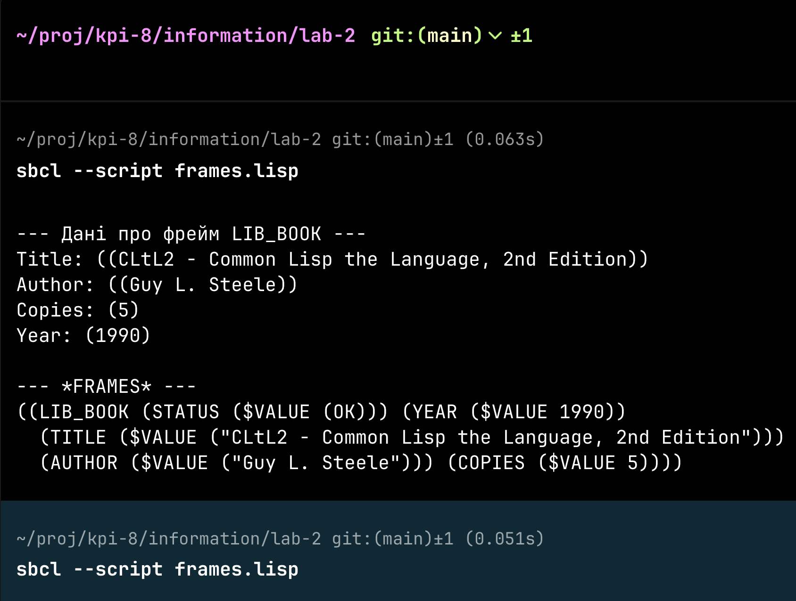

# Лабораторна робота №2

Тема: Створення мови представлення знань у вигляді мережі фреймів
Мета: ознайомлення з фреймовою моделлю подання знань та
реалізація мови представлення знань (МПЗ) у вигляді фреймової бази знань (ФБЗ).

## Теоретичні відомості  

### **Фреймова модель подання знань**  
Фрейми є однією з основних структур представлення знань в **експертних системах** та **штучному інтелекті**. Вони дозволяють описувати **об'єкти** та їх **властивості** у вигляді **структурованих даних**.

Кожен фрейм складається зі **слотів**, що містять **значення** або **процедури** для їх обчислення. Фрейми можуть мати **ієрархічну структуру**, де **нащадкові фрейми успадковують слоти** від батьківських.

Основні елементи **фреймової бази знань**:
- **Фрейм** – одиниця представлення знань.
- **Слоти** – атрибути фрейму.
- **Значення слотів** – можуть бути фіксованими або обчислюваними.
- **Процедури (демони)** – виконуються при зверненні або зміні значення слота.

### **Завдання лабораторної роботи**  
1. **Реалізувати** механізм створення фреймів та їх ієрархії.  
2. **Реалізувати** базові операції над фреймами:
   - Створення фрейму
   - Додавання та оновлення слотів
   - Отримання значень слотів  
3. **Забезпечити механізм успадкування** слотів між фреймами.  
4. **Реалізувати механізм демонів** для виконання процедур під час доступу до слотів.


## Виконання

### Структура даних для фреймів

Для зберігання фреймів у Lisp ми оберемо формат з **іменованою асоціативною структурою** (списком), де:

- **Перший елемент** списку — ім'я фрейма (атом).
- **Решта** елементів списку — це **слоти** (кожен слот теж асоціативний список).

Приклад:  
```lisp
(FRAME_NAME
   (SLOT_1 ... )
   (SLOT_2 ... )
   ...
   (SLOT_N ... ))
```

### Функція `DEFRAMEQ` для створення базового фрейма

Реалізуємо прототип функції, що дозволяє оголосити новий фрейм. Ідея полягає в тому, щоб зберігати всі фрейми у глобальній змінній (наприклад, `*FRAMES*`), яка є **асоціативним списком**:  
```lisp
(defvar *FRAMES* nil
  "Глобальний список (або хеш-таблиця) для зберігання всіх створених фреймів.")
```

Створимо функцію `DEFRAMEQ`, що додає (або модифікує) відповідний фрейм у `*FRAMES*`:
```lisp
(defun deframeq (frame-name &rest slots)
  "Створює або оновлює фрейм FRAME-NAME, додаючи в нього слоти SLOTS."
  (let ((old-frame (assoc frame-name *FRAMES*)))
    (if old-frame
        ;; Якщо фрейм уже існує, об'єднуємо нові слоти з наявними
        (setf (cdr old-frame)
              (merge-slots (cdr old-frame) slots))
      ;; Якщо фрейму ще немає, створюємо
      (push (cons frame-name (slots->internal slots)) *FRAMES*)))
  frame-name)

(defun slots->internal (slots)
  "Перетворює список слотів (SLOT ...) у внутрішню структуру.
   Кожен слот — це (SLOT-NAME (ASPECT ... ) (ASPECT ...) ...)."
  (mapcar (lambda (sl) sl) slots))

(defun merge-slots (old-slots new-slots)
  "Об'єднує старі слоти з новими, оновлюючи співпадіння."
  ;; Тут можна зробити логіку злиття, наприклад, додавати нові аспекти.
  ;; Для прикладу спростимо до додавання / заміни слотів.
  (let ((result old-slots))
    (dolist (slot new-slots)
      (let ((existing (assoc (car slot) result)))
        (if existing
            (setf (cdr existing) (cdr slot)) ;; Заміна
          (push slot result))))
    result))
```

Таким чином, виклик:
```lisp
(deframeq 'FRAME_1
  (SLOT_1 ($VALUE (EX1)))
  (SLOT_2 ($VALUE (EX2))))
```
додасть у `*FRAMES*` елемент:
```lisp
'( (FRAME_1 (SLOT_1 ($VALUE (EX1))) (SLOT_2 ($VALUE (EX2)))) ... )
```

### Функція `FASSERTQ` для оновлення фрейма

Припустимо, що ми хочемо додати (або доповнити) слоти в існуючий фрейм аналогічно до `DEFRAMEQ`, але звертаємо увагу, що назва функції передбачає **довизначення** фрейма. Для цього використаємо вже описану `merge-slots`:
```lisp
(defun fassertq (frame-name &rest slots)
  "Додає або змінює SLOTS у фреймі FRAME-NAME."
  (deframeq frame-name (unpack-slots slots)))

(defun unpack-slots (slots)
  "Якщо потрібно – обробляє слоти додатково, але поки просто повертає slots."
  slots)
```

Тепер:
```lisp
(fassertq 'FRAME_1
  (SLOT_3 ($DEFAULT (EX3))))
```
додасть у `FRAME_1` слот `SLOT_3` із аспектом `$DEFAULT` та значенням `(EX3)`.

### Отримання даних із фрейму: `FGET`

Одне з ключових завдань МПЗ — **витягувати дані** за допомогою функції `FGET`. Механізм може бути досить складним (з успадкуванням і перевіркою аспектів), але почнемо з простої реалізації, що бере дані зі **слоту** й **аспекту** вказаного фрейма:
```lisp
(defun fget (frame-name slot-name &optional (aspect '$value))
  "Повертає список значень із аспекту ASPECT слота SLOT-NAME у фреймі FRAME-NAME."
  (let ((frame (assoc frame-name *FRAMES*)))
    (if (null frame)
        ;; Фрейм не знайдено
        nil
      (let ((slot (assoc slot-name (cdr frame))))
        (if (null slot)
            nil
          (let ((asp (assoc aspect (cdr slot))))
            (if asp
                ;; Повертаємо все, що далі йде як значення
                (cdr asp)
              nil)))))))
```
Приклад виклику:
```lisp
(fget 'FRAME_1 'SLOT_1 '$value)
;; => (EX1)
```

### Приклад використання (демонстраційний код)

Нижче наведений приклад створення фрейма та вилучення з нього інформації:

```lisp
;; Очищаємо глобальну змінну
(setq *FRAMES* nil)

(deframeq 'LIB_BOOK
  (TITLE ($VALUE ("CLtL2 - Common Lisp the Language, 2nd Edition")))
  (AUTHOR ($VALUE ("Guy L. Steele")))
  (COPIES ($VALUE 5)) )

;; Поглянемо на результат:
(print *FRAMES*)

;; Припустимо, хочемо додати ще один слот:
(fassertq 'LIB_BOOK
  (YEAR ($VALUE 1990)))

;; Перевіримо дані
(format t "~%Title: ~A" (fget 'LIB_BOOK 'TITLE '$value))
(format t "~%Copies: ~A" (fget 'LIB_BOOK 'COPIES '$value))
(format t "~%Year: ~A" (fget 'LIB_BOOK 'YEAR '$value))
```

Очікуваний результат (спрощено):
```
((LIB_BOOK
  (TITLE ($VALUE ("CLtL2 - Common Lisp the Language, 2nd Edition")))
  (AUTHOR ($VALUE ("Guy L. Steele")))
  (COPIES ($VALUE 5))
  (YEAR ($VALUE 1990))))
Title: ("CLtL2 - Common Lisp the Language, 2nd Edition")
Copies: (5)
Year: (1990)
```

### Реалізація приєднаних процедур

За специфікацією лабораторної, фрейми можуть містити **демони**, тобто процедури, які викликаються при додаванні або видаленні значень. Для демонстрації створимо у слоті `($IF-ADDED (...))` невеличкий лог:
```lisp
(defun fput (frame-name slot-name aspect value)
  "Додає VALUE до аспекту ASPECT слота SLOT-NAME у фреймі FRAME-NAME.
   Якщо у слоті є $IF-ADDED – викликає відповідну процедуру."
  (fassertq frame-name
    (slot-name
      (aspect (value))))
  (maybe-run-if-added frame-name slot-name aspect value))

(defun maybe-run-if-added (frame-name slot-name aspect value)
  (let ((demon (fget frame-name slot-name '$if-added)))
    (when demon
      ;; У самому простому випадку demon – це список лямбда-функцій
      (dolist (proc demon)
        (funcall proc frame-name slot-name aspect value)))))

;; Наприклад:
(fassertq 'LIB_BOOK
  (SLOT_DEMO ($IF-ADDED
                (#'(lambda (frm s a v)
                    (format t "~%Додано ~A до ~A / ~A у фреймі ~A"
                            v s a frm))))))

(fput 'LIB_BOOK 'SLOT_DEMO '$value 'TEST_VALUE)
;; => "Додано TEST_VALUE до SLOT_DEMO / $VALUE у фреймі LIB_BOOK"
```

У складнішому варіанті `demon` може містити логіку умов (IF, ALT, OR тощо) — у такому разі доведеться додатково **інтерпретувати** список процедур за правилами МПЗ.

### Можливе розширення: успадкування (AKO)

Якщо нам потрібно успадковувати значення (наприклад, з фрейма-прототипу), можна створити слот `AKO` і при спробі `fget` звертатися рекурсивно до прототипів. Скетч коду:
```lisp
(defun fget-inherit (frame-name slot-name &optional (aspect '$value))
  "Приклад fget із успадкуванням (спрощений)."
  (let ((res (fget frame-name slot-name aspect)))
    (if res
        res
      ;; Якщо не знайдено, звертаємось до прототипів
      (let ((akos (fget frame-name 'AKO '$value)))
        (some (lambda (proto)
                (fget-inherit proto slot-name aspect))
              akos)))))
```
**some** поверне перший непорожній результат. У більш розширеній версії враховуються й інші типи успадкування, інші аспекти ($DEFAULT тощо).

## Демонстрація можливостей та приклад використання

### Використання фреймової системи

Покажемо, як створити кілька фреймів, додати в них слоти, отримати дані та викликати «демони». Усе це ілюструє роботу нашої простої МПЗ.

Нижче наведено **повний код**, який містить:

1. **Глобальну змінну** для зберігання фреймів.
2. Функції для **створення/оновлення фреймів** (`DEFRAMEQ`, `FASSERTQ`).
3. Функції для **отримання даних** (`FGET`) і **додавання нових значень** (`FPUT`).
4. Приклад «демона» `($IF-ADDED)`, який викликається автоматично при додаванні нових значень у слот.

### Повний код

```lisp
;;; ==============================
;;; Фреймова "мова представлення знань"
;;; ==============================

(defvar *FRAMES* nil
  "Глобальний список (або хеш-таблиця) для зберігання створених фреймів.")

;; ---- Допоміжні функції ----

(defun slots->internal (slots)
  "Перетворює список слотів у внутрішню структуру.
   Кожен слот має вигляд: (SLOT-NAME (ASPECT ... ) (ASPECT ...) ...)."
  ;; 'slots' is expected to be a list of slot-forms, e.g. ((TITLE ($VALUE ...)) (AUTHOR ($VALUE ...)) ...)
  (mapcar #'identity slots))

(defun merge-slots (old-slots new-slots)
  "Об'єднує старі слоти з новими, оновлюючи чи додаючи слоти."
  (let ((result old-slots))
    (dolist (slot new-slots)
      (let ((existing (assoc (car slot) result)))
        (if existing
            (setf (cdr existing) (cdr slot)) ;; Заміна на новий вміст
          (push slot result))))
    result))

;; ---- Створення/оновлення фреймів ----

(defmacro deframeq (frame-name &rest slots)
  "Оголошує або оновлює фрейм FRAME-NAME, додаючи SLOT definitions (as data)."
  `(deframeq-internal ',frame-name ',slots))

(defun deframeq-internal (frame-name slots)
  "Реалізує логіку створення/оновлення фрейму за допомогою 'slots->internal' і 'merge-slots'."
  (let ((old-frame (assoc frame-name *FRAMES*)))
    (if old-frame
        (setf (cdr old-frame)
              (merge-slots (cdr old-frame) (slots->internal slots)))
      (push (cons frame-name (slots->internal slots)) *FRAMES*)))
  frame-name)

(defun fassertq (frame-name &rest slots-forms)
  "Додає або змінює слот(и) у фреймі FRAME-NAME.
SLOTS-FORMS - це список, де кожен елемент - список слотів."
  ;; Each element in slots-forms is presumably a quoted list of slot definitions.
  (dolist (slotlist slots-forms)
    (deframeq-internal frame-name slotlist)))


;; ---- Отримання даних зі слота фрейма ----

(defun fget (frame-name slot-name &optional (aspect '$value))
  "Повертає список значень з аспекта ASPECT у слоті SLOT-NAME фрейма FRAME-NAME."
  (let ((frame (assoc frame-name *FRAMES*)))
    (if (null frame)
        ;; Фрейм не знайдено
        nil
      (let ((slot (assoc slot-name (cdr frame))))
        (if (null slot)
            nil
          (let ((asp (assoc aspect (cdr slot))))
            (if asp
                (cdr asp)
              nil)))))))

;; ---- Демони, які викликаються при додаванні значень ----

(defun maybe-run-if-added (frame-name slot-name aspect value)
  "Якщо в даному слоті є аспект $IF-ADDED, викликаємо всі процедури звідти."
  (let ((demon (fget frame-name slot-name '$if-added)))
    (when demon
      (dolist (proc demon)
        (funcall proc frame-name slot-name aspect value)))))

(defun fput (frame-name slot-name aspect value)
  "Додає VALUE до аспекту ASPECT слота SLOT-NAME у фреймі FRAME-NAME.
Якщо існує демон ($IF-ADDED), він викликається."
  (fassertq frame-name
    `((,slot-name
       (,aspect (,value)))))
  (maybe-run-if-added frame-name slot-name aspect value)
  value)


;;; =========================
;;; ПРИКЛАД ВИКОРИСТАННЯ
;;; =========================

;; Очищаємо глобальний список фреймів
(setq *FRAMES* nil)

;; 1) Створимо фрейм 'LIB_BOOK' з даними про книгу
(deframeq LIB_BOOK
  (TITLE ($VALUE ("CLtL2 - Common Lisp the Language, 2nd Edition")))
  (AUTHOR ($VALUE ("Guy L. Steele")))
  (COPIES ($VALUE 5)))

;; 2) Додамо слот з роком (Зверніть увагу на подвійні дужки, бо це один слот.)
(fassertq 'LIB_BOOK
  '((YEAR ($VALUE 1990))))

;; 3) Отримаємо дані
(format t "~%--- Дані про фрейм LIB_BOOK ---~%")
(format t "Title: ~A~%"  (fget 'LIB_BOOK 'TITLE))
(format t "Author: ~A~%" (fget 'LIB_BOOK 'AUTHOR))
(format t "Copies: ~A~%" (fget 'LIB_BOOK 'COPIES))
(format t "Year: ~A~%"   (fget 'LIB_BOOK 'YEAR))

;; 4) Демонстрація "демона":
;;   Додамо в слот 'STATUS' аспект $IF-ADDED з лямбда-процедурою
;;   Зверніть увагу: у fassertq все ще потрібне подвоєння дужок
(fassertq 'LIB_BOOK
  '((STATUS ($IF-ADDED
             (#'(lambda (frm s a v)
                  (format t "~%[DEMON] Додано ~A до слота ~A фрейму ~A!~%"
                          v s frm)))))))

;; Тепер якщо ми викличемо fput - побачимо "демон"
(fput 'LIB_BOOK 'STATUS '$value 'OK)

;; Перевіримо структуру глобальної змінної *FRAMES*
(format t "~%--- *FRAMES* ---~%~S~%" *FRAMES*)
```

Це підтверджує, що:

- **Фрейм** `LIB_BOOK` успішно створено і записано до `*FRAMES*`.
- **Демон** `$IF-ADDED` відпрацював при додаванні значення `OK` до слота `STATUS`.



Таким чином, ми отримали просту **мову представлення знань** у формі **мережі фреймів**, яку можна розширювати механізмом **успадкування**, **динамічних процедур** (демонів) та іншими можливостями для складніших застосувань.

## Висновок

У цій лабораторній роботі створено **мову представлення знань** у вигляді **мережі фреймів** на Lisp. Реалізовані основні концепції:

1. **Опис фреймів** (через `DEFRAMEQ` та їх зберігання у глобальній змінній).  
2. **Додавання/оновлення слотів** (`FASSERTQ`).  
3. **Отримання значень** зі слотів (`FGET`) з можливістю розширення до **успадкування**.  
4. **Приєднані процедури** (демони) через приклад `($IF-ADDED ...)`.  

Отриманий прототип дозволяє створювати й керувати **фреймовою базою знань**, а також демонструє, як можна включати **процедури** (демони) в логіку МПЗ. Це дає змогу розробникам розширювати систему в напрямку **динамічного успадкування**, обчислювальних даних і **автоматичної реакції** на зміни в БЗ.
