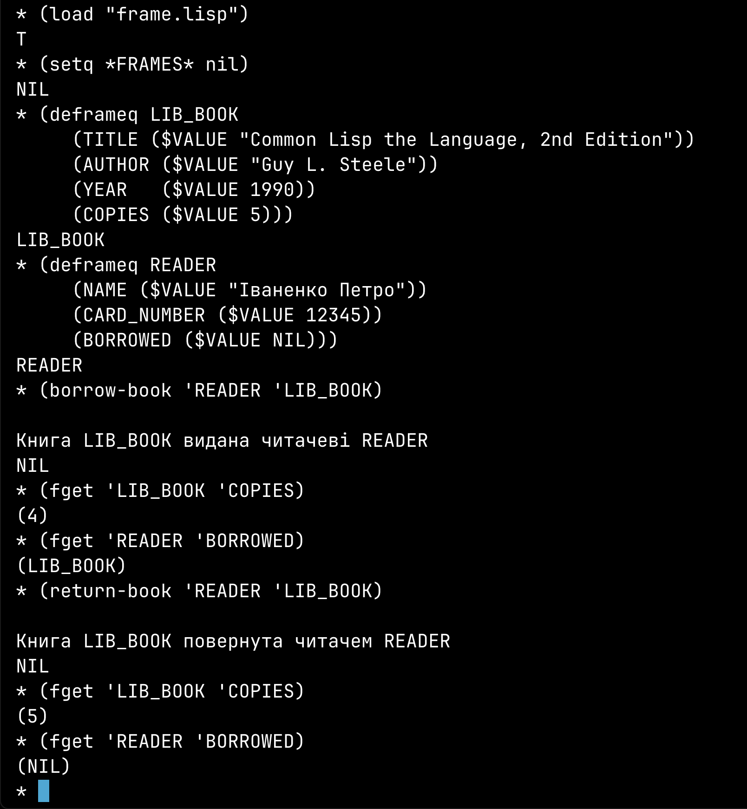

# Лабораторна робота №3
Тема: Створення фреймової бази знань на основі МПЗ

Мета: Розробити фреймову базу знань (ФБЗ) для обраної предметної області на основі мови представлення знань (МПЗ), розробленої у попередній лабораторній роботі.

## Теоретичні відомості

Фреймова база знань є набором взаємопов'язаних фреймів, що представляють різні сутності певної предметної області. Вона дозволяє не тільки зберігати статичні знання у вигляді атрибутів і зв’язків між об’єктами, але й реалізовувати логіку їхньої взаємодії через процедури, прив’язані до слотів.

У цій лабораторній роботі ми використовуємо розроблену мову представлення знань (МПЗ) для створення та маніпулювання ФБЗ. Основними функціями для роботи з фреймами є:
- DEFRAMEQ – створення фрейму
- FASSERTQ – додавання чи оновлення слотів фрейму
- FGET – отримання інформації з фрейму
- FPUT – додавання значень у фрейм
- FDELETE – видалення слотів чи аспектів фрейму

## Виконання

### Вибір предметної області
Для реалізації ФБЗ ми обрали бібліотечну систему, яка містить інформацію про книги, авторів, читачів та їхні взаємодії (наприклад, взяття книги в оренду).

Фреймова база знань для бібліотеки включатиме:
- Книги (назва, автор, рік видання, кількість примірників)
- Читачі (ім'я, номер читацького квитка, список взятих книг)
- Процедури для управління взаємодіями (видача/повернення книги)


### Реалізація фреймової бази знань

#### Створення фреймів для бібліотечної системи
```lisp
;; Очищаємо попередні дані
(setq *FRAMES* nil)

;; Фрейм книги
(deframeq 'BOOK
  (TITLE   ($VALUE "Common Lisp the Language, 2nd Edition"))
  (AUTHOR  ($VALUE "Guy L. Steele"))
  (YEAR    ($VALUE 1990))
  (COPIES  ($VALUE 5)))

;; Фрейм читача
(deframeq 'READER
  (NAME         ($VALUE "Іваненко Петро"))
  (CARD_NUMBER  ($VALUE 12345))
  (BORROWED     ($VALUE NIL))) ;; Початково жодних книг не взято
```

#### Додавання нових даних
```lisp
;; Додамо ще одну книгу
(deframeq 'BOOK-2
  (TITLE   ($VALUE "Artificial Intelligence: A Modern Approach"))
  (AUTHOR  ($VALUE "Stuart Russell, Peter Norvig"))
  (YEAR    ($VALUE 2020))
  (COPIES  ($VALUE 3)))

;; Додамо ще одного читача
(deframeq 'READER-2
  (NAME         ($VALUE "Сидорчук Марина"))
  (CARD_NUMBER  ($VALUE 67890))
  (BORROWED     ($VALUE NIL)))
```

---

#### Реалізація функцій для бібліотечних операцій
##### Функція видачі книги читачеві
```lisp
(defun borrow-book (reader book)
  "Видає книгу читачеві, зменшуючи кількість копій у фреймі книги."
  (let ((copies (fget book 'COPIES)))
    (if (and copies (> copies 0))
        (progn
          ;; Зменшуємо кількість примірників книги
          (fput book 'COPIES '$value (- copies 1))
          ;; Додаємо книгу в список читача
          (fput reader 'BORROWED '$value book)
          (format t "~%Книга ~A видана читачеві ~A~%" book reader))
      (format t "~%Немає вільних примірників книги ~A~%" book))))
```

##### Функція повернення книги
```lisp
(defun return-book (reader book)
  "Читач повертає книгу в бібліотеку."
  (let ((borrowed (fget reader 'BORROWED)))
    (if (member book borrowed)
        (progn
          ;; Збільшуємо кількість примірників
          (fput book 'COPIES '$value (+ (fget book 'COPIES) 1))
          ;; Видаляємо книгу зі списку читача
          (fput reader 'BORROWED '$value (remove book borrowed))
          (format t "~%Книга ~A повернута читачем ~A~%" book reader))
      (format t "~%Читач ~A не має книги ~A~%" reader book))))
```

---

### Використання фреймової бази знань
Перевіримо роботу системи
```lisp
;; Видаємо книгу читачеві
(borrow-book 'READER 'BOOK)

;; Перевіряємо оновлену інформацію
(format t "~%Книги в бібліотеці після видачі: ~A~%" (fget 'BOOK 'COPIES))
(format t "~%Книги читача: ~A~%" (fget 'READER 'BORROWED))

;; Читач повертає книгу
(return-book 'READER 'BOOK)

;; Перевіряємо стан після повернення
(format t "~%Книги в бібліотеці після повернення: ~A~%" (fget 'BOOK 'COPIES))
(format t "~%Книги читача: ~A~%" (fget 'READER 'BORROWED))
```


### **Повний код фреймової бази знань**

Перед тим як виконувати операції в інтерпретаторі, потрібно завантажити всю систему.

```lisp
;;; =============================================================================
;;;  Фреймова "мова представлення знань" (виправлена версія).
;;; =============================================================================

(defvar *FRAMES* nil
  "Глобальний список (або хеш-таблиця) для зберігання створених фреймів.")

(defun slots->internal (slots)
  "Перетворює список слотів у внутрішню структуру.
Кожен елемент має вигляд: (SLOT-NAME (ASPECT ...) (ASPECT ...))."
  (mapcar #'identity slots))

(defun merge-slots (old-slots new-slots)
  "Об'єднує старі слоти з новими, оновлюючи чи додаючи слоти."
  (let ((result old-slots))
    (dolist (slot new-slots)
      (let ((existing (assoc (car slot) result)))
        (if existing
            (setf (cdr existing) (cdr slot)) ;; Оновити слот
          (push slot result))))
    result))

;;; ---------------------------
;;; Створення / оновлення фреймів
;;; ---------------------------
(defmacro deframeq (frame-name &rest slots)
  "Оголошує (або оновлює) фрейм FRAME-NAME, додаючи SLOT definitions (as data)."
  `(deframeq-internal ',frame-name ',slots))

(defun deframeq-internal (frame-name slots)
  "Реалізує логіку створення/оновлення фрейму."
  (let ((old-frame (assoc frame-name *FRAMES*)))
    (if old-frame
        (setf (cdr old-frame)
              (merge-slots (cdr old-frame) (slots->internal slots)))
      (push (cons frame-name (slots->internal slots)) *FRAMES*)))
  frame-name)

(defun fassertq (frame-name &rest slots-forms)
  "Додає або змінює слот(и) у фреймі FRAME-NAME.
Кожен елемент – список слотів типу '((SLOTNAME (ASPECT (DATA...)))...)"
  (dolist (slotlist slots-forms)
    (deframeq-internal frame-name slotlist)))


;;; ---------------------------
;;; Отримання даних зі слота фрейма
;;; ---------------------------
(defun fget (frame-name slot-name &optional (aspect '$value))
  "Повертає список значень з аспекта ASPECT у слоті SLOT-NAME фрейма FRAME-NAME.
Наприклад, якщо (COPIES ($VALUE 5)), (fget 'FRAME 'COPIES) => (5)."
  (let ((frame (assoc frame-name *FRAMES*)))
    (if (null frame)
        nil
      (let ((slot (assoc slot-name (cdr frame))))
        (if (null slot)
            nil
          (let ((asp (assoc aspect (cdr slot))))
            (if asp
                (cdr asp)  ;; Повертає (DATA1 DATA2 ...)
              nil)))))))

;;; ---------------------------
;;; Демони ($IF-ADDED), що викликаються при додаванні значень
;;; ---------------------------
(defun maybe-run-if-added (frame-name slot-name aspect value)
  "Якщо в слоті є ( $IF-ADDED (#'<lambda> ...)), викликати ці процедури."
  (let ((demon (fget frame-name slot-name '$if-added)))
    (when demon
      (dolist (proc demon)
        (funcall proc frame-name slot-name aspect value)))))

(defun fput (frame-name slot-name aspect value)
  "Додає VALUE до аспекту ASPECT слота SLOT-NAME у фреймі FRAME-NAME.
Головна зміна: тепер зберігаємо (,aspect ,value), а не (,aspect (,value)).
Це уникає подвійних дужок."
  (fassertq frame-name
    `((,slot-name
       (,aspect ,value))))
  (maybe-run-if-added frame-name slot-name aspect value)
  value)

;;; =========================
;;; Функції для бібліотечної системи
;;; =========================

(defun borrow-book (reader book)
  "Видає книгу читачеві, зменшуючи кількість копій.
(fget book 'COPIES) => (5). (car ...) => 5. Потім зберігаємо (4) (одна пара дужок)."
  (let* ((copies-raw (fget book 'COPIES))  ;; => (5)
         (copies (car copies-raw)))        ;; => 5
    (if (and copies (> copies 0))
        (progn
          (fput book 'COPIES '$value (1- copies))  ;; тепер (4) замість ((4))
          (fput reader 'BORROWED '$value book)     ;; (LIB_BOOK) замість ((LIB_BOOK))
          (format t "~%Книга ~A видана читачеві ~A~%" book reader))
      (format t "~%Немає вільних примірників книги ~A~%" book))))

(defun return-book (reader book)
  "Читач повертає книгу.
Якщо (fget book 'COPIES) => (4), беремо (car ...) => 4, зберігаємо (5)."
  (let* ((borrowed (fget reader 'BORROWED))   ;; => (LIB_BOOK)
         (copies-raw (fget book 'COPIES))     ;; => (4)
         (copies (car copies-raw)))           ;; => 4
    (if (member book borrowed)
        (progn
          (fput book 'COPIES '$value (1+ copies))   ;; => (5)
          (fput reader 'BORROWED '$value (remove book borrowed))
          (format t "~%Книга ~A повернута читачем ~A~%" book reader))
      (format t "~%Читач ~A не має книги ~A~%" reader book))))

```

### **Тестування системи в інтерпретаторі**

#### **Крок 1: Створення початкових фреймів**
```lisp
(setq *FRAMES* nil)
```
**Що сталося?**  
Ця команда очищає всі фрейми, щоб почати роботу "з нуля".

```lisp
(deframeq LIB_BOOK
  (TITLE ($VALUE "Common Lisp the Language, 2nd Edition"))
  (AUTHOR ($VALUE "Guy L. Steele"))
  (YEAR ($VALUE 1990))
  (COPIES ($VALUE 5)))
```
**Що сталося?**  
Ми створили фрейм `LIB_BOOK`, що містить інформацію про книгу.

```lisp
(deframeq READER
  (NAME ($VALUE "Іваненко Петро"))
  (CARD_NUMBER ($VALUE 12345))
  (BORROWED ($VALUE NIL)))
```
**Що сталося?**  
Додано фрейм `READER`, який представляє читача бібліотеки.

#### **Крок 2: Отримання інформації**
```lisp
(fget 'LIB_BOOK 'TITLE)
```
**Що сталося?**  
Отримано назву книги.

```lisp
(fget 'LIB_BOOK 'COPIES)
```
**Що сталося?**  
Перевірено кількість доступних примірників.

```lisp
(fget 'READER 'BORROWED)
```
**Що сталося?**  
Перевірено, які книги взяв читач (наразі `NIL`).

#### **Крок 3: Видача книги читачеві**
```lisp
(borrow-book 'READER 'LIB_BOOK)
```
**Що сталося?**  
Книга `LIB_BOOK` була видана читачеві `READER`, зменшивши доступні копії.

```lisp
(fget 'LIB_BOOK 'COPIES)
```
**Що сталося?**  
Кількість примірників зменшилася.

```lisp
(fget 'READER 'BORROWED)
```
**Що сталося?**  
Читач тепер має записану книгу у списку взятих.


#### **Крок 4: Повернення книги**
```lisp
(return-book 'READER 'LIB_BOOK)
```
**Що сталося?**  
Читач повернув книгу назад до бібліотеки.

```lisp
(fget 'LIB_BOOK 'COPIES)
```
**Що сталося?**  
Кількість примірників книги знову збільшилася.

```lisp
(fget 'READER 'BORROWED)
```
**Що сталося?**  
Список книг читача знову порожній.



## Висновки
У цій лабораторній роботі ми розробили фреймову базу знань для бібліотечної системи на основі мови представлення знань (МПЗ). Було реалізовано:
- Створення фреймів для книг та читачів
- Модифікацію фреймів шляхом додавання нової інформації
- Вилучення інформації з фреймів
- Процедури видачі та повернення книг

Ця модель може бути розширена для обслуговування складніших систем, таких як автоматизація бібліотечних процесів або система управління ресурсами.
