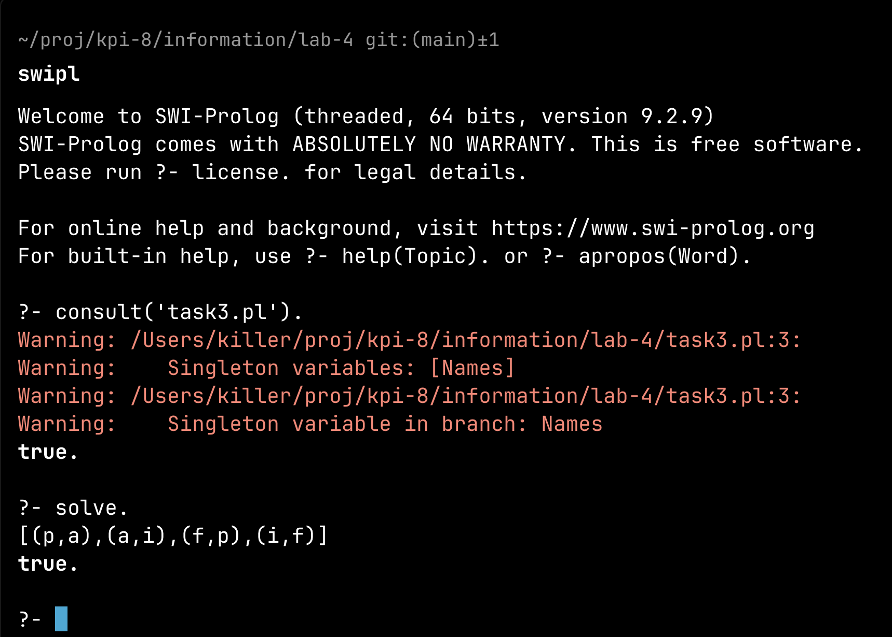
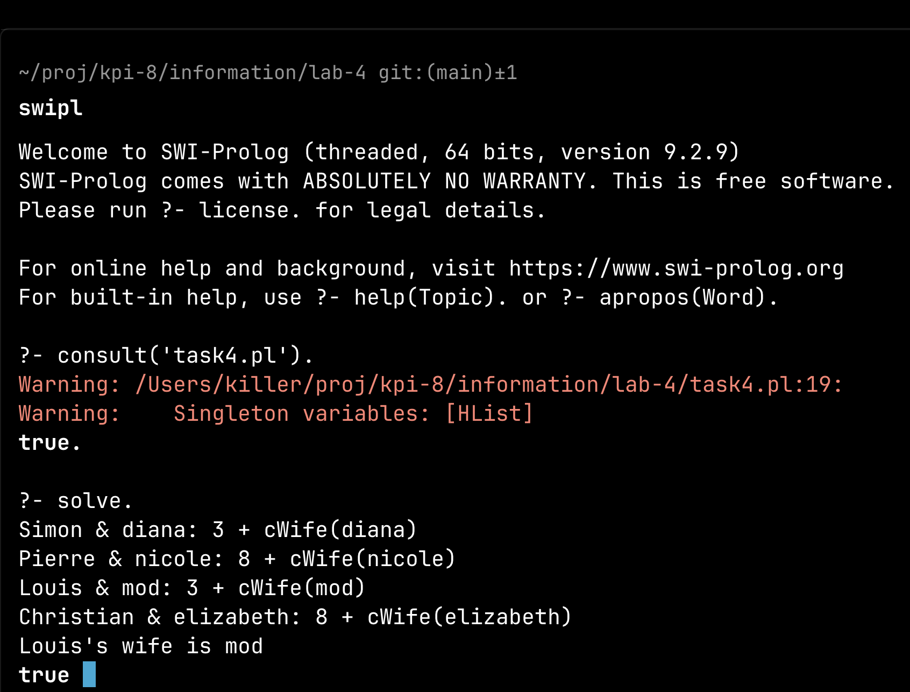
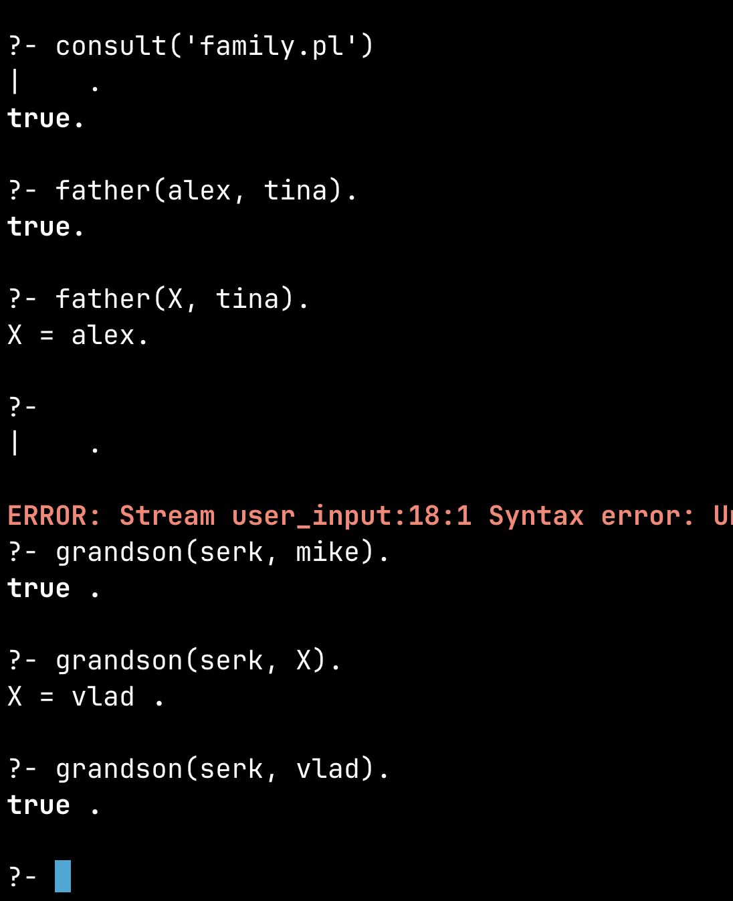

# Лабораторна робота №4  
Тема: Використання логічного програмування в Prolog  
Мета: Ознайомитися з основами логічного програмування та реалізувати базу знань у вигляді родинного дерева.
Варіант: 16


## Теоретична частина  

Prolog – це мова програмування, заснована на формальній логіці, яка використовується в інтелектуальних системах, обробці природної мови та базах знань.  

### Основні поняття  

1. Факти – твердження, які визначають стосунки між об’єктами.  
   ```prolog
   parent(bill, moris).  % Біл – батько Моріса
   ```
2. Правила – визначають взаємозв’язки між фактами.  
   ```prolog
   father(X, Y) :- parent(X, Y), male(X).  % X – батько Y, якщо X – чоловік і є батьком
   ```
3. Запити – дозволяють виконувати логічні запити до бази знань.  
   ```prolog
   ?- father(bill, moris).  
   ```


## Встановлення Prolog на macOS

На Mac зручний спосіб встановити SWI-Prolog – найпопулярнішу реалізацію Prolog.

### Встановлення через Homebrew
Відкрийте термінал і виконайте команду:
```sh
brew install swi-prolog
```
Після встановлення перевірте, чи все працює:
```sh
swipl
```
Ви побачите щось на кшталт:
```
Welcome to SWI-Prolog ...
```
Це означає, що середовище встановлене правильно.  

### Запуск Prolog
Для запуску Prolog-файлу (`family.pl`), виконайте:
```sh
swipl -s family.pl
```
Щоб завантажити базу знань у запущеній сесії:
```prolog
?- consult('family.pl').
```

## Приклад роботи з Prolog  

Факти:
```prolog
parent(john, mary).
parent(mary, alice).
```
Правило для визначення дідуся:
```prolog
grandparent(X, Y) :- parent(X, Z), parent(Z, Y).
```
Запит:
```prolog
?- grandparent(john, alice).
```
Очікуваний результат:
```prolog
true.
```


## Виконання  

### Завдання 3  

У нас є чотири школярі з іменами: Петро, Андрій, Федір та Іван. Їхні прізвища: Петренко, Андреєнко, Федоренко, Іванов.  

Для розв’язання задачі використовуємо логічне програмування в Prolog. Ми визначимо набір імен та прізвищ, після чого створимо правило, яке знаходить розв’язок, перевіряючи всі можливі комбінації, які задовольняють обмеження.  

```prolog
domain([p, a, f, i]).

solve :-
    domain(Names),
    domain(Surnames),
    permutation(Surnames, [S1,S2,S3,S4]),
    Students = [(p,S1),(a,S2),(f,S3),(i,S4)],

    all_distinct_pairs(Students),

    check_surname_a(Students),

    member((p, SurOfP), Students),
    member((SurOfP, SurOfSurOfP), Students),
    member((NameWithF, f), Students),
    NameWithF = SurOfSurOfP,

    writeln(Students),
    fail ; true.

all_distinct_pairs([]).
all_distinct_pairs([(N,S)|T]) :-
    N \= S,
    all_distinct_pairs(T).

check_surname_a([]).
check_surname_a([(N,a)|T]) :- N \= i, check_surname_a(T).
check_surname_a([(_,S)|T]) :- S \= a, check_surname_a(T).

```
Щоб отримати розв’язок, потрібно виконати команду:  
```prolog
?- solve.
```



Тобто правильні імена:

- Андрієнко Петро
- Іванов Андрій
- Петренко Федір
- Федоренко Іван

### Завдання 4  

У задачі є чотири подружні пари, які курили різну кількість сигарет

Разом викурено 32 сигарети. Потрібно визначити ім'я дружини Луї.  

Для розв’язання задачі у Prolog ми задаємо змінні для кожного чоловіка та його дружини, встановлюємо рівняння відповідно до правил та обчислюємо правильні значення.  

```prolog
wives([diana, elizabeth, nicole, mod]).
cigWife(diana, 3).
cigWife(elizabeth, 2).
cigWife(nicole, 4).
cigWife(mod, 1).

husbands([simon, pierre, louis, christian]).
ratio(simon, 1).
ratio(pierre, 2).
ratio(louis, 3).
ratio(christian, 4).

total(32).

solve :-
    wives(WList), husbands(HList),
    permutation(WList, [W1, W2, W3, W4]),    % Reorder wives
    ratio(simon, RS), ratio(pierre, RP), ratio(louis, RL), ratio(christian, RC),
    cigWife(W1, SW1), cigWife(W2, SW2), cigWife(W3, SW3), cigWife(W4, SW4),
    HS1 is SW1 * RS,
    HS2 is SW2 * RP,
    HS3 is SW3 * RL,
    HS4 is SW4 * RC,
    Sum is SW1 + SW2 + SW3 + SW4 + HS1 + HS2 + HS3 + HS4,
    total(Total),
    Sum =:= Total,
    write_result(W1, W2, W3, W4, [HS1,HS2,HS3,HS4]).

write_result(W1, W2, W3, W4, [H1,H2,H3,H4]) :-
    format("Simon & ~w: ~w + ~w~n", [W1, H1, cWife(W1)]),
    format("Pierre & ~w: ~w + ~w~n", [W2, H2, cWife(W2)]),
    format("Louis & ~w: ~w + ~w~n", [W3, H3, cWife(W3)]),
    format("Christian & ~w: ~w + ~w~n", [W4, H4, cWife(W4)]),
    format("Louis's wife is ~w~n", [W3]).

cWife(W) :- cigWife(W, C), format("~w", [C]).

```
Запуск програми:  
```prolog
?- solve.
```



В результаті виконання четвертого завдання ми отримали наступні відповідності між чоловіками та їхніми дружинами:

- Сімон одружений з Діаною.
- П'єр одружений з Ніколь.
- Луї одружений з Мод.
- Крістіан одружений з Елізабет.

Згідно з обчисленнями, Луї викурив у три рази більше сигарет, ніж його дружина. Загалом усі учасники викурили 32 сигарети, і після розрахунків визначено, що дружина Луї — Мод.


### Родина  

У цій секції ми розглянемо родинні зв’язки між особами у сімейному дереві та реалізуємо відповідні логічні правила в мові Prolog.  

Сімейне дерево складається з наступних осіб:  
- Батьки: Алекс, Нателла, Енн, Джон, Тіна, Влад, Ольга, Майк, Сем, Жозефіна  
- Діти: Тіна, Сара, Влад, Маргарет, Сем, Борис, Жозефіна, Серік, Хорхе  

#### Опис родинних зв’язків  
- Батько (father/2) – чоловік, що має біологічних дітей.  
- Мати (mother/2) – жінка, що має біологічних дітей.  
- Син (son/2) – хлопець щодо своїх батьків.  
- Дочка (daughter/2) – дівчина щодо своїх батьків.  
- Брат (brother/2) – хлопець щодо своїх братів або сестер.  
- Сестра (sister/2) – дівчина щодо своїх братів або сестер.  
- Дід (grandfather/2) – батько одного з батьків.  
- Баба (grandmother/2) – мати одного з батьків.  
- Онук (grandson/2) – хлопець щодо своїх дідуся чи бабусі.  
- Онука (granddaughter/2) – дівчина щодо своїх дідуся чи бабусі.  
- Дядько (uncle/2) – брат одного з батьків.  
- Тітка (aunt/2) – сестра одного з батьків.  
- Небіж (nephew/2) – син брата чи сестри.  
- Небога (niece/2) – дочка брата чи сестри.  


#### Реалізація в Prolog  

```prolog
% Факти про сімейні зв’язки
father(alex, tina).
father(alex, sara).
father(enn, vlad).
father(enn, margaret).
father(vlad, sam).
father(vlad, boris).
father(mike, josephine).
father(sam, serk).
father(sam, jorge).

mother(natella, tina).
mother(natella, sara).
mother(john, vlad).
mother(john, margaret).
mother(tina, sam).
mother(tina, boris).
mother(olga, josephine).
mother(josephine, serk).
mother(josephine, jorge).

% Визначення родинних зв’язків
parent(X, Y) :- father(X, Y).
parent(X, Y) :- mother(X, Y).

sibling(X, Y) :- parent(P, X), parent(P, Y), X \= Y.

brother(X, Y) :- sibling(X, Y), male(X).
sister(X, Y) :- sibling(X, Y), female(X).

son(X, Y) :- parent(Y, X), male(X).
daughter(X, Y) :- parent(Y, X), female(X).

grandparent(X, Y) :- parent(X, Z), parent(Z, Y).
grandfather(X, Y) :- grandparent(X, Y), male(X).
grandmother(X, Y) :- grandparent(X, Y), female(X).

grandchild(X, Y) :- grandparent(Y, X).
grandson(X, Y) :- grandchild(X, Y), male(X).
granddaughter(X, Y) :- grandchild(X, Y), female(X).

uncle(X, Y) :- brother(X, P), parent(P, Y).
aunt(X, Y) :- sister(X, P), parent(P, Y).

nephew(X, Y) :- uncle(Y, X).
nephew(X, Y) :- aunt(Y, X).
niece(X, Y) :- uncle(Y, X).
niece(X, Y) :- aunt(Y, X).

% Гендерні факти (потрібні для визначення братів/сестер)
male(alex). 
male(enn). 
male(john). 
male(vlad). 
male(mike).
male(sam).
male(boris).
male(serk).
male(jorge).

female(natella).
female(enn).
female(tina).
female(sara).
female(margaret).
female(olga).
female(josephine).
```


#### Приклади запитів  

Щоб перевірити зв’язки, можна виконати такі запити в Prolog:  

```prolog
?- father(alex, tina).   % Перевірити, чи Алекс є батьком Тіни  
?- sibling(sam, boris).  % Чи Сам і Борис є братами?  
?- grandson(serk, mike). % Чи Серік є онуком Майка?  
?- niece(sara, vlad).    % Чи Сара є небогою Влада?  
?- uncle(vlad, serk).    % Чи Влад є дядьком Серіка?  
```

Ці предикати дозволяють з легкістю працювати з сімейним деревом та встановлювати родинні відносини.



## Висновок  

У цій лабораторній роботі було розв’язано дві логічні задачі засобами Prolog.  
Перше завдання полягало у визначенні відповідностей між іменами та прізвищами школярів.  
Друге завдання вимагало знайти ім’я дружини Луї, враховуючи кількість викурених сигарет.  

У результаті було продемонстровано, як Prolog може використовуватися для розв’язання логічних головоломок та побудови висновків на основі фактів та обмежень.