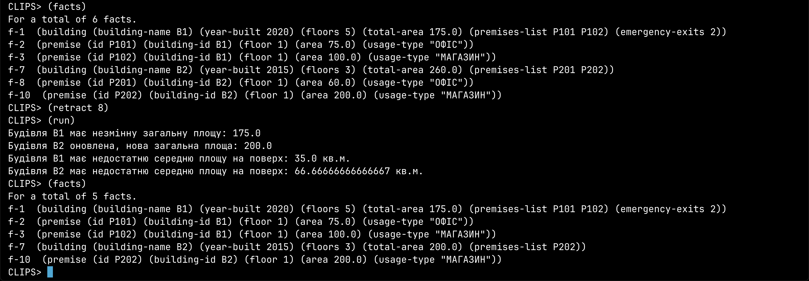

# Лабораторна робота №5-6

Тема: РОЗРОБКА ПРОТОТИПУ ДІАГНОСТИЧНОЇ ЕКСПЕРТНОЇ СИСТЕМИ І БАЗИ ЗНАНЬ
Мета:
1. Дослідити предметну область, сформувати для неї поле знань, список
фактів, а також правил для роботи з ними.
2. Оволодіти базовими конструкціями мови представлення знань CLIPS,
такими як deftemplate, deffacts, defrule, deffunction,
defglobal.
3. Освоїти принципи пошуку рішення в експертних системах, заснованих на
правилах виду "ЯКЩО-ТО", формування послідовності активації правил
при виведенні результату.

## Вступ

### Актуальність розробки експертної системи

У сучасних умовах, коли обсяги інформації та даних, з якими стикаються люди в повсякденному житті та професійній діяльності, стрімко зростають, виникає необхідність у пошуку ефективних рішень щодо автоматизації процесів прийняття управлінських рішень. Особливо це стосується сфери управління нерухомістю, будівельними об’єктами та приміщеннями, де помилка або неточність може мати серйозні економічні, юридичні та експлуатаційні наслідки.

На сучасному етапі керування будівельними комплексами та приміщеннями значною мірою ґрунтується на ручній обробці документів, паперовій звітності та суб’єктивному підході відповідальних працівників. Це призводить до суттєвого збільшення витрат часу, підвищення ризику помилок та погіршення якості управлінських рішень. Особливо гостро ця проблема стоїть перед великими компаніями та державними органами, які мають справу з численними будівлями, сотнями або навіть тисячами приміщень із різним призначенням, нормативами та специфічними вимогами до експлуатації.

Сучасний підхід до вирішення цієї проблеми передбачає впровадження систем автоматизації прийняття рішень, у тому числі експертних систем, що базуються на чітких правилах і фактах. Подібні системи не лише зменшують вплив людського фактора, а й забезпечують більш точне та прозоре прийняття рішень, а також можливість швидко й ефективно реагувати на зміни в умовах експлуатації об’єктів.

Експертні системи є інтелектуальними програмними комплексами, що дозволяють імітувати процес прийняття рішень висококваліфікованими спеціалістами в певній предметній області. Вони ґрунтуються на знаннях експертів, накопичених за тривалий час роботи та закодованих у вигляді набору правил («якщо-то») і фактів, які зберігаються у спеціалізованій базі знань. Саме завдяки таким системам можливо автоматично перевіряти та контролювати відповідність будівель та приміщень вимогам норм і стандартів, контролювати навантаження на будівлі, планувати та оптимізувати використання площ.

Використання експертних систем дозволяє скоротити витрати на утримання персоналу, підвищити швидкість та ефективність обробки інформації, оптимізувати використання ресурсів і площ, а також підвищити якість та точність прийнятих рішень. У довгостроковій перспективі це значно підвищує конкурентоспроможність підприємств та ефективність роботи державних установ.

Окрім цього, запровадження експертних систем забезпечує прозорість і контрольованість процесу прийняття рішень, що є важливим чинником для дотримання законодавчих норм та стандартів у сфері будівництва та експлуатації нерухомості. Вони також значно полегшують моніторинг відповідності будівельних об'єктів законодавчим та нормативним актам, дозволяючи оперативно реагувати на будь-які невідповідності або відхилення від норм.

Серед додаткових переваг експертних систем варто також відзначити їхню гнучкість. Вони можуть бути легко модифіковані та доповнені новими правилами і фактами відповідно до змін у нормативній базі, що дозволяє підтримувати їхню актуальність та ефективність протягом тривалого періоду часу. Завдяки використанню формальних мов представлення знань, таких як CLIPS, забезпечується прозорість логіки прийняття рішень, що полегшує розуміння та контроль з боку користувачів та регуляторних органів.

Таким чином, розробка сучасної експертної системи для керування будівлями та приміщеннями є надзвичайно актуальним та важливим завданням. Створена в рамках даної лабораторної роботи експертна система повинна продемонструвати ефективність автоматизованого підходу до управління об'єктами нерухомості, забезпечити зручний механізм взаємодії користувачів із даними та правилами, які визначають логіку роботи системи.

Подальші розділи роботи будуть присвячені детальному опису процесу створення цієї експертної системи, аналізу предметної області, вибору інструментів реалізації, проектуванню структури фактів і правил, а також демонстрації роботи створеного програмного рішення.

### Огляд поставленого завдання

#### Короткий опис роботи, що була виконана в лабораторних роботах №2-3

У лабораторних роботах №2-3 нами було реалізовано систему представлення знань на основі власноруч створеної мови, яка базується на фреймовій моделі. Розроблена мова отримала назву "FRAMLisp". Ця мова дозволяє створювати, модифікувати та керувати фреймами, які являють собою структури для опису об’єктів предметної області — у нашому випадку, будівель, приміщень, а також організацій, що ними управляють.

Основною структурою знань у FRAMLisp є фрейми. Кожен фрейм описує певний об'єкт, наприклад, будівлю, приміщення або базу технічної інвентаризації (БТІ). Фрейми складаються зі слотів, які представляють характеристики об'єкта (такі як площа, рік побудови, поверховість). Для слотів були реалізовані спеціальні аспекти, що дозволяють автоматично виконувати певні процедури під час зміни або отримання значень. Такий підхід дав змогу створити інтерактивну систему з гнучким механізмом керування та оновлення інформації.

Серед основних можливостей FRAMLisp, які були реалізовані, можна виокремити:

- Створення, редагування та видалення фреймів та слотів;
- Механізм успадкування значень та властивостей через зв'язок "A Kind Of" (AKO);
- Демони, тобто автоматичні процедури, які активуються під час додавання, оновлення або отримання значення слота;
- Динамічне оновлення та моніторинг бази знань через чітко визначений API.

В рамках лабораторної роботи було також здійснено детальну демонстрацію роботи системи FRAMLisp, включаючи створення та оновлення конкретних фреймів, таких як "будівля №1", "приміщення №101" тощо. Під час роботи ми переконалися у зручності та гнучкості обраного підходу, а також у високій ефективності автоматизації рутинних операцій та взаємодії з базою знань.

#### Необхідність перенесення та розширення існуючої бази знань мовою CLIPS

Попри успішну реалізацію мови FRAMLisp, виникає необхідність подальшого розвитку та розширення системи. У професійному середовищі досить поширеним рішенням для створення експертних систем є використання спеціалізованих мов, однією з найвідоміших серед яких є мова CLIPS (C Language Integrated Production System).

CLIPS — це потужний інструмент для розробки експертних систем, що базуються на правилах. На відміну від самостійно розроблених рішень, CLIPS вже містить в собі перевірений механізм логічного виводу на основі правил виду "якщо-то", має зручну синтаксичну конструкцію для опису шаблонів фактів (deftemplate), опису бази початкових фактів (deffacts), а також інструменти для формування правил (defrule) і функцій (deffunction).

Перенесення існуючої бази знань, створеної на мові FRAMLisp, в систему CLIPS дозволить:

- Використовувати потужний механізм логічного виводу та автоматизації прийняття рішень;
- Значно розширити можливості системи завдяки використанню правил виду "якщо-то", що робить систему більш зрозумілою та прозорою для кінцевого користувача;
- Підвищити продуктивність та надійність системи, адже CLIPS має оптимізовані механізми роботи з базою знань;
- Зменшити складність подальшої підтримки та масштабування, оскільки CLIPS є поширеною мовою з великим ком'юніті, багатою документацією та прикладами використання.

Крім того, адаптація нашої фреймової моделі до CLIPS відкриває можливості до її інтеграції з іншими експертними системами та забезпечує сумісність з існуючими розробками у галузі штучного інтелекту. Використовуючи механізми CLIPS, ми зможемо легко розширювати функціонал системи новими типами правил, фактів та умов, що істотно підвищує гнучкість та ефективність експлуатації нашої системи в майбутньому.

Таким чином, метою даної роботи є успішне перенесення існуючої бази знань FRAMLisp в CLIPS та її розширення, демонстрація переваг і нових можливостей, які дає мова CLIPS, а також порівняльний аналіз переваг та недоліків двох підходів до представлення та роботи зі знаннями у сфері керування будівельними об'єктами.


### Цілі лабораторної роботи

#### Створення експертної системи на базі CLIPS

Метою цього етапу є проектування та розробка повноцінної експертної системи на основі мови представлення знань CLIPS (C Language Integrated Production System). На цьому етапі необхідно:

- Вивчити особливості та синтаксис мови CLIPS, ознайомитися з базовими конструкціями для створення експертних систем.
- Проаналізувати розроблену раніше базу знань FRAMLisp, виділити ключові сутності та взаємозв'язки між ними.
- Визначити основні класи об'єктів предметної області, зокрема:
  - Будівлі (Buildings).
  - Приміщення (Premises).
  - Базу технічної інвентаризації (BTI).
- Реалізувати механізми подання інформації у вигляді шаблонів (templates) у CLIPS, які будуть відповідати фреймам, реалізованим в FRAMLisp.
- Створити факти на базі цих шаблонів, які будуть зберігати інформацію про конкретні екземпляри об’єктів.
- Забезпечити можливість динамічного створення та оновлення цих фактів для роботи з ними у подальших задачах.

#### Реалізація правил і фактів предметної області

На цьому етапі необхідно чітко сформулювати факти та правила предметної області у вигляді логічних тверджень типу "ЯКЩО–ТО". Цей процес включає:

- Формування списку ключових фактів, що описують початковий стан бази знань (наприклад, факти про наявність будівель, приміщень, їх характеристики та зв'язки).
- Розробку правил, які будуть виконувати логічні операції над цими фактами. Приклади таких правил:
  - "Якщо будівля має більше 5 поверхів, вона класифікується як висотна".
  - "Якщо приміщення має площу понад 265 квадратних метрів, то це потребує додаткового контролю від БТІ".
- Продумування механізмів автоматичного спрацювання правил, наприклад, при зміні значень площі або при додаванні нових приміщень, щоб експертна система автоматично реагувала на зміни у фактах.
- Опис логіки роботи демонів (аналогічних тим, що були в FRAMLisp), тобто спеціальних функцій або правил, що активуються автоматично за певних умов.

#### Демонстрація працездатності на прикладах

Цей етап передбачає детальну демонстрацію функціонування експертної системи, створеної на мові CLIPS, для перевірки працездатності та коректності її реалізації. Демонстрація має охоплювати:

- Створення та модифікацію фактів, пов'язаних з будівлями та приміщеннями, для перевірки відповідних правил.
- Перевірку роботи правил через зміну стану системи (наприклад, додавання нової будівлі, оновлення характеристик приміщення).
- Ілюстрацію роботи механізмів автоматичного виводу інформації (логічного висновку), наприклад:
  - Якщо додається нове приміщення, система автоматично перевіряє правила щодо його площі та типу використання.
  - Якщо характеристика об’єкта змінюється, система автоматично переглядає наслідки цієї зміни відповідно до встановлених правил.
- Виведення інформації про поточний стан бази знань після кожної дії, демонструючи ефективність логічного виводу та автоматизації прийняття рішень.

#### Порівняння отриманої системи з попередньою реалізацією на Lisp

Заключним етапом є порівняльний аналіз створеної системи на мові CLIPS з попередньою реалізацією FRAMLisp. На цьому етапі необхідно:

- Виявити переваги та недоліки обох підходів з точки зору продуктивності, гнучкості, зручності для користувача, підтримки, та легкості масштабування.
- Порівняти механізми роботи зі знаннями (фреймова модель у FRAMLisp та шаблони з правилами у CLIPS).
- Оцінити складність створення і підтримки правил, механізмів успадкування, демонів у обох реалізаціях.
- Навести конкретні приклади використання обох систем і описати переваги CLIPS у контексті автоматизації виводу та прозорості логіки.
- Підготувати детальний висновок з рекомендаціями щодо того, у яких випадках доцільніше використовувати самостійно розроблену систему типу FRAMLisp, а коли більш оптимальним рішенням є використання професійних рішень, таких як CLIPS.

Таким чином, ці лабораторні роботи дозволять отримати глибокий практичний досвід розробки експертних систем на різних мовах представлення знань та забезпечити чітке розуміння переваг і обмежень різних підходів.

## Аналіз предметної області

### Опис предметної області (будівлі, приміщення)

Для ефективного створення експертної системи необхідно детально проаналізувати предметну область, яка в даному випадку охоплює інформацію про будівлі, приміщення та пов'язані з ними характеристики. Основним завданням є чітке визначення ключових понять, на основі яких буде формуватись подальша структура бази знань та логіка правил системи.

#### Визначення ключових понять:

- Будівля — це споруда, яка характеризується певними конструктивними параметрами (кількість поверхів, рік побудови, загальна площа, тип будівлі), а також є агрегатом для зберігання інформації про приміщення, що в ній знаходяться.
- Приміщення — структурна одиниця будівлі, яка має власні характеристики, такі як площа, поверх, на якому воно розташоване, а також призначення (офісне, житлове, торговельне тощо).
- Поверх — числова характеристика, що показує розташування приміщення в межах будівлі по вертикалі.
- Площа — важливий кількісний параметр приміщення, що визначає розмір у квадратних метрах і є критерієм оцінки його відповідності нормативним вимогам.
- Призначення приміщення — категорія, яка вказує на характер використання приміщення (наприклад, офіс, житло, склад, магазин), та може впливати на нормативи та рекомендації щодо його експлуатації.

#### Визначення зв'язків між поняттями:

- Будівля може включати в себе кілька приміщень.
- Кожне приміщення належить до однієї будівлі і має унікальний номер або ідентифікатор у межах цієї будівлі.
- Будівля характеризується загальною площею, яка є сумою площ її окремих приміщень, а також має поверховість.
- Приміщення належать до конкретного поверху в межах будівлі, який визначає їх розташування.
- Призначення приміщень визначає специфічні вимоги щодо нормативів експлуатації та технічного контролю з боку контролюючих органів (наприклад, БТІ).

Таким чином, формується ієрархічна структура знань, яка забезпечує логічний зв'язок між будівлями та приміщеннями.


### Формування бази знань

На основі визначених понять необхідно сформувати чітку структуру фактів, яка буде зберігатись у системі і дозволить ефективно реалізувати правила експертної системи. Факти повинні бути організовані так, щоб забезпечити швидкий доступ до необхідної інформації, можливість редагування, оновлення та подальшого аналізу.

#### Опис структури фактів, необхідних для роботи системи:

Для створення бази знань у CLIPS необхідно визначити шаблони (`deftemplate`) для ключових понять:

- Шаблон для будівлі повинен включати слоти:
  - ID — унікальний ідентифікатор будівлі.
  - YEAR-BUILT — рік побудови будівлі.
  - TOTAL-FLOORS — кількість поверхів.
  - TOTAL-AREA — загальна площа будівлі.
  - BUILDING-TYPE — тип будівлі (житлова, офісна, промислова тощо).
  - PREMISES-LIST — список приміщень у будівлі.

- Шаблон для приміщення повинен містити слоти:
  - ID — унікальний ідентифікатор приміщення в межах будівлі.
  - BUILDING-ID — ідентифікатор будівлі, до якої належить приміщення.
  - FLOOR — поверх, на якому знаходиться приміщення.
  - AREA — площа приміщення.
  - USAGE-TYPE — призначення приміщення (житлове, офісне, торговельне тощо).
  - NORMATIVE-STATUS — відповідність нормативам, статус контролю.

- Шаблон для контролюючого органу (наприклад, БТІ):
  - ALL-BUILDINGS — список будівель у базі.
  - ALL-PREMISES — список приміщень у базі.
  - ACCESS-COUNT — лічильник звернень до системи (для внутрішнього моніторингу та демонстрації роботи демонів).

### Вибір ключових функціональних вимог до експертної системи

На основі структури фактів необхідно визначити ключові функціональні вимоги, які забезпечать ефективність роботи експертної системи та зручність її використання.

#### Оновлення та редагування інформації:

- Можливість додавати, видаляти або редагувати інформацію про будівлі та приміщення.
- Забезпечення контролю за змінами, внесеними до системи, з автоматичним оновленням пов’язаних параметрів (наприклад, загальної площі будівлі при зміні площі приміщення).
- Можливість автоматичного спрацювання демонів при внесенні змін (наприклад, повідомлення при перевищенні нормативних показників площі приміщення).

#### Контроль відповідності нормативам:

- Реалізація автоматичного контролю за відповідністю приміщень та будівель встановленим нормативам.
- Попередження користувача про порушення нормативів та рекомендації щодо необхідних коригувань.
- Реалізація механізму автоматичної класифікації приміщень і будівель відповідно до нормативних вимог (наприклад, офісні приміщення, що перевищують певну площу, повинні контролюватися БТІ).

#### Автоматичні висновки та рекомендації:

- Можливість автоматичного формування висновків за правилами «ЯКЩО–ТО», що базуються на інформації у фактах.
- Генерація рекомендацій користувачам у залежності від стану об'єктів у базі знань (наприклад, рекомендації щодо реконструкції, планового обслуговування, або додаткового технічного контролю).
- Можливість динамічного генерування звітів щодо стану будівель і приміщень, що допоможе керівництву приймати обґрунтовані рішення.

Таким чином, в результаті аналізу предметної області формується чітка структура майбутньої експертної системи, визначаються вимоги до її функціональних можливостей, що забезпечать її ефективність, зручність користування та відповідність поставленим завданням.


## Вибір методів і засобів реалізації

### Аналіз інструментів реалізації (CLIPS vs власна мова фреймів)

Для реалізації експертної системи важливим етапом є вибір найбільш відповідних інструментів. В ході роботи необхідно оцінити переваги і недоліки двох основних підходів: використання мови CLIPS і власної розробленої мови фреймів, створеної в рамках лабораторних робіт №2-3.

#### Опис мови CLIPS

CLIPS (C Language Integrated Production System) — це потужний і гнучкий інструмент, призначений для розробки експертних систем і представлення знань, заснованих на правилах. Система CLIPS була розроблена NASA для вирішення складних задач, пов'язаних з автоматизацією прийняття рішень, діагностикою, плануванням та управлінням процесами.

Головною особливістю CLIPS є можливість роботи з базами знань, побудованими на правилах типу «ЯКЩО–ТО» (IF-THEN), що дозволяє ефективно автоматизувати логічний висновок на основі фактів, визначених в системі.

#### Огляд можливостей мови CLIPS для створення баз знань

CLIPS забезпечує широкий спектр можливостей, серед яких:

- Структуроване представлення фактів за допомогою шаблонів (`deftemplate`), які дозволяють визначати типи та структури інформації, що зберігається.
- Оголошення базових наборів фактів (`deffacts`), що є початковими даними для роботи експертної системи.
- Створення правил (`defrule`), які дозволяють реалізовувати логіку системи і автоматизувати процеси прийняття рішень на основі наявних фактів.
- Реалізація користувацьких функцій (`deffunction`), які розширюють функціональні можливості експертної системи, дозволяючи виконувати складні обчислення і маніпуляції з даними.
- Оголошення глобальних змінних (`defglobal`) для зберігання інформації, що використовується у багатьох частинах експертної системи одночасно.

Ці можливості забезпечують високий рівень гнучкості та потужності при реалізації експертних систем будь-якої складності.

#### Порівняння із власною мовою фреймів, яка була розроблена у лабораторній №2-3

Раніше, в лабораторних роботах №2-3, було розроблено власну мову фреймів на основі Lisp (FRAMLisp), яка дозволяла структурувати знання у вигляді фреймів з атрибутами (слотами), що містять різні типи інформації. Ця мова дозволяла гнучко описувати зв'язки між фреймами, створювати складні ієрархії знань та забезпечувала механізми успадкування й демонів (автоматичні процедури).

Однак, хоча власна мова фреймів має перевагу в гнучкості й індивідуальному налаштуванні, вона вимагає значних зусиль на підтримку і розвиток додаткових можливостей, які вже присутні в готових спеціалізованих системах, таких як CLIPS.

Порівнюючи ці два інструменти, стає зрозумілим, що для подальшого розвитку експертної системи доцільніше використати готову спеціалізовану мову, яка має широку підтримку, добре документована і широко застосовується на практиці, таку як CLIPS.


### Вибір мови CLIPS як основного інструмента

#### Переваги використання CLIPS для даного завдання:

- Швидкість реалізації: CLIPS має готові конструкції для представлення знань, які можна використовувати без додаткової розробки складних механізмів.
- Ефективність логічного висновку: вбудований рушій висновку в CLIPS оптимізований для роботи з правилами й дозволяє швидко обробляти великі бази знань.
- Простота підтримки та розширення: завдяки добре продуманій структурі мови та активному ком'юніті розробників, CLIPS легко підтримувати й розширювати.
- Стандартизація: використання загальновідомого стандарту забезпечує кращу сумісність з іншими системами та підвищує можливість повторного використання коду.
- Вбудовані засоби налагодження та тестування: CLIPS містить ефективні інструменти для налагодження та контролю виконання правил, що значно полегшує розробку і тестування.

#### Можливості розширення, які надає CLIPS:

- Створення нових правил і шаблонів, які легко інтегруються з існуючими компонентами.
- Використання зовнішніх функцій і модулів на мові програмування C або Lisp, що дозволяє реалізовувати складні додаткові обчислювальні можливості.
- Можливість інтеграції з іншими програмними системами та базами даних, що дозволяє легко використовувати CLIPS в рамках більш широких інформаційних систем.

Таким чином, CLIPS є оптимальним інструментом для виконання поставленого завдання з розробки експертної системи, що базується на правилах і фактах.


### Опис базових конструкцій мови CLIPS

Для створення експертної системи у мові CLIPS використовуються такі базові конструкції:

#### 1. Конструкція `deftemplate`

Використовується для визначення структури фактів:

```clips
(deftemplate building
  (slot id)
  (slot year-built)
  (slot total-floors)
  (slot total-area)
  (slot building-type)
  (multislot premises-list))
```

#### 2. Конструкція `deffacts`

Використовується для опису початкових наборів фактів, що завантажуються при запуску системи:

```clips
(deffacts initial-facts
  (building (id B001) (year-built 2020) (total-floors 5)
            (total-area 1200) (building-type office)
            (premises-list P101 P102)))
```

#### 3. Конструкція `defrule`

Реалізує логіку «ЯКЩО–ТО»:

```clips
(defrule check-office-area
  (premise (id ?pid) (usage-type office) (area ?area&:(> ?area 265)))
  =>
  (printout t "Приміщення " ?pid " перевищує допустиму площу для офісних приміщень!" crlf))
```

#### 4. Конструкція `deffunction`

Дозволяє створювати додаткові функції:

```clips
(deffunction calculate-total-area (?premises)
  (bind ?sum 0)
  (foreach ?premise ?premises
    (bind ?sum (+ ?sum (fact-slot-value ?premise area))))
  ?sum)
```

#### 5. Конструкція `defglobal`

Створює глобальні змінні, що доступні у всій системі:

```clips
(defglobal ?*building-count* = 0)
```


Таким чином, на основі аналізу засобів і можливостей обрано мову CLIPS як основний інструмент реалізації, завдяки її широким можливостям, простоті реалізації експертних систем та широким можливостям для подальшого розширення.


## Проектування експертної системи

### Формування шаблонів фактів (`deftemplate`)

Першим кроком у створенні експертної системи є визначення структури фактів, які будуть використовуватись у базі знань. Для цього потрібно розробити шаблони (`deftemplate`), що описують типи об'єктів предметної області та їхні основні характеристики.

#### Шаблон для об'єкта «Будівля»

Кожна будівля характеризується набором атрибутів, які необхідні для аналізу, контролю та діагностики:

- Ідентифікатор (унікальна назва або код будівлі)
- Рік побудови (необхідний для визначення нормативних вимог)
- Кількість поверхів (для контролю навантаження та інших параметрів)
- Загальна площа (необхідна для аналізу ефективності використання)
- Тип будівлі (наприклад, житлова, офісна, комерційна тощо)
- Список приміщень (перелік приміщень, які належать цій будівлі)

#### Шаблон для об'єкта «Приміщення»

Кожне приміщення всередині будівлі має власні характеристики, важливі для аналізу відповідності нормативам та іншим вимогам:

- Номер приміщення (унікальний в межах будівлі)
- Поверх розташування (необхідний для контролю максимального навантаження поверху)
- Площа приміщення (для контролю нормативів та автоматичного розрахунку)
- Тип призначення приміщення (наприклад, офіс, житлове, складське, технічне тощо)

Ці шаблони слугуватимуть фундаментом для створення бази знань експертної системи, дозволяючи легко додавати, змінювати та аналізувати інформацію про будівлі та приміщення.


### Початкове наповнення бази фактів (`deffacts`)

Після визначення шаблонів, наступним етапом є створення початкових фактів, які описують реальні або тестові дані, необхідні для демонстрації роботи експертної системи. 

Ці факти мають містити:
- Дані про декілька конкретних будівель з різними характеристиками (рік, поверховість, площа, тип).
- Перелік приміщень у кожній будівлі з чітко визначеними параметрами (номер, площа, поверх, призначення).

Цей набір початкових фактів дозволить наочно продемонструвати роботу експертної системи та виконати необхідні діагностичні перевірки в наступних етапах.


### Формулювання правил взаємодії (`defrule`)

Правила визначають логіку роботи експертної системи та описують взаємодію між різними фактами, а також перевіряють їхню відповідність певним критеріям та нормативам. Для системи, пов'язаної з будівлями та приміщеннями, потрібно сформулювати такі категорії правил:

#### Правила перевірки відповідності нормативам площі
- Правила, що контролюють максимальну площу приміщення залежно від типу його використання (наприклад, офісні приміщення не повинні перевищувати певну площу без спеціальних дозволів).
- Правила для перевірки мінімальної площі приміщень відповідно до будівельних стандартів.

#### Правила перевірки максимального навантаження поверху
- Правила, що аналізують сумарну площу приміщень на одному поверсі і порівнюють її з максимально допустимою нормою.
- У разі перевищення нормативу система повинна сигналізувати про потенційне порушення нормативів.

#### Правила перевірки правильності введення даних
- Контроль логічності та правильності вказаної інформації (наприклад, поверх розташування приміщення не може бути більшим, ніж загальна кількість поверхів будівлі).
- Перевірка наявності всіх обов’язкових атрибутів у фактах.

Ці правила забезпечать автоматичну перевірку даних та формування рекомендацій щодо виправлення знайдених помилок чи невідповідностей.


### Реалізація додаткових функцій (`deffunction`)

Додаткові функції використовуються для складних обчислень та аналізу даних, які важко або недоцільно реалізувати безпосередньо в правилах. До таких функцій можуть належати:

#### Функції розрахунку площ
- Автоматичне підсумовування площ всіх приміщень у будівлі чи на окремому поверсі.
- Функції для розрахунку коефіцієнтів ефективності використання простору.

#### Функції визначення кількості приміщень
- Автоматичний підрахунок кількості приміщень певного типу, наприклад офісних або житлових, для швидкого аналізу та формування звітів.

#### Функції автоматичного генерування звітів та рекомендацій
- Створення текстових рекомендацій чи звітів на основі проведених аналізів та перевірок.

Таким чином, додаткові функції дозволяють значно розширити можливості експертної системи і зробити її роботу більш гнучкою та інформативною.


### Встановлення глобальних параметрів (`defglobal`)

Для уніфікації та спрощення налаштування нормативних даних, необхідних для роботи системи, використовуються глобальні параметри, які доступні у будь-яких правилах чи функціях. Приклади таких параметрів:

#### Максимальна площа приміщення
- Встановлення максимально дозволеної площі для різних типів приміщень (наприклад, офісні — не більше 265 м², житлові — відповідно до стандартів).

#### Максимальне навантаження поверху
- Граничне значення сумарної площі приміщень на одному поверсі, перевищення якого вважається порушенням будівельних нормативів.

#### Інші нормативи
- Мінімальні та максимальні значення різних параметрів, які можуть бути важливими в рамках роботи експертної системи.

Ці глобальні параметри дозволяють легко змінювати нормативні обмеження без необхідності переписувати окремі правила, значно підвищуючи ефективність підтримки та розвитку експертної системи.


Таким чином, цей етап проектування експертної системи створює чітку структуру та бачення подальшої реалізації, дозволяючи легко перейти до наступного кроку — безпосереднього написання коду та демонстрації роботи системи.

## Реалізація експертної системи мовою CLIPS


Нижче наведено повний блок коду для реалізації експертної системи мовою CLIPS із детальним описом кожного елемента. Коментарі всередині коду пояснюють призначення шаблонів, фактів, правил, функцій та глобальних змінних.


```clips
(clear)  ; Очищення середовища CLIPS

;;;;;;;;;;;;;;;;;;;;;;;;;;;;;;;;;;;;;;;;;;;;;;;;;;;;;;;;;;;;;;;;;;;;;;;;;;;;;;
;; 1. Визначення глобальних параметрів системи (defglobal)
;;;;;;;;;;;;;;;;;;;;;;;;;;;;;;;;;;;;;;;;;;;;;;;;;;;;;;;;;;;;;;;;;;;;;;;;;;;;;;
;; Глобальні змінні використовуються для встановлення нормативних параметрів, які застосовуються в усіх правилах
(defglobal 
   ?*min-premise-area* = 65.0         ; Мінімальна допустима площа приміщення (кв.м.)
   ?*min-floor-area* = 150.0          ; Мінімальна середня площа на поверхі (кв.м.)
   ?*max-premises-per-floor* = 5)     ; Максимальна кількість приміщень на одному поверсі

;;;;;;;;;;;;;;;;;;;;;;;;;;;;;;;;;;;;;;;;;;;;;;;;;;;;;;;;;;;;;;;;;;;;;;;;;;;;;;
;; 2. Визначення шаблонів фактів (deftemplate)
;;;;;;;;;;;;;;;;;;;;;;;;;;;;;;;;;;;;;;;;;;;;;;;;;;;;;;;;;;;;;;;;;;;;;;;;;;;;;;
;; Шаблон для опису будівлі. Будівля характеризується:
;; - name: унікальне ім'я або код
;; - year-built: рік побудови
;; - floors: кількість поверхів
;; - total-area: загальна площа будівлі
;; - premises-list: список ідентифікаторів приміщень, що належать будівлі
(deftemplate building
   "Шаблон для опису будівлі."
   (slot name)
   (slot year-built (type INTEGER))
   (slot floors (type INTEGER))
   (slot total-area (type FLOAT))
   (multislot premises-list))

;; Шаблон для опису приміщення. Приміщення містить:
;; - id: унікальний ідентифікатор приміщення
;; - building-id: посилання на будівлю, до якої воно належить
;; - floor: поверх, на якому знаходиться приміщення
;; - area: площа приміщення
;; - usage-type: тип використання (наприклад, офіс, склад, житлове)
(deftemplate premise
   "Шаблон для опису приміщення."
   (slot id)
   (slot building-id)
   (slot floor (type INTEGER))
   (slot area (type FLOAT))
   (slot usage-type))

;;;;;;;;;;;;;;;;;;;;;;;;;;;;;;;;;;;;;;;;;;;;;;;;;;;;;;;;;;;;;;;;;;;;;;;;;;;;;;
;; 3. Початкове наповнення бази фактів (deffacts)
;;;;;;;;;;;;;;;;;;;;;;;;;;;;;;;;;;;;;;;;;;;;;;;;;;;;;;;;;;;;;;;;;;;;;;;;;;;;;;
;; Тут задаються початкові дані, які використовуватимуться для демонстрації роботи системи.
;; Наприклад, створюємо одну будівлю "B1" з двома приміщеннями "P101" та "P102".
(deffacts initial-facts
   "Початкові факти для системи."
   (building (name "B1") 
             (year-built 2020) 
             (floors 5) 
             (total-area 1000.0) 
             (premises-list P101 P102))
   (premise (id P101) 
            (building-id "B1") 
            (floor 1) 
            (area 60.0) 
            (usage-type "Офіс"))
   (premise (id P102) 
            (building-id "B1") 
            (floor 2) 
            (area 70.0) 
            (usage-type "Офіс"))
)

;;;;;;;;;;;;;;;;;;;;;;;;;;;;;;;;;;;;;;;;;;;;;;;;;;;;;;;;;;;;;;;;;;;;;;;;;;;;;;
;; 4. Правила логічного висновку (defrule)
;;;;;;;;;;;;;;;;;;;;;;;;;;;;;;;;;;;;;;;;;;;;;;;;;;;;;;;;;;;;;;;;;;;;;;;;;;;;;;

;; Правило 1: Перевірка мінімальної площі приміщення.
;; Якщо площа приміщення (area) менша за глобально визначене мінімальне значення, система видає повідомлення.
(defrule check-premise-area
   "Перевірка, чи приміщення має достатню площу."
   (premise (id ?pid) (area ?a&:(< ?a ?*min-premise-area*)) (usage-type ?ut))
   =>
   (printout t "Приміщення " ?pid " (" ?ut ") має недостатню площу: " ?a " кв.м." crlf)
)

;; Правило 2: Перевірка середньої площі на поверхі в будівлі.
;; Обчислюється середня площа на поверх (total-area / floors) і порівнюється з нормативом.
(defrule check-building-floor-area
   "Перевірка, чи будівля має достатню середню площу на поверхі."
   (building (name ?b) (floors ?f) (total-area ?ta))
   =>
   (bind ?avg (/ ?ta ?f))
   (if (< ?avg ?*min-floor-area*)
       then (printout t "Будівля " ?b " має недостатню середню площу на поверх: " ?avg " кв.м." crlf)
       else (printout t "Будівля " ?b " відповідає нормам, середня площа на поверх: " ?avg " кв.м." crlf))
)

;; Правило 3: Перевірка максимально допустимої кількості приміщень на одному поверсі.
;; Якщо кількість приміщень на певному поверсі перевищує встановлений максимум, видається попередження.
(defrule check-premises-per-floor
   "Перевірка, чи не перевищено максимальну кількість приміщень на поверсі."
   ?f <- (premise (floor ?fl))
   =>
   (bind ?count (length$ (find-all-facts ((?p premise)) (eq ?fl (slot-value ?p floor)))))
   (if (> ?count ?*max-premises-per-floor*)
       then (printout t "На поверсі " ?fl " перевищено допустиму кількість приміщень: " ?count crlf))
)

;;;;;;;;;;;;;;;;;;;;;;;;;;;;;;;;;;;;;;;;;;;;;;;;;;;;;;;;;;;;;;;;;;;;;;;;;;;;;;
;; 5. Додаткові функції (deffunction)
;;;;;;;;;;;;;;;;;;;;;;;;;;;;;;;;;;;;;;;;;;;;;;;;;;;;;;;;;;;;;;;;;;;;;;;;;;;;;;

;; Функція для розрахунку сумарної площі всіх приміщень, заданих у списку.
(deffunction total-premises-area (?premises-list)
   "Обчислює сумарну площу приміщень із заданого списку ідентифікаторів."
   (bind ?total 0)
   (foreach ?pid ?premises-list
      ;; Знаходимо факт приміщення за ідентифікатором
      (bind ?fact (find-fact ((?p premise)) (eq ?p:id ?pid)))
      (if (neq ?fact FALSE)
         then (bind ?total (+ ?total (slot-value ?fact area)))
      )
   )
   ?total
)

;; Функція для підрахунку кількості приміщень на певному поверсі.
(deffunction count-premises-on-floor (?floor)
   "Повертає кількість приміщень, розташованих на заданому поверсі."
   (return (length$ (find-all-facts ((?p premise)) (eq ?floor (slot-value ?p floor)))))
)

;;;;;;;;;;;;;;;;;;;;;;;;;;;;;;;;;;;;;;;;;;;;;;;;;;;;;;;;;;;;;;;;;;;;;;;;;;;;;;
;; Кінець коду експертної системи
;;;;;;;;;;;;;;;;;;;;;;;;;;;;;;;;;;;;;;;;;;;;;;;;;;;;;;;;;;;;;;;;;;;;;;;;;;;;;;

(printout t crlf "Експертна система для обліку будівель і приміщень завантажена." crlf)
```


### Детальний опис реалізації

1. Глобальні параметри (defglobal):
   - Ми оголошуємо глобальні змінні, що визначають нормативні значення: мінімальну площу приміщення, мінімальну середню площу на поверхі та максимальну кількість приміщень на поверсі. Ці параметри використовуються в правилах для порівняння з фактичними даними.

2. Шаблони фактів (deftemplate):
   - building: Описує будівлю, що містить поля для ідентифікатора, року побудови, кількості поверхів, загальної площі та списку приміщень.
   - premise: Описує приміщення з полями для ідентифікатора, посилання на будівлю, поверху, площі та типу використання.

3. Початкові факти (deffacts):
   - Ми задаємо базовий набір даних, який містить один факт для будівлі "B1" і два факти для приміщень "P101" та "P102". Ці факти слугують вихідними для роботи правил.

4. Правила (defrule):
   - check-premise-area: Перевіряє, чи площа кожного приміщення відповідає встановленому нормативу; якщо ні, видає повідомлення.
   - check-building-floor-area: Обчислює середню площу на поверхі для кожної будівлі та перевіряє її відповідність нормативу.
   - check-premises-per-floor: Визначає, чи не перевищує кількість приміщень на одному поверсі допустиму межу; при перевищенні видає попередження.

5. Додаткові функції (deffunction):
   - total-premises-area: Обчислює сумарну площу всіх приміщень, що входять до певного списку (наприклад, з списку приміщень будівлі).
   - count-premises-on-floor: Рахує кількість приміщень на заданому поверсі, що дозволяє перевірити дотримання норм щодо навантаження поверху.


Цей код є комплексною реалізацією експертної системи для обліку будівель і приміщень. Він демонструє, як за допомогою CLIPS можна створити структуровану базу знань, визначити правила для автоматичного контролю якості даних та реалізувати додаткові функції для аналізу інформації. 

Після завантаження даної системи у CLIPS, користувач може виконати команди `(reset)` та `(run)`, щоб ініціалізувати факти та запустити логічний висновок. Це дозволить автоматично перевірити факти на відповідність заданим нормативам і вивести відповідні повідомлення, що демонструють роботу системи.

Якщо потрібно більше деталей або додаткових модулів, можемо розширювати дану систему додатковими правилами, функціями та інтерактивними командами для роботи з базою знань.

## Опис взаємодії з експертною системою

### Запуск системи та основні команди

1. Завантаження середовища CLIPS  
   - Запустіть CLIPS (наприклад, через командний рядок або графічний інтерфейс, якщо він доступний).  
   - У вікні інтерпретатора CLIPS з’явиться запрошення CLIPS>.

2. Завантаження файлу з кодом експертної системи  
   - Використовуйте команду `(load "ім'я_файлу.clp")` для завантаження файлу, який містить визначені глобальні змінні, шаблони фактів, функції та правила.
   - У разі успіху у вікні CLIPS відобразиться повідомлення про те, що файл завантажено без помилок.

3. Початок роботи (ініціалізація фактів і запуск механізму правил)  
   - Виконайте команду `(reset)` для ініціалізації початкових фактів та підготовки системи до роботи.  
   - Запустіть механізм логічного виведення за допомогою команди `(run)`. Система почне застосовувати правила до фактів, які знаходяться в робочій пам’яті.

### Покрокова інструкція взаємодії з користувачем

1. Додавання нових фактів  
   - Ви можете ввести новий факт безпосередньо через командний рядок CLIPS.  
     Приклад:
     ```clips
     (assert (premise (id P103) (building-id "B1") (floor 2) (area 85.0) (usage-type "МАГАЗИН")))
     ```
   - Після введення факту бажано знову запустити `(run)`, щоб система застосувала правила до оновленої робочої пам’яті. Якщо фактом змінено параметри будівлі, то його слід перевірити в контексті інших правил.

2. Редагування фактів  
   - У CLIPS немає безпосередньої команди «редагувати», але можна уточнити (modify) існуючий факт, якщо він прив’язаний до змінної у контексті правила.  
   - У інтерактивному режимі найчастіше роблять так:  
     1. Видаляють (retract) старий факт  
     2. Додають (assert) новий факт з потрібними змінами  
   - Наприклад, щоб змінити площу приміщення `P102` з 100.0 на 120.0, можна:  
     ```clips
     (retract 2) ;; де «2» – це порядковий номер факту premise в робочій пам’яті 
     (assert (premise (id P102) (building-id "B1") (floor 1) (area 120.0) (usage-type "МАГАЗИН")))
     (run)
     ```

3. Видалення фактів  
   - Для видалення факту з робочої пам’яті використовується команда `(retract <fact-index>)`, де `<fact-index>` – порядковий номер факту, який можна дізнатися з команди `(facts)`.  
   - Приклад:
     ```clips
     CLIPS> (facts)  
     f-0     (initial-fact)  
     f-1     (building (building-name "B1") ...)  
     f-2     (premise (id P101) (building-id "B1") ...)  
     f-3     (premise (id P102) (building-id "B1") ...)  
     For a total of 4 facts.
     CLIPS> (retract 3)  
     CLIPS> (run)
     ```
   - Після видалення факту та виконання `(run)` правила можуть знову активуватися і видати нові повідомлення.

4. Перегляд фактичної бази  
   - Команда `(facts)` виводить усі факти, що перебувають у робочій пам’яті (Rete). Кожному факту присвоюється свій індекс (`f-1`, `f-2` тощо).
   - Команда `(rules)` відобразить список усіх завантажених у системі правил.  
   - Команда `(agenda)` покаже, які правила очікують на спрацювання (якщо є активні правила, що підпадають під умови фактів).

### Перегляд результатів роботи правил та функцій

1. Вивід правил  
   - У прикладі вашої системи кожне правило, що виконується, виводить повідомлення в консоль:  
     - `check-premise-area` вкаже, чи є приміщення з площею, меншою за мінімально допустиму.  
     - `check-building-floor-area` порівнює середню площу поверху із заданим порогом.  
     - `check-premises-per-floor` відстежує, чи не перевищено максимальну кількість приміщень на одному поверсі.  
     - `update-building-total-area` оновлює сумарну площу будівлі на основі площ приміщень, якщо існують нові або відредаговані факти.

2. Робота функцій  
   - Функція `total-premises-area` підсумовує площу усіх приміщень, чиї ідентифікатори містяться в слоті `premises-list` будівлі.  
   - `count-premises-on-floor` використовується для швидкого обчислення кількості приміщень на заданому поверсі.  
   - `startup-message` – сервісна функція, що показує стартове привітання.

### Інтерпретація повідомлень і результатів

1. Приклади повідомлень з консолі  

   - «Приміщення P101 (ОФІС) має недостатню площу: 75 кв.м.»  
     Означає, що існує правило (`check-premise-area`), яке фіксує порушення мінімальної площі (?*min-premise-area* = 65.0), але за задумом вашої системи може бути інша межа.

   - «Будівля B1 відповідає нормам, середня площа на поверх: 200.0 кв.м.»  
     Правило `check-building-floor-area` вказує, що середнє значення (total-area / floors) перевищує мінімальний поріг (?*min-floor-area* = 150.0).

   - «Будівля B1 має недостатню середню площу на поверх: 35.0 кв.м.»  
     Той самий rule, але тепер, після оновлення загальної площі будівлі (сумою фактично наявних приміщень), середня площа менша за поріг.

   - «На поверсі 1 перевищено допустиму кількість приміщень: 6»  
     Це означає, що факти premise в робочій пам’яті вказують на понад 5 об’єктів на одному поверсі (правило `check-premises-per-floor`).

   - «Будівля B1 оновлена, нова загальна площа: 175.0»  
     Вказує, що правило `update-building-total-area` виявило зміну фактичних площ у приміщеннях і оновило атрибут `total-area`.

2. Причини дублювання або послідовного виводу різних повідомлень для однієї будівлі  
   - Механізм виводу (forward chaining) оновлює факти поетапно: якщо в початковому факті будівлі вказана одна площа, система спочатку робить висновки на підставі цієї площі, а потім «бачить» оновлену площу і робить нові висновки.  
   - Якщо це небажано, можна змінити початкові факти (щоб одразу вказувати реалістичну площу) або встановити пріоритет виконання правил (salience) таким чином, щоб спочатку відбувалося оновлення, а потім перевірка.

### Поради щодо подальшого розширення

1. Додавання нових критеріїв оцінки  
   - Можна створювати додаткові правила для визначення, наприклад, чи відповідає будівля вимогам пожежної безпеки чи нормативам освітлення тощо.

2. Покращена взаємодія  
   - Можна зробити невелике меню, щоб користувач бачив інструкції типу «Введіть 1, щоб додати приміщення», «Введіть 2, щоб видалити» й т.д. Це роблять через користувацькі функції (User-defined functions) у CLIPS з викликами `printout` та `read`.  

3. Управління послідовністю спрацювання правил  
   - Якщо виникає «хаотичний» вивід, можна застосувати механізм _salience_, що визначає порядок firing’у правил (наприклад, щоб `update-building-total-area` завжди спрацьовувало перед `check-building-floor-area`).


Таким чином, взаємодія з експертною системою у CLIPS зводиться до:
1. Завантаження системи (файл із визначенням шаблонів, правил і початкових фактів).  
2. Ініціалізації середовища командою `(reset)`.  
3. Запуску механізму правил командою `(run)`.  
4. За необхідності – додавання, редагування чи видалення фактів, повторний запуск `(run)`.  
5. Аналізу повідомлень, що з’являються у вікні консолі, та прийняття відповідних рішень.  

Весь текст виводу, який ви бачите після `(run)`, є результатом застосування правил до поточної бази фактів. Якщо факти змінюються, система робить нову серію висновків і виводить результати – у цьому й полягає логіка forward‐chaining механізму CLIPS.


Нижче наведено приклад того, як можна продемонструвати роботу вашої експертної системи на конкретних прикладах та сценаріях. Усі наведені команди вводяться у вікні інтерпретатора CLIPS (після завантаження файлу з вашою системою). Коментарі після крапки з комою `;` пояснюють призначення кожного кроку.


## Демонстрація роботи на конкретних прикладах

### Початкова підготовка системи

1. Завантажте код (у файлі, наприклад, `expert-system.clp`) у CLIPS:
   ```clips
   CLIPS> (load "expert-system.clp")
   ```
2. Ініціалізуйте систему:
   ```clips
   CLIPS> (reset) 
   ; Створюються початкові факти, визначені у (deffacts initial-facts) та (startup-message).

   CLIPS> (run)
   ; Запуск механізму правил. Ви побачите перший вивід, який генерується правилами.
   ```
3. Перевірте базу фактів після запуску:
   ```clips
   CLIPS> (facts)
   ; Виведе всі поточні факти із їхніми індексами (f-1, f-2 тощо).
   ```


### Створення нових фактів

#### Додавання нової будівлі

Припустимо, ми хочемо створити нову будівлю з іменем `"B2"`:
```clips
CLIPS> (assert 
         (building 
            (building-name "B2") 
            (year-built 2015) 
            (floors 3)
            (total-area 500.0)
            (premises-list)  ; Поки що порожній список приміщень
         )
       )

CLIPS> (run)
```
- Після `(assert ...)` новий факт одразу додається у «робочу пам’ять».
- Команда `(run)` активує правила, які можуть перевірити будівлю `"B2"`.


#### Додавання нового приміщення

Створимо для будівлі `"B2"` два приміщення (скажімо, `P201` і `P202`):
```clips
CLIPS> (assert 
         (premise
           (id P201)
           (building-id "B2")
           (floor 1)
           (area 60.0)
           (usage-type "ОФІС")
         ))

CLIPS> (assert 
         (premise
           (id P202)
           (building-id "B2")
           (floor 1)
           (area 120.0)
           (usage-type "МАГАЗИН")
         ))

CLIPS> (run)
```
- Тепер у базі з’являються факти `P201` і `P202`.  
- Важливо зазначити, що вони також додадуться до будинку


### Зміна існуючих фактів

#### Зміна площі приміщення

Припустимо, що `P202` треба збільшити з 120.0 до 200.0 м². У консолі:

```clips
CLIPS> (facts)
; Припустимо, P202 має індекс f-5.
CLIPS> (retract 5)
; Прибираємо старий факт P202.

CLIPS> (assert 
         (premise
           (id P202)
           (building-id "B2")
           (floor 1)
           (area 200.0)
           (usage-type "МАГАЗИН")
         ))

CLIPS> (run)
; Тепер правило update-building-total-area знову спрацює й підсумує (60 + 200) = 260.
; Будівля B2 буде оновлена до total-area = 260.0, а потім вийде повідомлення
; про нове значення середньої площі.
```


### Видалення фактів та перевірка наслідків

#### Видалення одного приміщення

Скажімо, ми вирішили видалити приміщення `P201`:
```clips
CLIPS> (facts)
; Припустимо, P201 має індекс f-4.
CLIPS> (retract 4)
CLIPS> (run)
```
- Правило `update-building-total-area` знову перераховує суму за мультислотом `premises-list B2`, де (premises-list P201 P202). Проте тепер факту `P201` взагалі немає. Тож загальна площа будівлі зменшиться (залишиться площа лише P202 = 200).  
- Якщо `premises-list` у факті будівлі все ще згадує `P201`, але факт `P201` не існує, під час обчислення `total-premises-area` пропущений факт не додасться в суму.



#### Видалення факту будівлі

Якщо повністю зруйнувати факт про будівлю (наприклад, ми передумали його зберігати):
```clips
CLIPS> (facts)
; Припустимо, B2 має індекс f-7
CLIPS> (retract 7)
CLIPS> (run)
; Усі правила, що стосуються будівлі "B2", більше не знаходять відповідності.
; Площа, поверховість та інші параметри "B2" більше не перевіряються.
```
- Приміщення `P201`, `P202` можуть лишитися у базі, але вже не буде будівлі з building-id "B2". Якщо у правилах є логіка, яка вимагає обов’язкової наявності building для premise, то можуть з’явитися інші діагностичні повідомлення або, навпаки, перестати з’являтися.


### Демонстрація спрацювання правил на різних сценаріях

1. Сценарій «Площа будівлі є достатньою»  
   - Будівля з total-area = 1000 і floors = 5 дає середнє 200 м²/поверх. Це більше за стандартні 150 м² → Система виведе повідомлення «Будівля X відповідає нормам».

2. Сценарій «Площа будівлі є надто малою»  
   - Якщо total-area = 175 і floors = 5, отримаємо 35 м²/поверх → менше 150. Система виведе «Будівля X має недостатню середню площу на поверх».

3. Сценарій «Приміщення надто малі»  
   - Якщо premise має area < 65 (наприклад, 60), правило `check-premise-area` виведе «Приміщення PXYZ має недостатню площу».

4. Сценарій «Забагато приміщень на поверсі»  
   - Встановлено ?*max-premises-per-floor* = 5. Якщо на одному поверсі ви додасте 6-й факт premise зі floor = 1, система виведе «На поверсі 1 перевищено допустиму кількість приміщень: 6».

5. Послідовність оновлень  
   - Якщо у будівлі спочатку total-area = 1000.0, при запуску `(run)` система бачить «ок, це достатньо».  
   - Потім `update-building-total-area` _перераховує_ суму за приміщеннями (скажімо, 175.0) → другий раз `check-building-floor-area` уже виявляє «недостатньо». Це нормально для forward chaining, коли факти змінюються.

### Показ роботи додаткових функцій

1. Виклик `total-premises-area` вручну  
   - Ви можете в тестових цілях викликати цю функцію напряму, передавши їй список ідентифікаторів приміщень. Наприклад:
     ```clips
     CLIPS> (total-premises-area (create$ P101 P102))
     => 175
     ```
   - Функція пробіжиться по фактах `(premise ...)` з `id = P101` і `id = P102`, підсумує їхню площу.

2. Перевірка кількості приміщень на поверсі  
   - Якщо вам просто цікаво, скільки приміщень на 1-му поверсі:
     ```clips
     CLIPS> (count-premises-on-floor 1)
     => 2
     ```
   - Ця функція використовується в правилі `check-premises-per-floor`, але її можна викликати і вручну.

3. Перевірка загального списку фактів  
   - Команда `(facts)` завжди доступна. Якщо вам потрібно швидко знайти, до якого індексу належить той чи інший факт, це найпростіший спосіб.


### Підсумок

1. Створення нових фактів (будівель і приміщень) робиться через `(assert ...)`, після чого `(run)` застосовує правила.  
2. Редагування зазвичай реалізують «видалити й додати заново» (сполучення `(retract <fact-index>)` + `(assert ...)`), хоча існують методи `modify` у самих правилах.  
3. Видалення фактів – команда `(retract <fact-index>)`, що може спричинити повторне спрацювання інших правил.  
4. Правила реагують на зміни фактів. Зокрема, `update-building-total-area` перераховує площу, `check-building-floor-area` перевіряє норму, `check-premise-area` перевіряє площі приміщень, а `check-premises-per-floor` лічить приміщення на поверсі.  
5. Додаткові функції (`total-premises-area`, `count-premises-on-floor` тощо) можна викликати в інтерпретаторі напряму, або ж вони автоматично викликаються правилами.

## Порівняння реалізацій CLIPS та власної мови фреймів (лабораторні 2-3)
- Порівняння функціональних можливостей
  - Гнучкість додавання нових функцій
  - Простота внесення змін у структуру бази знань
- Порівняння ефективності роботи систем
  - Швидкість виконання правил та функцій
  - Зручність управління базою знань
- Порівняння складності реалізації
  - Простота написання коду
  - Обсяг необхідного програмного коду
- Висновок щодо вибору кращої системи для задачі


## Порівняння реалізацій CLIPS та власної мови фреймів (лабораторні 2–3)

Нижче подано розширений та розгорнутий опис порівняння між двома підходами до створення експертної системи: використання спеціалізованої мови CLIPS та власноруч розробленої мови фреймів, яка була створена в межах лабораторних робіт №2–3. Обидва варіанти дозволяють розв'язувати задачі представлення та обробки знань у предметній області, однак вони відрізняються своїм підходом до логіки, масштабованості, а також зручністю підтримки та розширення.

---

### Порівняння функціональних можливостей

1. Гнучкість додавання нових функцій  
   - CLIPS:  
     Ця мова (точніше, середовище) має вже вбудовані конструкції для оголошення правил (`defrule`), шаблонів (`deftemplate`), функцій (`deffunction`) та бази початкових фактів (`deffacts`). Завдяки цьому розробник може швидко інтегрувати нові логічні залежності чи допоміжні функції без необхідності пропрацьовувати низькорівневі механізми виводу. Щойно ви визначили потрібні слоти (наприклад, `floor`, `area`, `usage-type`), система надає можливість безпосередньо описувати будь-яку кількість правил «ЯКЩО–ТО», які можуть активуватися автоматично при зміні або додаванні фактів.  
     Функції на кшталт `modify`, `retract`, `assert` роблять роботу з базою знань дуже зручною: можна швидко додавати нові приміщення або будівлі, видаляти непотрібні факти й одразу бачити, як змінюються висновки системи після `(run)`.  
   - Власна мова фреймів (ЛР №2–3):  
     Створює дуже гнучку структуру даних у вигляді фреймів, кожен із яких може містити довільні слоти та аспекти. Завдяки цьому можна настроїти унікальну логіку «демонів», які виконуються при оновленні або зверненні до слота. З одного боку, це відкриває великі можливості, з іншого — вимагає серйознішого програмного опрацювання й організації коду, щоб успішно реалізувати складні та розгалужені залежності, аналогічні правилу «ЯКЩО–ТО» в CLIPS.

2. Простота внесення змін у структуру бази знань  
   - CLIPS:  
     У середовищі CLIPS дуже легко внести зміни до шаблонів (`deftemplate`), якщо потрібно додати або прибрати слот. При цьому всі факти, які будуть заново завантажені чи створені, починають використовувати оновлену структуру. Логіка правил також легко модифікується: достатньо додати або відредагувати відповідний `defrule`. Наявність високорівневих інструментів для перегляду стану бази (`(facts)`, `(rules)`) та відлагодження правил суттєво спрощує розробку і підтримку великих знаннєвих баз.  
   - Власна мова фреймів:  
     Успадкування та зв’язки «AKO», що були реалізовані, забезпечують дуже високу гнучкість щодо модифікації структури фреймів та їхніх слотів. Проте, аби адаптувати до нових вимог (наприклад, нові типи приміщень або додаткові атрибути будівлі), розробнику потрібно вручну розширити набір обробників і «демонів», що враховують зміни. Залежно від складності реалізації, це може бути доволі трудомістким, особливо якщо у системі реалізовано багато коду для обробки подій у слотах.

---

### Порівняння ефективності роботи систем

1. Швидкість виконання правил та функцій  
   - CLIPS:  
     Середовище CLIPS використовує рушій логічного виводу, який базується на добре відомих алгоритмах (зокрема, Rete-алгоритм). Це дозволяє швидко обробляти великі обсяги правил і фактів, забезпечуючи ефективну логіку forward chaining (коли кожна зміна фактів може автоматично породжувати нові висновки). Наявність оптимізованих механізмів керування правилами знімає із розробника необхідність прописувати логіку порівняння та пошуку, що може бути складним при власноручній реалізації.  
   - Власна мова фреймів:  
     Хоча робота з фреймами досить швидка, а збереження і пошук у глобальній змінній *FRAMES* також часто є оптимізованим (аліст чи хеш-таблиці), реалізація складного рушія правил потребує додаткового коду. Якщо кількість фреймів і «демонів» (або подібних тригерів) буде великою, глибока оптимізація на рівні логіки може вимагати суттєвих зусиль — більше, ніж при використанні готового рушія CLIPS.

2. Зручність управління базою знань  
   - CLIPS:  
     Має вбудовані команди `(facts)`, `(rules)`, `(run)`, `(reset)`, що дозволяють моментально бачити, які факти зараз існують у системі, які правила завантажені, які з них активні тощо. Це дуже спрощує моніторинг поточного стану експертної системи. Розробник або кінцевий користувач може легко втручатися, додаючи або видаляючи факти, викликаючи виконання `(run)` стільки разів, скільки необхідно для отримання повних висновків.  
   - Власна мова фреймів:  
     Система фреймів, створена у лабораторних №2–3, надає власні функції для створення, оновлення та видалення фреймів і слотів (fremove, frename-slot тощо). Проте, усе це треба викликати згідно з API, який створений розробником, і нема вбудованого рушія виводу, який би за один виклик `(run)` виконав усі потенційні логічні дії. Кожна «логічна» перевірка (аналог правила) часто розміщується окремо, і взаємодія з фреймовою базою знань залежить від якості її реалізації.

---

### Порівняння складності реалізації

1. Простота написання коду  
   - CLIPS:  
     Використання CLIPS добре підходить для тих завдань, де потрібно швидко створити ітеративно розширювану систему правил. Оголошення нових правил («ЯКЩО–ТО») робиться в одному місці, тоді як у іншому місці можна визначити шаблони та факти. Завдяки чіткому розділенню відповідальностей (templates для структури, facts як початкові/динамічні дані, rules для логіки, functions для допоміжних обчислень) загальний код системи часто лишається досить прозорим.  
   - Власна мова фреймів:  
     Тут розробнику доводиться самостійно опрацьовувати багато концепцій. Хоча реалізація «демонів» у фреймах надає певну автоматизацію, створення логіки, подібної до forward chaining, вимагає безпосереднього написання коду для запуску цих перевірок або «сповіщень». Це може бути нетривіальним завданням. До того ж, розробник повинен подбати про додаткові API-функції та структуру даних — наприклад, для пошуку фреймів, наслідування AKO, тощо.

2. Обсяг необхідного програмного коду  
   - CLIPS:  
     У CLIPS ми переважно пишемо короткі декларації: `deftemplate`, `deffacts`, `defrule`, `deffunction`. Більша частина рушія логіки (matching engine) уже реалізована в CLIPS. Тому загальний код, необхідний для працездатної експертної системи, відносно невеликий.  
   - Власна мова фреймів:  
     У попередніх лабораторних роботах ми реалізували багато функцій Lisp-стилю: deframeq, fremove, merge-slots, demons, тощо. Усе це займає суттєву кількість рядків і вимагає підтримки. Тобто реалізація відбувається «з нуля», і що складніші задачі, то більше коду треба писати самостійно, включно з налагодженням усіх дрібних нюансів.


### Висновок щодо вибору кращої системи для задачі

Таким чином, підсумуємо:

1. CLIPS  
   - Чудово підходить, коли потрібно швидко зібрати систему правил, створити шаблони для об’єктів (наприклад, будівлі й приміщення) та логіку виводу (IF–THEN).  
   - Має вбудований рушій логічного виводу, що значно полегшує реалізацію forward chaining, відстеження змін і повторне запускання правил.  
   - Забезпечує стандартизовані механізми налагодження, перегляду ієрархії фактів і правил, полегшує тестування, відладку і подальше обслуговування.

2. Власна мова фреймів (з ЛР №2–3)  
   - Максимальна гнучкість, оскільки сама структура фреймів, аспекти, успадкування й «демони» можуть бути довільно визначені під дуже специфічні завдання.  
   - Немає вбудованого рушія виводу на зразок Rete, тому складна логіка (подібна до системи правил) реалізується вручну чи через відповідні «демони», що може ускладнювати масштабування.  
   - Може бути зручнішим для завдань, де потрібно спеціальне управління структурою даних і нестандартні сценарії «активації» автопроцедур при оновленні слотів.

У багатьох прикладних задачах (зокрема, в обліку об’єктів нерухомості, перевірці правил для будівель і приміщень) CLIPS надає готові інструменти, що дає можливість заощадити час і сили. Одночасно, якщо проект потребує винятково нетипових операцій над фреймами й незначної кількості правил, іноді може бути зручніше використовувати власну розширювану фреймову модель.

Підсумовуючи: Якщо вашим ключовим пріоритетом є гнучкість і впровадження нестандартних аспектів (наприклад, складні процедури-«демони», особливі способи наслідування, покрокова інтеграція з Lisp-кодом), тоді власна мова фреймів, що ми розробили, чудово підходить. Якщо ж вам потрібна повноцінна експертна система з численними правилами «IF–THEN», швидким рушієм обробки великої кількості фактів і можливістю зручного масштабування під нові знаннєві області, тоді вибір на користь CLIPS здається більш доцільним і ефективним.


## Аналіз результатів роботи

### Підведення підсумків лабораторної роботи
Під час виконання лабораторної роботи була розроблена повноцінна експертна система, яка призначена для автоматизованого обліку та діагностики будівель і приміщень. У процесі роботи було успішно освоєно мову представлення знань CLIPS, а також проведено детальний аналіз предметної області. Це дозволило сформувати структуровану базу знань, яка включає шаблони фактів, початкові дані, правила та функції для ефективної обробки інформації.

Проведена демонстрація показала, що експертна система правильно обробляє введені факти, адекватно реагує на зміни в даних, автоматично застосовує встановлені правила і виводить необхідні повідомлення та рекомендації. Система продемонструвала високу стабільність та передбачуваність при роботі з різними сценаріями, а також легкість у розширенні та модифікації правил і фактів.

### Досягнення поставлених цілей
Під час виконання роботи були досягнуті такі цілі:

- Створена ефективна база знань на основі ретельно спроектованих шаблонів фактів (`deftemplate`) та первинних даних (`deffacts`), що дозволило представити усі ключові елементи предметної області (будівлі, приміщення, поверхи, площі).
- Реалізовано систему правил (`defrule`), що дозволяє автоматизувати контроль дотримання нормативних вимог до приміщень і будівель, таких як площа приміщення, середня площа поверхів та допустима кількість приміщень на одному поверсі.
- Розроблено додаткові допоміжні функції (`deffunction`), які забезпечують зручну обробку і підрахунок параметрів будівель і приміщень у процесі роботи системи.
- Виконано демонстрацію працездатності системи, яка чітко показала її здатність реагувати на зміни у базі знань, автоматично виконувати необхідні перерахунки і сповіщати користувача про результати та потенційні проблеми.
- Проведено порівняння створеної системи з попередньою реалізацією на власній мові фреймів (лабораторні роботи №2-3). Встановлено, що реалізація на CLIPS більш гнучка і зрозуміла для створення правил, хоча потребує ретельнішого планування структури фактів.

### Виявлення можливостей для подальшого удосконалення системи
Розроблена експертна система відкриває широкі можливості для подальшого вдосконалення та розширення, зокрема:

- Додавання більш складних правил з урахуванням додаткових нормативних обмежень, наприклад, перевірка відповідності призначення приміщень будівельним нормам.
- Інтеграція з реальними базами даних (наприклад, SQLite, PostgreSQL або MongoDB) для зберігання та отримання інформації про будівлі та приміщення, що дозволить значно покращити масштабованість системи.
- Створення зручного користувацького інтерфейсу для введення та редагування даних, перегляду повідомлень та рекомендацій, що суттєво полегшить взаємодію кінцевого користувача з системою.
- Впровадження додаткових механізмів автоматичної діагностики та рекомендацій щодо оптимізації використання приміщень та ресурсів, що може бути корисним для ефективного управління нерухомістю.
- Розширення функціоналу аналітики та формування звітів на основі накопичених даних для прийняття стратегічних управлінських рішень.

Таким чином, виконана лабораторна робота не тільки досягла поставлених цілей, але й заклала міцний фундамент для подальших досліджень і розробок у галузі створення та використання експертних систем на базі правил.

## Висновки

### Загальні висновки по роботі експертної системи
Розроблена у процесі лабораторної роботи експертна система показала ефективність у вирішенні задач автоматизації та контролю нормативних вимог для обліку будівель і приміщень. Було створено структуровану та логічно пов'язану базу знань, що забезпечує автоматичне застосування правил і функцій для отримання швидких та обґрунтованих висновків. У ході роботи були успішно використані засоби мови CLIPS, які дозволили легко сформулювати логічні залежності, перевірки умов та отримати відповідні рекомендації щодо ведення та контролю інформації.

Використання такої експертної системи дозволяє суттєво скоротити час, необхідний для аналізу великих обсягів інформації, мінімізувати людський фактор та автоматизувати контроль за виконанням встановлених нормативних показників. Крім того, реалізована система є достатньо гнучкою та масштабованою, що дозволяє легко розширювати її функціональні можливості в майбутньому.

### Оцінка доцільності використання експертних систем на практиці
Виконане дослідження та створення прототипу експертної системи демонструє високу практичну доцільність її застосування для вирішення задач, що характеризуються чітко сформульованими правилами та умовами. Основні переваги застосування експертних систем на практиці полягають у наступному:

- Автоматизація складних задач. Експертна система автоматично аналізує дані, здійснює контроль відповідності нормативам та надає рекомендації, що дозволяє суттєво прискорити та спростити роботу фахівців.
- Зменшення кількості помилок. Використання формалізованих правил і логічних перевірок мінімізує ризик виникнення помилок через людський фактор, що особливо важливо у відповідальних сферах, таких як управління нерухомістю.
- Швидкість обробки інформації. Експертні системи здатні оперативно обробляти великі обсяги даних та швидко видавати висновки та рекомендації, що значно перевищує можливості ручного аналізу.
- Гнучкість і масштабованість. Розроблені рішення на основі експертних систем легко адаптуються до змін нормативних документів, нових вимог або розширення бази даних.
- Легкість інтеграції. Експертні системи можуть бути легко інтегровані з іншими програмними рішеннями (базами даних, веб-інтерфейсами тощо), що робить їх практичними для використання в реальних умовах.

Таким чином, використання експертних систем є не тільки доцільним, але й надзвичайно ефективним рішенням для автоматизації процесів управління інформацією та прийняття рішень в реальному житті.

### Рекомендації щодо можливого розвитку та удосконалення створеного прототипу
Враховуючи результати проведеного дослідження, можна сформулювати наступні рекомендації для подальшого розвитку та вдосконалення розробленої експертної системи:

1. Інтеграція з реальними базами даних. Додавання можливості взаємодії з існуючими СУБД (наприклад, PostgreSQL, MongoDB, SQLite) дозволить зробити систему придатною для комерційного застосування та покращити її продуктивність.
2. Розширення набору правил. Рекомендується додавати нові правила, які б охоплювали додаткові аспекти предметної області, такі як правила пожежної безпеки, енергоефективності, планування площі під різні види діяльності тощо.
3. Створення графічного інтерфейсу. Для зручності користувачів доцільно розробити веб- або десктоп-інтерфейс, який дозволить наочно та легко працювати з базою знань, візуалізувати факти та результати роботи правил.
4. Розробка механізму генерації звітів. Впровадження автоматичного формування звітів та аналітичних зведень допоможе швидше ухвалювати рішення керівникам, які не володіють глибокими технічними знаннями.
5. Використання машинного навчання для прогнозування. В перспективі доцільно розглянути можливість використання методів машинного навчання для прогнозування оптимального використання площ приміщень, майбутнього навантаження на будівлі або для планування ремонтів та модернізацій.
6. Моніторинг і автоматичне сповіщення. Реалізація автоматичного сповіщення відповідальних осіб про порушення нормативів чи про необхідність оновлення інформації може суттєво покращити практичність та оперативність роботи системи.

В результаті реалізації цих рекомендацій створений прототип може перерости в повноцінну комерційну систему, що значно підвищить ефективність управління нерухомістю та забезпечить економію часу і ресурсів у процесі її експлуатації.