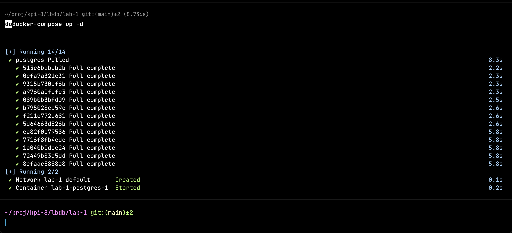
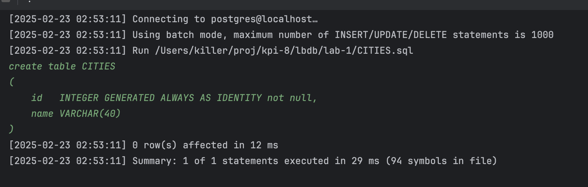
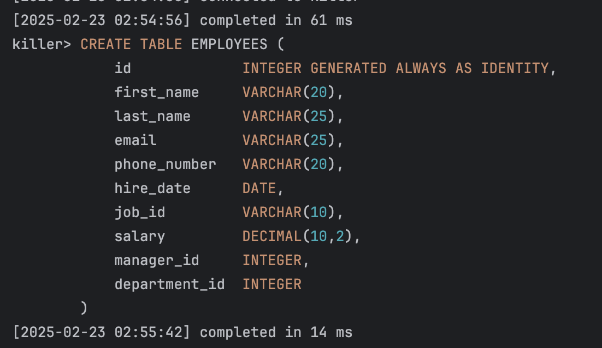
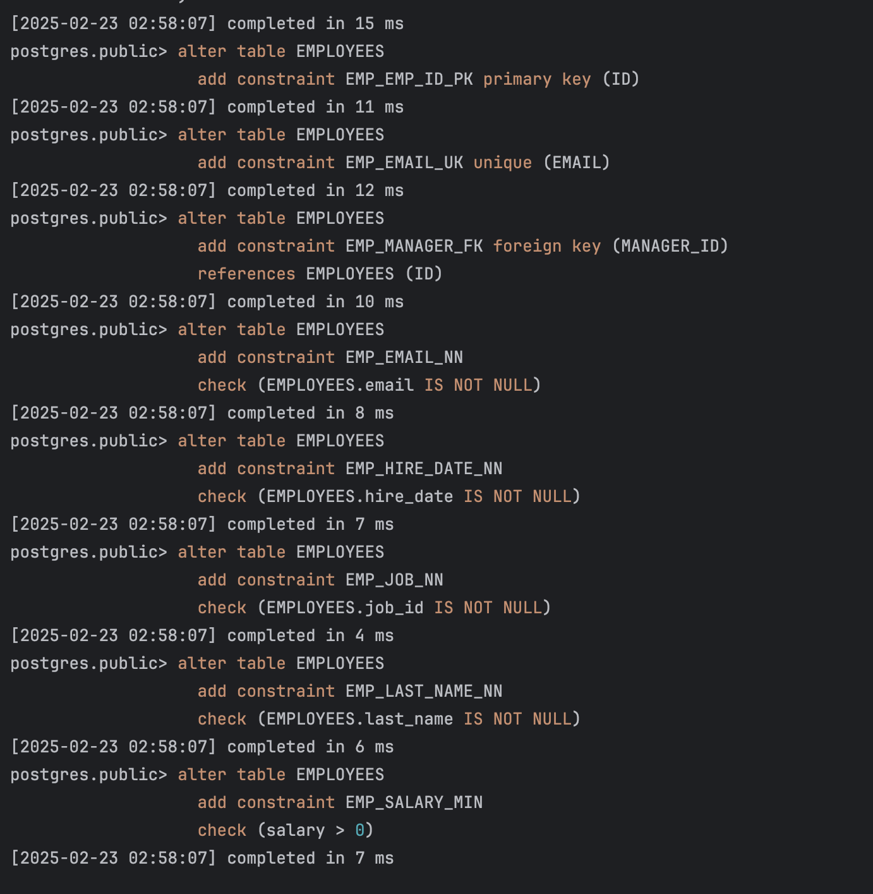

# Лабораторна робота №1

Тема: Налаштування простої бази даних

Мета: Набути навичок налаштування та конфігурації PostgreSQL у Docker, оптимізувати параметри для підвищення продуктивності та ознайомитися з базовими налаштуваннями балансування навантаження.

## Виконання

### Налаштування PostgreSQL у Docker

Створимо `docker-compose.yml`, який містить конфігурацію для PostgreSQL зі параметрами оптимізації продуктивності та балансування навантаження.

```yaml
services:
  postgres:
    image: postgres:13.3
    command:
      - "postgres"
      - "-c"
      - "max_connections=50"  # Максимальна кількість одночасних підключень
      - "-c"
      - "shared_buffers=1GB"  # Розмір буфера пам'яті для кешування даних
      - "-c"
      - "effective_cache_size=4GB"  # Приблизний обсяг доступної кешованої пам'яті
      - "-c"
      - "work_mem=16MB"  # Обсяг пам'яті для кожного оператора сортування
      - "-c"
      - "maintenance_work_mem=512MB"  # Пам'ять для операцій обслуговування, таких як VACUUM
      - "-c"
      - "random_page_cost=1.1"  # Вартість випадкового доступу до сторінок
      - "-c"
      - "temp_file_limit=10GB"  # Ліміт розміру тимчасових файлів
      - "-c"
      - "log_min_duration_statement=200ms"  # Логувати запити, що виконуються довше 200 мс
      - "-c"
      - "idle_in_transaction_session_timeout=10s"  # Автоматичне завершення неактивних транзакцій
      - "-c"
      - "lock_timeout=1s"  # Час очікування блокування перед скасуванням операції
      - "-c"
      - "statement_timeout=60s"  # Ліміт часу на виконання запиту
      - "-c"
      - "shared_preload_libraries=pg_stat_statements"  # Включення модуля збору статистики запитів
      - "-c"
      - "pg_stat_statements.max=10000"  # Максимальна кількість збережених запитів у статистиці
      - "-c"
      - "pg_stat_statements.track=all"  # Відстеження всіх запитів
    environment:
      POSTGRES_DB: "killer"  # Ім'я бази даних
      POSTGRES_USER: "killer"  # Користувач бази даних
      POSTGRES_PASSWORD: "killer"  # Пароль для підключення
      PGDATA: "/C/pg-docker/data"  # Шлях до збереження даних
    volumes:
      - .:/var/lib/postgresql/data  # Монтований том для збереження даних
    ports:
      - "5432:5432"  # Порт для підключення до бази
    healthcheck:
      test: ["CMD-SHELL", "pg_isready -U killer -d killer"]  # Перевірка стану бази даних
      interval: 10s  # Інтервал перевірки
      timeout: 5s  # Тайм-аут перевірки
      retries: 5  # Кількість повторних перевірок
      start_period: 10s  # Час очікування перед початком перевірок
    restart: unless-stopped  # Перезапуск у разі збою
    deploy:
      resources:
        limits:
          cpus: '1'  # Обмеження використання CPU
          memory: 4G  # Обмеження використання пам'яті
```

#### Опис конфігурації

- **Обмеження ресурсів** – встановлено максимальну кількість підключень, буфери, кеш, тайм-аути та обмеження пам'яті.
- **Моніторинг запитів** – увімкнено `pg_stat_statements` для збору статистики SQL-запитів.
- **Перевірка стану бази** – використовується `pg_isready` для healthcheck.
- **Оптимізація тайм-аутів** – встановлено значення для уникнення зависань транзакцій.



### Створення таблиць

1. **Створимо таблицю CITIES:**
   ```sql
   CREATE TABLE CITIES (
       id   NUMBER GENERATED ALWAYS AS IDENTITY NOT NULL,
       name VARCHAR2(40)
   );
   ```

   

2. **Створимо таблицю EMPLOYEES:**
   ```sql
   CREATE TABLE EMPLOYEES (
       id             NUMBER GENERATED ALWAYS AS IDENTITY,
       first_name     VARCHAR2(20),
       last_name      VARCHAR2(25),
       email          VARCHAR2(25),
       phone_number   VARCHAR2(20),
       hire_date      DATE,
       job_id         VARCHAR2(10),
       salary         NUMBER(10,2),
       manager_id     NUMBER(6),
       department_id  NUMBER(4)
   );
   ```

   

3. **Додаємо обмеження:**
   ```sql
   ALTER TABLE EMPLOYEES ADD CONSTRAINT EMP_EMP_ID_PK PRIMARY KEY (ID);
   ALTER TABLE EMPLOYEES ADD CONSTRAINT EMP_EMAIL_UK UNIQUE (EMAIL);
   ALTER TABLE EMPLOYEES ADD CONSTRAINT EMP_MANAGER_FK FOREIGN KEY (MANAGER_ID) REFERENCES EMPLOYEES (ID);
   ALTER TABLE EMPLOYEES ADD CONSTRAINT EMP_EMAIL_NN CHECK (EMAIL IS NOT NULL);
   ALTER TABLE EMPLOYEES ADD CONSTRAINT EMP_HIRE_DATE_NN CHECK (HIRE_DATE IS NOT NULL);
   ALTER TABLE EMPLOYEES ADD CONSTRAINT EMP_JOB_NN CHECK (JOB_ID IS NOT NULL);
   ALTER TABLE EMPLOYEES ADD CONSTRAINT EMP_LAST_NAME_NN CHECK (LAST_NAME IS NOT NULL);
   ALTER TABLE EMPLOYEES ADD CONSTRAINT EMP_SALARY_MIN CHECK (SALARY > 0);
   ```

   

## Висновок

У цій лабораторній роботі ми налаштували PostgreSQL у Docker, оптимізували його параметри та створили базові таблиці для роботи з даними. Було додано обмеження та індекси для забезпечення цілісності даних. Отримані навички дозволяють ефективно конфігурувати базу даних для використання в реальних умовах.

