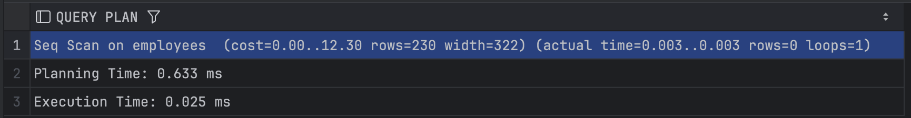
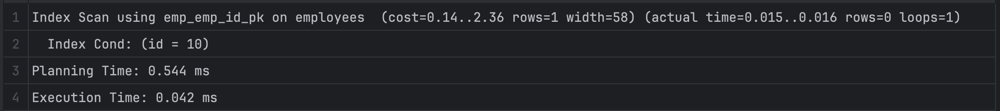
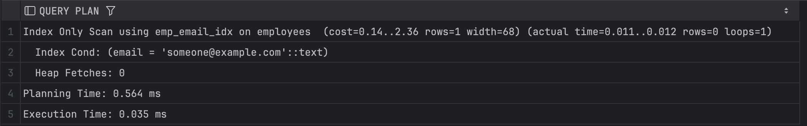
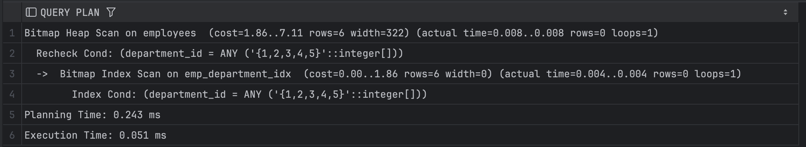
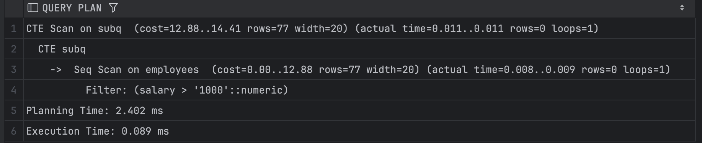
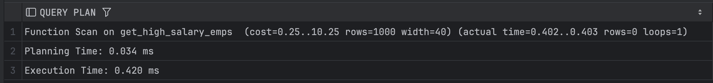
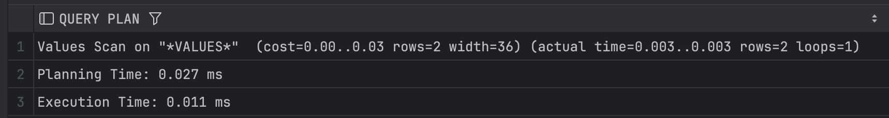
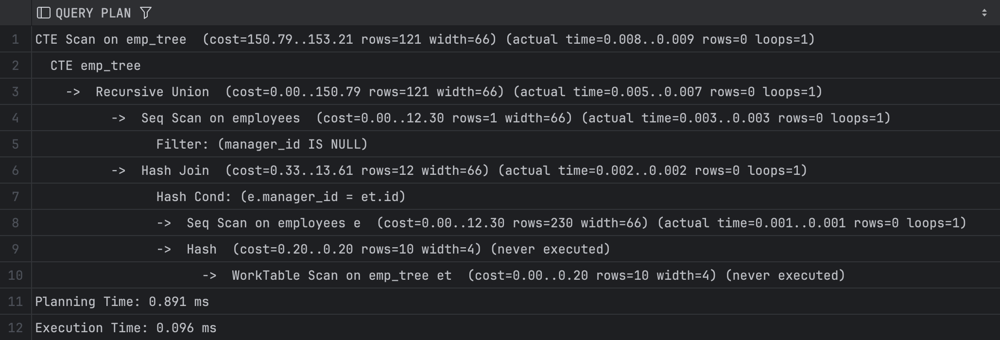

# Лабораторна робота №2

**Тема:** Використання різних типів проходу таблиць у PostgreSQL

**Мета:** Навчитися визначати та практично використовувати всі основні способи сканування таблиць у PostgreSQL, щоб розуміти, як оптимізатор обирає методи доступу до даних.

## Виконання

### Короткі теоретичні відомості

> **Seq Scan**  
> Це коли база просто бере та й читає всі рядки таблиці підряд. Зручно, коли треба переглянути всю таблицю або коли умова вибірки не дуже селективна (тобто не відфільтровує багато рядків).

> **Index Scan**  
> Коли у таблиці є індекс по певній колонці, і ми використовуємо його для пошуку рядків, замість того, щоб переглядати все підряд. Це швидше, бо зазвичай індекс менший і впорядкований.

> **Index Only Scan**  
> Дуже схоже на Index Scan, але тут PostgreSQL навіть не заходить у саму таблицю, бо вся потрібна інформація вже є в індексі. Ідеально, якщо запит стосується тільки колонок, які покриває індекс.

> **Bitmap Index Scan / Bitmap Heap Scan**  
> Це складніша штука: база спочатку збирає всі потрібні посилання на рядки через індекс (Bitmap Index Scan), а потім вже йде до самої таблиці (Bitmap Heap Scan), завдяки чому може “гуртом” зчитувати необхідні блоки.

> **TID Scan**  
> TID (Tuple ID) – це внутрішнє посилання на рядок у таблиці. Якщо знаємо його точно (наприклад, через `CTID`), то можна швидко звернутися без індексу, але таке використовують рідко.

> **Subquery Scan**  
> Тут маємо підзапит (`SELECT`), який має виконуватися першим, а потім скануватися як окрема таблиця.  
> *PostgreSQL занадто мудрує та оптимізує все до звичайного Seq Scan, тому змусити його залишити Subquery Scan складно.*  

> **Function Scan**  
> Сканування результату функції, що повертає набір рядків (табличний результат). Схоже на роботу з тимчасовою таблицею, але джерелом є функція.

> **Values Scan**  
> Коли у запиті напряму прописані якісь константи (наприклад, `VALUES (1,2), (3,4)`), і PostgreSQL просто обробляє їх як таблицю з кількох рядків.

> **CTE Scan**  
> Common Table Expression (`WITH`) – це коли ми оголошуємо тимчасові таблиці, а потім скануємо їх у основному запиті. Можна читати, ніби підзапити з іменами.

> **WorkTable Scan**  
> Застосовується, коли у нас рекурсивний CTE (наприклад, для ієрархічних структур), і ми скануємо проміжні результати під час побудови цієї ієрархії.


### Приклади запитів

1. **Seq Scan**  
   ```sql
   SELECT * FROM employees;
   ```
   *Використовуємо без умов, тому база просто бере і читає все підряд.*

   

2. **Index Scan**  
   ```sql
   SELECT first_name FROM employees WHERE id = 10;
   ```
   *Пошук за первинним ключем (або індексованою колонкою), база йде по індексу і швидко знаходить потрібний рядок.*

   

3. **Index Only Scan**  
   ```sql
   CREATE INDEX emp_email_idx ON employees(email);
   SELECT email FROM employees WHERE email = 'someone@example.com';
   ```
   *Тут потрібна тільки одна колонка `email`, і вона вже в індексі, тому таблиця взагалі не чіпається.*

   

4. **Bitmap Index Scan / Bitmap Heap Scan**  
   ```sql
   CREATE INDEX emp_department_idx ON employees(department_id);
   SELECT * FROM employees WHERE department_id IN (1, 2, 3, 4, 5);
   ```
   *Коли рядків багато, PostgreSQL спочатку бере всі посилання через індекс на `department_id`, а потім гуртом “зачитує” таблицю.*

   

5. **TID Scan**  
   ```sql
   SELECT * FROM employees WHERE ctid = '(0,1)';
   ```
   *Пряме звернення до рядка за його внутрішнім місцем зберігання.*

   

6. **Subquery Scan**  
   ```sql
   SELECT * FROM (
       SELECT id, salary FROM employees WHERE salary > 1000
   ) AS subq OFFSET 0;
   ```
   *PostgreSQL занадто оптимізує запити, тому змусити його виконати окремий Subquery Scan виявилося складним завданням.*  

   

7. **Function Scan**  
   ```sql
   CREATE OR REPLACE FUNCTION get_high_salary_emps(min_sal INTEGER)
   RETURNS TABLE (id INT, name TEXT, sal INT)
   AS $$
   BEGIN
       RETURN QUERY
       SELECT e.id, e.first_name || ' ' || e.last_name, e.salary::INT
       FROM employees e
       WHERE e.salary > min_sal;
   END;
   $$ LANGUAGE plpgsql;

   SELECT * FROM get_high_salary_emps(1500);
   ```
   *Тут PostgreSQL “сканує” результат з функції.*

   

8. **Values Scan**  
   ```sql
   SELECT * FROM (VALUES (1, 'Test'), (2, 'Hello')) AS t(col1, col2);
   ```
   *Просто беремо набір значень, які подані напряму в запиті.*

   

9. **CTE Scan**  
   ```sql
   WITH subq AS MATERIALIZED (
       SELECT id, salary FROM employees WHERE salary > 1000
   )
   SELECT * FROM subq;
   ```
   *База створює тимчасову “таблицю” з підзапиту (CTE) і потім сканує її.*

   

10. **WorkTable Scan**  
   ```sql
   WITH RECURSIVE emp_tree AS (
       SELECT id, manager_id, first_name 
       FROM employees
       WHERE manager_id IS NULL
       
       UNION ALL
       
       SELECT e.id, e.manager_id, e.first_name
       FROM employees e
       JOIN emp_tree et ON e.manager_id = et.id
   )
   SELECT * FROM emp_tree;
   ```
   *Рекурсивна “таблиця” під час виконання CTE, тут і відбувається WorkTable Scan.*

   


## Висновок

У цій лабораторній роботі ми розглянули 10 різних підходів до сканування таблиць у PostgreSQL і дізналися, як оптимізатор обирає конкретний метод, залежно від наших умов та структури даних. Це допомагає краще розуміти роботу СУБД і ефективніше проєктувати запити в майбутньому.
